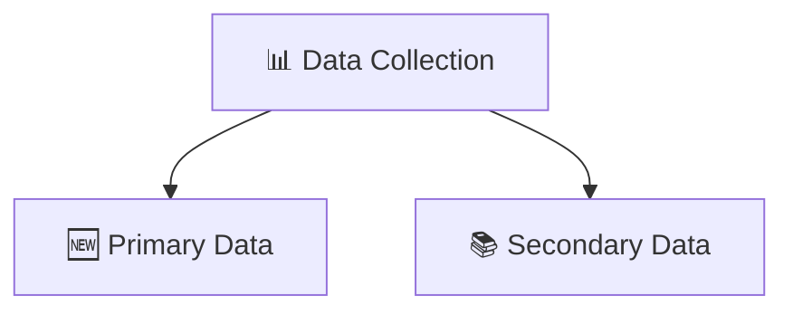
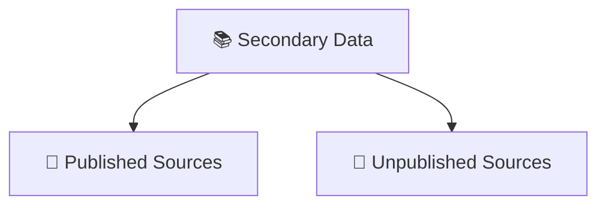

# 📊 Data Collection Methods  
## A Story of How We Discover the Truth 🔍

---

## 🌟 Imagine This...

You are an investigator.

Not a detective solving crimes…  
But a researcher solving questions.

You are asked:

- Why are sales dropping? 📉  
- Why are students performing better this year? 📚  
- How has rice production changed over time? 🌾  
- Are customers satisfied with our product? 🛍️  

Before answering any of these questions, you need something powerful.

You need **data**.

And that’s where our story begins.

---

# 🧭 Chapter 1: What is Data Collection?

Data Collection is the process of:

- Gathering information  
- Measuring it  
- Analyzing it  
- Using it to find answers  

In simple words:

> Data collection means collecting facts and figures to discover the truth.

It is the **first and most important step** in research.

Because:

- Good data → Correct decisions ✅  
- Poor data → Wrong conclusions ❌  

---

# 🎯 Why Do We Collect Data?

Every investigator collects data for a reason.

Main objectives:

- 📌 To support decision-making  
- 📈 To identify trends and patterns  
- 📊 To measure progress and performance  
- 📑 To provide evidence for conclusions  

Without data, decisions become guesses.

---

# 👥 Meet the Characters in Our Story

Before moving forward, let’s meet the key people involved.

### 📦 Data
The information we collect to understand a problem.

There are two types:
- Primary Data  
- Secondary Data  

---

### 🕵️ Investigator
The person who conducts the research.

They ask questions.
They analyze data.
They find conclusions.

---

### 📝 Enumerators
The helpers.

They assist the investigator in collecting information from people.

---

### 👤 Respondents
The people who provide the information.

Without respondents, there is no data.

---

### 📋 Survey
A method used to collect information from a group of people.

Example:
- Customer satisfaction
- Product feedback
- Public opinion

---

# ⚔️ Two Paths to Collect Data

When collecting data, an investigator has two main paths:

Let’s explore both journeys.

---

# 🆕 Chapter 2: Primary Data – Going to the Source

Primary Data is:

> Data collected directly from original sources for a specific purpose.

It is fresh.
It is specific.
It is collected firsthand.

Think of it like cooking your own meal instead of ordering food 🍳

### Why is Primary Data Powerful?

- 🎯 High accuracy  
- 🛠 More control over quality  
- 📌 Tailored to research objectives  

---

## 🛠 Methods of Collecting Primary Data

### 1️⃣ Interviews 🎤

Direct communication between investigator and respondent.

Types:

- **Direct Personal Investigation**  
  Investigator personally collects information.

- **Indirect Oral Investigation**  
  Information collected from knowledgeable third parties.

✅ Advantage: Real-time, detailed information  
❌ Disadvantage: Can be biased or influenced  
🎯 Use Case: Behavioral studies, user experience research

---

### 2️⃣ Questionnaires 📋

A structured set of questions.

Two ways:

- **Mailing Method** → Sent online or by mail  
- **Enumerator’s Method** → Enumerator fills responses in person  

✅ Advantage: Reach many people quickly  
❌ Disadvantage: Low response rate, biased answers  
🎯 Use Case: Customer surveys, market research

---

### 3️⃣ Observation 👀

Watching and recording behavior as it naturally happens.

No asking.
Just observing.

✅ Advantage: Real, natural data  
❌ Disadvantage: Observer bias  
🎯 Use Case: Classroom studies, field research

---

### 4️⃣ Experiments 🧪

Testing cause-and-effect relationships in controlled environments.

You change one variable.
You observe what happens.

✅ Advantage: Clear cause-and-effect results  
❌ Disadvantage: Expensive and artificial  
🎯 Use Case: Drug testing, marketing experiments

---

### 5️⃣ Focus Groups 👥

6–12 participants discuss a topic under a moderator.

You observe opinions and reactions.

✅ Advantage: Deep insights  
❌ Disadvantage: May not represent entire population  
🎯 Use Case: Product feedback, brand perception

---

### 6️⃣ Local Correspondents 🌍

The investigator appoints local people in different regions to collect data.

Useful when:
- Covering large geographical areas  
- Gathering regional data  

---

# 📚 Chapter 3: Secondary Data – Learning from What Already Exists

Now imagine this…

Instead of collecting data yourself,  
you use data that someone else already collected.

That is **Secondary Data**.

> Data that has already been gathered, processed, and published by others.

It saves time.
It saves money.
But you must check reliability.

---

## 📂 Types of Secondary Data

---

## 📖 Published Sources

These are officially available reports and documents.

Examples:

### 🏛 Government Publications
- Census data  
- Economic surveys  
- Industrial statistics  

These are highly reliable.

---

### 🏢 Semi-Government Publications
- Municipal records  
- Health statistics  
- Birth and death records  

---

### 🏭 Trade Associations
Example:
- Sugar Mills Association data  

---

### 📰 Journals & Newspapers
Provide economic, social, and statistical information.

---

### 🌍 International Organizations
Such as:
- IMF  
- UNO  
- ILO  
- World Bank  

They publish global statistics.

---

### 🎓 Research Institutions
Universities and statistical institutes publish research findings.

---

## 📁 Unpublished Sources

Some data is collected but not published publicly.

Examples:
- Research papers by professors  
- Business internal records  
- Company sales data  

These are used internally.

---

# 🌾 A Real Example: Rice Production in India

Let’s see data in action.

Imagine we have this information:

| Year | Production of Rice (Million Tonnes) |
|------|-------------------------------------|
| 1950–1951 | 20.58 |
| 1966–1967 | 30.34 |
| 1975–1976 | 48.74 |
| 1998–1999 | 86.03 |
| 2002–2003 | 77.70 |
| 2020–2021 | 120.00 |
| 2023–2024 (Estimated) | 136.76 |

### What Do We Notice?

- In 1950–1951 → 20.58 million tonnes  
- In 2020–2021 → 120 million tonnes  
- Estimated 2023–2024 → 136.76 million tonnes  

📈 Production increased significantly over time.

---

# 🔢 Understanding Variables

In this example:

- Year (X) → One variable  
- Rice Production (Y) → Another variable  

Since rice production changes each year,  
it is called a **variable**.

> A variable is a quantity whose value changes over time.

By studying variables:
- We identify trends  
- We detect growth patterns  
- We understand development  

---

# 🏁 The Final Lesson

Data Collection is not just gathering numbers.

It is:

- Asking the right questions  
- Choosing the right method  
- Ensuring accuracy  
- Finding meaningful insights  

Whether you collect:

- 🆕 Primary Data (your own)  
or  
- 📚 Secondary Data (existing sources)  

The goal remains the same:

👉 Discover the truth.  
👉 Support decisions.  
👉 Understand patterns.  

---

## 🌟 If This Helped You

- ⭐ Star this repository  
- 📢 Share with others  
- 🤝 Contribute improvements  

Because knowledge grows when shared 📊✨
