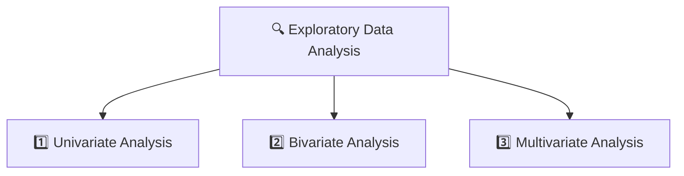

# 🔍 Exploratory Data Analysis (EDA)  
## The Story of Understanding Data Before Trusting It 📊✨

---

## 🌟 Imagine This…

You are given a dataset.

It has:
- Hundreds of rows 📄  
- Many columns 📊  
- Some numbers 🔢  
- Some text 📝  

And someone tells you:

> “Build a machine learning model.”

But wait… 🤚

Would you cook food without tasting the ingredients?  
Would you drive a car without checking fuel and brakes?  

No.

Before building a model,  
you must understand your data.

That process is called:

# 🔍 Exploratory Data Analysis (EDA)

---

# 🧠 What is Exploratory Data Analysis?

Exploratory Data Analysis (EDA) is the process of:

- Looking at data carefully  
- Understanding its structure  
- Finding patterns  
- Detecting errors  
- Discovering relationships  

In simple words:

> EDA means exploring your data before making decisions.

It helps answer questions like:

- How many features does this dataset have?
- What type of data is inside?
- Are there missing values?
- Are there unusual values?
- Do variables relate to each other?

EDA turns confusion into clarity.

---

# 🎯 Why is EDA Important?

EDA helps us:

✅ Understand the dataset  
✅ Find hidden patterns  
✅ Detect errors and outliers  
✅ Select important features  
✅ Choose the right model  

Without EDA:

You are guessing.

With EDA:

You are making informed decisions.

---

# 📂 Types of Exploratory Data Analysis

EDA depends on how many variables we are analyzing.

---

# 1️⃣ Univariate Analysis  
### (Studying One Variable at a Time)

“Uni” means one.

Here, we analyze just one column.

Example:
- Only Age
- Only Salary
- Only Gender

We ask:
- What is the average?
- What is the minimum and maximum?
- Is it normally distributed?
- Are there outliers?

### Tools Used:

- 📊 Histogram → Shows distribution  
- 📦 Box plot → Detects outliers  
- 📊 Bar chart → For categorical data  

### Summary Statistics:

- Mean (average)  
- Median (middle value)  
- Mode (most frequent)  
- Variance  
- Standard deviation  

Univariate analysis helps us understand a single feature deeply.

---

# 2️⃣ Bivariate Analysis  
### (Studying Two Variables Together)

“Bi” means two.

Now we explore the relationship between two variables.

Example:
- Age vs Salary  
- Study Hours vs Marks  
- Temperature vs Ice Cream Sales  

We ask:
- Do they move together?
- Is there correlation?
- Does one affect the other?

### Tools Used:

- 📈 Scatter plot → Shows relationship between two numbers  
- 📊 Correlation coefficient → Measures strength of relationship  
- 📋 Cross-tabulation → For categorical variables  
- 📉 Line graph → For time-based comparison  

Bivariate analysis helps us understand interactions.

---

# 3️⃣ Multivariate Analysis  
### (Studying More Than Two Variables)

Now things get interesting.

We analyze multiple variables together.

Example:
- Age, Income, Education level, and Spending score  
- Price, Location, Size, and House age  

We want to understand:

- How do all variables interact?
- Which ones are most important?
- Can we reduce complexity?

### Techniques:

- 📊 Pair plots → Compare multiple variables  
- 🧠 PCA (Principal Component Analysis) → Reduce complexity  
- 🗺 Spatial analysis → For geographical data  
- ⏳ Time series analysis → For time-based data  

Multivariate analysis prepares data for modeling.

---

# 🛠 Step-by-Step Process of EDA

Let’s walk through how EDA is actually performed.

---

# 🔹 Step 1: Understand the Problem

Before touching the data, ask:

- What is the goal?
- What question are we trying to answer?
- What does each variable represent?
- Are there known issues?

Understanding the problem prevents wrong conclusions.

---

# 🔹 Step 2: Import and Inspect Data

Load the dataset into tools like:

- Python (Pandas, Matplotlib, Seaborn, Plotly)  
- R (ggplot2, dplyr, tidyr)

Then check:

- Number of rows and columns  
- Data types (numeric, categorical, text)  
- Missing values  
- Errors or inconsistencies  

This gives a first overview of the dataset.

---

# 🔹 Step 3: Handle Missing Data ❓

Missing data is common.

First, understand why it’s missing:

- Completely Random (MCAR)  
- Random (MAR)  
- Not Random (MNAR)  

Then decide:

- Remove rows?  
- Fill values using mean/median?  
- Use advanced methods like KNN?

Handling missing data carefully avoids biased results.

---

# 🔹 Step 4: Explore Data Characteristics

Now calculate:

- Mean  
- Median  
- Mode  
- Standard deviation  
- Skewness  
- Kurtosis  

This helps us understand:

- Distribution  
- Spread  
- Shape  
- Irregular patterns  

---

# 🔹 Step 5: Data Transformation

Sometimes data needs adjustment.

Common transformations:

- 📏 Scaling (Min-Max or Standardization)  
- 🔢 Encoding categorical variables  
- 🔄 Log transformation for skewed data  
- ➕ Creating new features  

Transformation prepares data for modeling.

---

# 🔹 Step 6: Visualize Relationships

Visualization reveals what numbers cannot.

For categorical variables:
- Bar charts  
- Pie charts  

For numerical variables:
- Histograms  
- Box plots  
- Density plots  

For relationships:
- Scatter plots  
- Correlation matrix  

Visuals often reveal hidden patterns instantly.

---

# 🔹 Step 7: Handle Outliers

Outliers are extreme values.

They can:
- Skew averages  
- Distort models  

We detect them using:
- IQR method  
- Z-score  
- Domain knowledge  

Then decide:
- Remove  
- Adjust  
- Keep (if meaningful)

---

# 🔹 Step 8: Communicate Insights

EDA is not complete until findings are shared.

Good communication includes:

- Clear goals  
- Visualizations  
- Key insights  
- Limitations  
- Next steps  

EDA is successful only when others understand it.

---

# 🏁 The Final Lesson

Exploratory Data Analysis is not optional.

It is the foundation of:

- Data Science  
- Machine Learning  
- Business Analytics  

EDA helps us:

🔍 Understand data  
📊 Discover patterns  
⚠️ Detect problems  
🎯 Make better decisions  

Without EDA:

Models may fail.

With EDA:

You build with confidence.

---

## 🌟 Remember

EDA is like:

🧭 Exploring a map before traveling  
🧪 Testing ingredients before cooking  
🔎 Investigating before concluding  

Explore first.  
Model later.

---

⭐ If this helped you, consider starring this repository.  
Because good analysis begins with good exploration 📊✨
