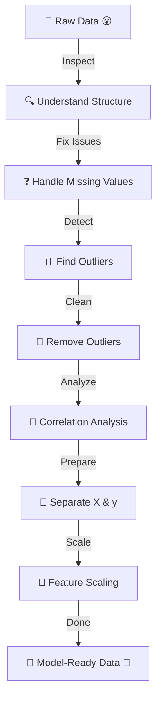

# 🧹 Data Preprocessing  
## Turning Messy Data into Model-Ready Intelligence 🚀

---

# 🎬 The Story Begins...

You download a dataset.

You feel excited.

You’re ready to train a machine learning model.

But then…

You notice:

- Missing values ❓  
- Extreme numbers 📉  
- Different scales 📊  
- No structure 😵  

And that’s when you realize:

> “If I train a model on this… it will learn garbage.”

So today, we clean it.

Welcome to the journey of:

# 🧹 Data Preprocessing

---

# 🌍 Real-World Analogy Section

Let’s understand preprocessing using real life.

---

## 🥦 1. Cooking Analogy

Raw vegetables = Raw Data  
Washing & cutting = Cleaning & transforming  
Cooking = Model training  
Delicious meal = Accurate prediction  

You don’t cook without washing vegetables.

You don’t train models without preprocessing.

---

## 🏗 2. Building a House

Imagine building a house.

- You don’t build on unstable ground.
- You prepare the foundation first.

Data preprocessing = Strong foundation  
Model training = Building the house  

If foundation is weak, the house collapses.

---

## 🧺 3. Washing Clothes

Dirty clothes → Washing machine → Clean clothes  

Raw data → Preprocessing → Clean data  

You wouldn’t wear dirty clothes.

So don’t train on dirty data.

---

# 🚀 The Animated Data Journey

Below is a visually engaging animated-style flow.



Now let’s walk through this journey step by step.

---

# 🛠 Step 1: Preparing Our Tools

Before starting the cleaning mission, we gather our tools.

```python
# pandas helps handle tables (like Excel)
import pandas as pd  

# numpy helps with math operations
import numpy as np  

# These help scale our data later
from sklearn.preprocessing import MinMaxScaler, StandardScaler  

# These create visualizations
import seaborn as sns  
import matplotlib.pyplot as plt  
```

Tools ready ✅

---

# 📂 Step 2: Load the Dataset

Now we bring the dataset into Python.

```python
# Load dataset from CSV file
df = pd.read_csv('Geeksforgeeks/Data/diabetes.csv')

# Show first 5 rows to understand structure
df.head()
```

Now pause.

Look carefully.

We are detectives now 🕵️

---

# 🔍 Step 3: Inspect the Data

Before cleaning, we inspect.

```python
# Show structure of dataset
df.info()

# Count missing values in each column
print(df.isnull().sum())
```

Ask yourself:

- Are there missing values?
- Are data types correct?
- Does everything look normal?

Understanding comes before fixing.

---

# 📊 Step 4: Understand the Numbers

```python
# Get statistical summary
df.describe()
```

This shows:

- Mean (average)
- Min & Max
- Spread of values

Now we check for unusual numbers.

---

# 📦 Step 5: Visualize Outliers

Outliers are extreme values.

Let’s visualize them.

```python
# Create boxplot for each column
fig, axs = plt.subplots(len(df.columns), 1, figsize=(7, 18), dpi=95)

for i, col in enumerate(df.columns):
    axs[i].boxplot(df[col], vert=False)
    axs[i].set_ylabel(col)

plt.tight_layout()
plt.show()
```

Points outside the box = possible outliers.

---

# 🧹 Step 6: Remove Outliers (IQR Method)

We calculate:

IQR = Q3 - Q1  

```python
# Calculate Q1 and Q3
q1, q3 = np.percentile(df['Insulin'], [25, 75])

# Calculate IQR
iqr = q3 - q1

# Define lower and upper limits
lower = q1 - 1.5 * iqr
upper = q3 + 1.5 * iqr

# Filter the data to remove outliers
clean_df = df[(df['Insulin'] >= lower) & (df['Insulin'] <= upper)]
```

Now extreme insulin values are removed.

Cleaner data ✅

---

# 🔗 Step 7: Correlation Analysis

Now we ask:

Which features are strongly related to diabetes?

```python
# Calculate correlation matrix
corr = df.corr()

# Create heatmap
plt.figure(dpi=130)
sns.heatmap(corr, annot=True, fmt='.2f', cmap='coolwarm')
plt.show()

# Sort features by correlation with Outcome
print(corr['Outcome'].sort_values(ascending=False))
```

Red = Strong positive  
Blue = Negative  

Now we know what matters most.

---

# 🎯 Step 8: Separate Features and Target

Machine learning needs:

- X → Inputs  
- y → Output  

```python
# All columns except Outcome become features
X = df.drop(columns=['Outcome'])

# Outcome column becomes target
y = df['Outcome']
```

Perfect.

---

# 📏 Step 9: Scaling (Very Important)

Without scaling:

Large numbers dominate learning.

---

## 🔹 Normalization (0 to 1)

```python
# Create scaler
scaler = MinMaxScaler()

# Apply scaling
X_normalized = scaler.fit_transform(X)

print(X_normalized[:5])
```

---

## 🔹 Standardization (Mean = 0)

```python
# Create scaler
scaler = StandardScaler()

# Apply scaling
X_standardized = scaler.fit_transform(X)

print(X_standardized[:5])
```

---

# 🎞 Final Animated Transformation


---

# 🏁 Final Message

Data preprocessing is not boring.

It’s powerful.

It’s the hidden hero of machine learning.

Without it:

Model fails.

With it:

Model shines. ✨

---

⭐ If you liked this approach, star the repository.

Because great models start with clean data.
