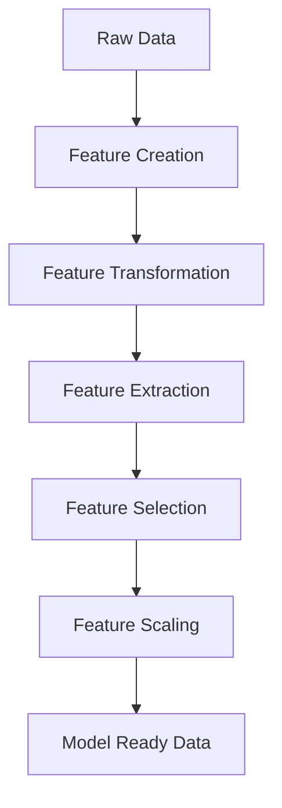

# 🧠 Feature Engineering  
## The Secret Weapon Behind Great Machine Learning Models 🚀

---

## 🌟 Imagine This…

You have collected data.

Lots of it.

- Customer ages 👤  
- Purchase history 🛒  
- Website clicks 🖱  
- Product categories 🏷  

You train a machine learning model…

And the accuracy is terrible. 😟

You try another algorithm.

Still bad.

You try tuning hyperparameters.

Still not great.

Then someone tells you:

> “The problem isn’t the model… it’s your features.”

Welcome to the world of:

# 🔥 Feature Engineering

---

# 📌 What is Feature Engineering?

Feature Engineering is the process of:

- Selecting  
- Creating  
- Transforming  
- Improving  

input variables (features) so that machine learning models can learn patterns better.

In simple words:

> Feature Engineering is turning raw data into smart data.

Raw data is messy.  
Models don’t understand “messy”.

Feature engineering prepares data in a way machines can understand.

---

# 🏗 What Does It Include?

Feature Engineering may involve:

- Handling missing values ❓  
- Encoding categorical variables 🔢  
- Scaling numerical values 📏  
- Creating new features ➕  
- Combining existing features 🔄  

It transforms:

Messy real-world data ➡ Clean, meaningful model input

---

# 🎯 Why is Feature Engineering Important?

Feature engineering can make or break your model.

Here’s what it improves:

### ✅ 1. Improves Accuracy
Better features = Better learning = Better predictions

---

### ✅ 2. Reduces Overfitting
Using only important features prevents the model from memorizing noise.

---

### ✅ 3. Boosts Interpretability
Clear features help us understand:
> Why did the model make this prediction?

---

### ✅ 4. Enhances Efficiency
Fewer, meaningful features = Faster training & prediction

---

# ⚙ Processes Involved in Feature Engineering

Let’s break it down step-by-step.

---

# 1️⃣ Feature Creation  
### (Creating Something New ✨)

This means generating new features.

It can be:

### 🔹 Domain-Specific
Created using business knowledge  
Example:
- Profit = Revenue - Cost

### 🔹 Data-Driven
Based on patterns found in data.

### 🔹 Synthetic
Combining features:
- BMI = Weight / Height²

Feature creation gives the model more meaningful information.

---

# 2️⃣ Feature Transformation  
### (Making Data Easier to Learn From 🔄)

Transformation improves how features behave.

### Common Methods:

- 📏 Normalization / Scaling  
- 🔢 Encoding categorical variables (One-Hot Encoding)  
- 📉 Log transformation (for skewed data)  

Example:

Text like:
"Red", "Blue", "Green"

Becomes:
1, 0, 0  
0, 1, 0  
0, 0, 1  

Now machines can understand it.

---

# 3️⃣ Feature Extraction  
### (Reducing Complexity 🧩)

Sometimes we have too many features.

We simplify.

### Techniques:

- 🧠 PCA (Principal Component Analysis)  
- ➕ Aggregation (averages, sums)  
- 📊 Combining related features  

This reduces dimensionality while keeping important information.

---

# 4️⃣ Feature Selection  
### (Choosing the Best Features 🎯)

Not all features are useful.

We select only relevant ones.

### Methods:

- 📊 Filter methods (correlation-based)  
- 🤖 Wrapper methods (based on model performance)  
- ⚙ Embedded methods (inside model training)  

Less noise = Better generalization.

---

# 5️⃣ Feature Scaling  
### (Making Features Comparable 📐)

Some features may be:

- Age: 0–100  
- Salary: 0–1,000,000  

If not scaled, large numbers dominate learning.

### Methods:

- Min-Max Scaling (0 to 1 range)  
- Standard Scaling (mean = 0, variance = 1)  

Scaling ensures fairness in learning.

---

# 🪜 Steps in Feature Engineering

Feature Engineering usually follows this process:

---

## 🔹 Step 1: Data Cleaning
- Fix errors  
- Remove duplicates  
- Handle missing values  

Garbage in ➡ Garbage out.

---

## 🔹 Step 2: Data Transformation
- Encode categorical variables  
- Normalize numerical features  
- Apply log transformations  

---

## 🔹 Step 3: Feature Extraction
- Combine features  
- Derive new features  
- Reduce dimensions  

---

## 🔹 Step 4: Feature Selection
- Keep only relevant features  
- Remove redundant ones  

---

## 🔹 Step 5: Feature Iteration 🔁
Test the model.
Improve features.
Repeat.

Feature engineering is not one-time.
It’s an iterative process.

---

# 🛠 Common Feature Engineering Techniques

Let’s look at practical examples.

---

## 🔹 1. One-Hot Encoding

Converts categories into binary columns.

Example:

| Color |
|-------|
| Red   |
| Blue  |
| Green |

Becomes:

| Red | Blue | Green |
|-----|------|-------|
| 1   | 0    | 0     |

Machines understand numbers, not words.

---

## 🔹 2. Binning

Convert continuous numbers into groups.

Example:

Age:
- 18 → 0–20  
- 45 → 41–60  

Makes patterns easier to detect.

---

## 🔹 3. Text Preprocessing 📝

For text data:

- Remove stopwords  
- Stemming  
- Vectorization  

Turns sentences into numeric vectors.

---

## 🔹 4. Feature Splitting ✂

Split one feature into multiple useful parts.

Example:

Full Address →  
- Street  
- City  
- Zipcode  

More granular insights = Better learning.

---

# 🧰 Tools for Feature Engineering

Here are powerful tools used in industry:

### 🔹 Featuretools  
Automates feature engineering for structured data.

### 🔹 TPOT  
Uses genetic algorithms to optimize ML pipelines.

### 🔹 DataRobot  
End-to-end automated ML platform.

### 🔹 Alteryx  
Visual workflow builder for data preparation.

### 🔹 H2O.ai  
Supports scaling, encoding, and advanced ML workflows.

---

# 🏁 Final Takeaway

You can use:

- The best algorithm  
- The most powerful GPU  
- The latest framework  

But without good features…

Your model will struggle.

Feature Engineering is:

🎨 The art of transforming data  
🧠 The science of improving learning  
🚀 The secret to high-performing models  

---

## 💡 Remember

Models don’t think.

They learn from what you give them.

If you give them better features…

They give you better predictions.

---

⭐ If this guide helped you, consider starring the repository.

Because in machine learning…

Great models start with great features. 🚀
