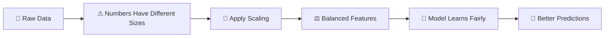
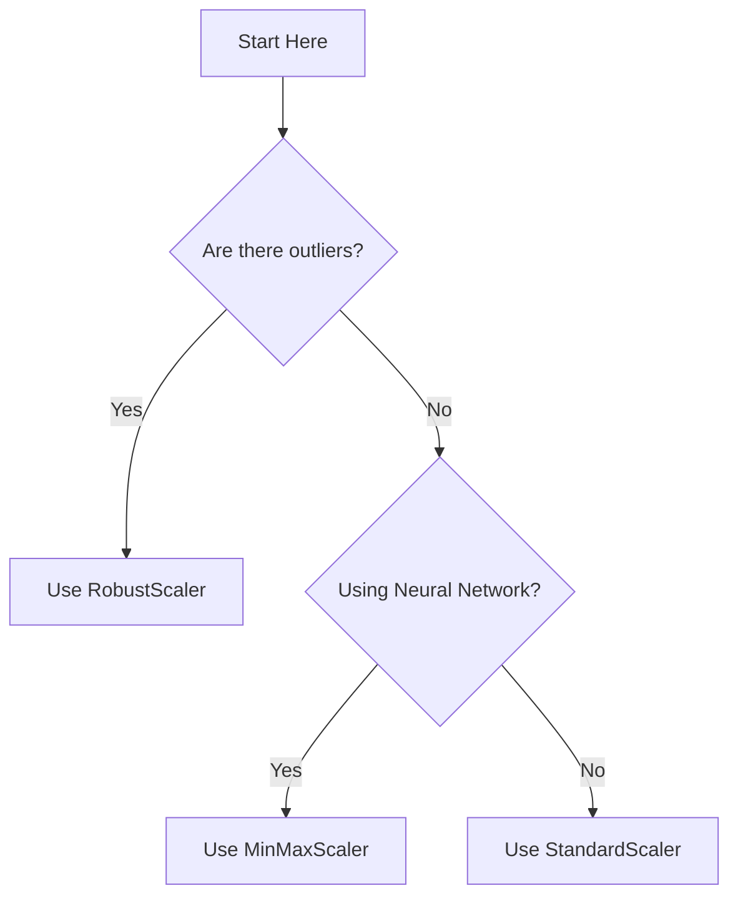
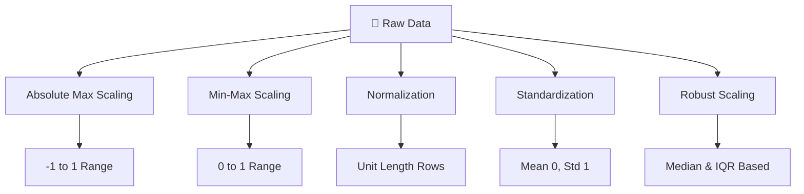

# 🎬 Feature Engineering: Scaling, Normalization & Standardization  
## The Day Numbers Learned to Behave


---

# 🌌 Scene 1 — The Day Your Model Got Confused

You build your first machine learning model.

You are excited.

You give it this data:

| Age | Salary | Experience |
|-----|--------|------------|
| 25  | 100000 | 3          |
| 40  | 50000  | 15         |

The model looks at numbers.

Age → 25  
Experience → 3  
Salary → 100000  

To the model…

100000 looks HUGE.

So it thinks:

> “Salary must be the most important feature!”

But what if it’s not?

The problem is not intelligence.

The problem is **scale**.

---

# 🧠 What Is Scaling? (In Human Language)

Scaling means:

Making all numbers comparable.

Think of it like this:

If one person speaks at volume 100 🔊  
And another at volume 5 🔈  

You don’t know who is important.

You first adjust volume.

Scaling adjusts the volume of numbers.

---

# 🗺 The Full Journey You’re About to Understand



Today you will master:

- Min-Max Scaling
- Standardization
- Normalization
- Robust Scaling
- Absolute Maximum Scaling

From ZERO.

---

# 🏗 Step 0 — Load the Data

Before anything, we need numbers.

```python
# We use pandas to work with tables (like Excel inside Python)
import pandas as pd

# numpy helps us with math operations
import numpy as np

# Load dataset from file
df = pd.read_csv("Housing.csv")

# Keep only numeric columns
# Because scaling works only on numbers
df = df.select_dtypes(include=np.number)

# Show first 5 rows so we can see the data
df.head()
```

Now we begin the transformation.

---

# 🟢 Chapter 1 — Min-Max Scaling (Making Everything Between 0 and 1)

## 🎭 Imagine This

Marks in a class:

20, 40, 60, 80, 100

Minimum = 20  
Maximum = 100  

We decide:

Lowest becomes 0  
Highest becomes 1  

Everything else fits between.

Now the range is controlled.

---

## 🧠 What It Really Does

Formula (don’t fear it):

New Value = (Value - Minimum) / (Maximum - Minimum)

Meaning:

- Subtract smallest value
- Divide by total range

Boom.

Everything becomes between 0 and 1.

---

## 📦 When Should You Use It?

Use Min-Max when:

- You are using Neural Networks
- You want values strictly between 0 and 1
- You don’t have extreme outliers

Avoid if:

- Dataset has crazy large extreme values

---

## 🧑‍💻 Code (Fully Explained)

```python
from sklearn.preprocessing import MinMaxScaler

# Create a scaling tool
# Think of this as creating a calculator that knows the formula
scaler = MinMaxScaler()

# fit_transform does TWO things:
# 1. fit → learns minimum and maximum from data
# 2. transform → applies the scaling formula
scaled_data = scaler.fit_transform(df)

# Convert the scaled result back into table format
scaled_df = pd.DataFrame(scaled_data, columns=df.columns)

# Display first 5 rows
scaled_df.head()
```

You just balanced your data.

---

# 🔵 Chapter 2 — Standardization (Centering Around Zero)

Now things get powerful.

---

## 🎭 Imagine This

Average height in class = 170 cm

One student = 180 cm

Instead of saying “180”  
We say:

> This student is +1 unit above average.

Standardization measures:

How far from average is each value?

After this:

Mean becomes 0  
Standard deviation becomes 1  

---

## 🧠 What Does That Mean?

It centers data around 0.

Negative → below average  
Positive → above average  

This makes training very stable.

---

## 📦 When To Use It?

Use Standardization when:

- Using Logistic Regression
- Using Linear Regression
- Using SVM
- Using KNN
- Unsure what to choose

This is the safest default method.

---

## 🧑‍💻 Code

```python
from sklearn.preprocessing import StandardScaler

# Create standardization tool
scaler = StandardScaler()

# Learn the average (mean) and spread (std deviation)
# Then convert values
scaled_data = scaler.fit_transform(df)

# Convert result back into DataFrame
scaled_df = pd.DataFrame(scaled_data, columns=df.columns)

# Display first rows
scaled_df.head()
```

Your data is now centered and balanced.

---

# 🟡 Chapter 3 — Normalization (Direction Matters, Not Size)

This one is different.

Very different.

---

## 🎭 Imagine Arrows

Some arrows are long.  
Some are short.

But you only care about direction.

Normalization keeps direction same  
But makes all arrows equal length.

---

## 🧠 What It Does

It scales each ROW.

Not column.

Each row becomes length = 1.

---

## 📦 When To Use It?

Use Normalization when:

- Working with text data
- Using cosine similarity
- Doing clustering
- Working with recommendation systems

---

## 🧑‍💻 Code

```python
from sklearn.preprocessing import Normalizer

# Create normalizer tool
scaler = Normalizer()

# This scales EACH ROW separately
scaled_data = scaler.fit_transform(df)

# Convert back into DataFrame
scaled_df = pd.DataFrame(scaled_data, columns=df.columns)

# Show first rows
scaled_df.head()
```

Each row now has equal strength.

---

# 🔴 Chapter 4 — Robust Scaling (The Outlier Fighter)

Now imagine this:

Most salaries = 40,000  
CEO salary = 10,000,000  

Average becomes distorted.

Standard scaling gets affected.

But robust scaling?

It ignores extreme values.

---

## 🧠 What It Uses

Instead of mean:

It uses median (middle value)

Instead of standard deviation:

It uses IQR (middle 50%)

---

## 📦 When To Use It?

Use Robust Scaling when:

- Dataset has outliers
- Data is skewed
- You see extreme values

---

## 🧑‍💻 Code

```python
from sklearn.preprocessing import RobustScaler

# Create robust scaling tool
scaler = RobustScaler()

# Learn median and IQR
# Then scale data
scaled_data = scaler.fit_transform(df)

# Convert back to DataFrame
scaled_df = pd.DataFrame(scaled_data, columns=df.columns)

# Show results
scaled_df.head()
```

Outliers now lose power.

---

# 🟣 Chapter 5 — Absolute Maximum Scaling

Simple method.

Divide everything by largest absolute value.

Range becomes -1 to 1.

---

## 📦 When To Use It?

- Sparse datasets
- No extreme outliers
- Simple experiments

---

## 🧑‍💻 Code

```python
# Find maximum absolute value in each column
max_abs = np.max(np.abs(df), axis=0)

# Divide each value by that maximum
scaled_df = df / max_abs

# Show result
scaled_df.head()
```

Simple but sensitive.

---

# 🧭 How To Choose? (Decision Map)



If still confused?

Use StandardScaler.
---


# 📊 Visual Comparison Flow



---

# ⚖ Comparison Table

| Method | Range | Outlier Sensitivity | Best For |
|--------|--------|--------------------|----------|
| Absolute Max | -1 to 1 | High | Sparse/simple data |
| Min-Max | 0 to 1 | High | Neural networks |
| Normalization | Unit length | Per row | Text, similarity |
| Standardization | Mean 0 | Moderate | Most ML models |
| Robust | Median-based | Low | Outlier-heavy data |


---
# 🎯 Final Mental Model

Scaling is not decoration.

Scaling is fairness.

Without scaling:
- Big numbers dominate
- Training becomes unstable
- Model becomes biased

With scaling:
- Fair feature contribution
- Faster convergence
- Better accuracy

Machines don’t understand units.

They only understand magnitude.

Your job is to balance magnitude.

---

# 🏁 Final Words

You started this guide knowing nothing.

Now you understand:

- What scaling is
- Why it matters
- When to use each method
- How to implement each one

That is feature engineering.

And now…

Your numbers behave. 🚀
