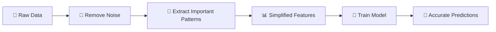
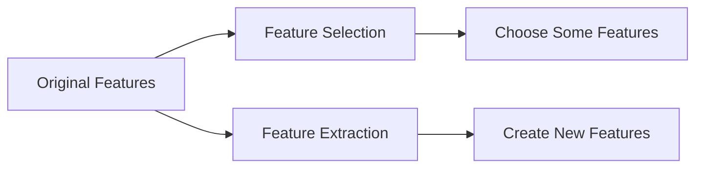

# 🎬 What is Feature Extraction?  
## The Day Raw Data Became Intelligent

---

# 🌌 Scene 1 — The Problem With Raw Data

Imagine you give a computer this:

An image.

What does the computer see?

Not a cat.  
Not a car.  
Not a human.

It sees:

Millions of tiny numbers.

If you give it text:

It does not see meaning.

It sees:

Letters. Symbols. Noise.

If you give it audio:

It does not hear music.

It sees:

Waves. Frequencies. Random signals.

Raw data is messy.

And machines don’t understand mess.

That is where something powerful begins.

# 🧠 Feature Extraction

---

# 🧠 What is Feature Extraction? (In Human Language)

Feature Extraction means:

Taking raw data  
And converting it into meaningful numbers  
That help a machine understand patterns.

Think of it like this:

Raw Data → Complex Jungle 🌳  
Feature Extraction → Clear Road 🛣  
Model → Car that drives on road 🚗  

Without a road, the car gets lost.

Without feature extraction, the model struggles.


---

# 🗺 The Big Transformation



---

# 💡 Why Feature Extraction is Important

Let’s imagine a photo.

It has 1,000,000 pixels.

Do we really need all 1,000,000 numbers?

No.

Feature extraction:

✔ Reduces complexity  
✔ Focuses on important parts  
✔ Makes training faster  
✔ Improves accuracy  
✔ Prevents overfitting  

Think of it like summarizing a book.

Instead of reading 500 pages,  
you read 5 important points.

---

# 🎭 Real-Life Analogy

Imagine a detective.

A crime scene has:

- Hundreds of objects
- Random noise
- Unimportant details

The detective ignores:

- Wall color
- Weather
- Background noise

And focuses on:

- Fingerprints
- Footprints
- Weapon

That selection of important clues?

That’s feature extraction.

---

# 🧮 Technique 1 — Statistical Feature Extraction

Let’s start simple.

Imagine this data:

[10, 20, 30, 40, 50]

Instead of using all numbers,
we summarize it using:

- Mean (average)
- Median (middle)
- Standard deviation (spread)

Now instead of 5 numbers,
we use just 3.

That is feature extraction.

---

## 🧠 What These Mean (Very Simple)

Mean → Average value  
Median → Middle value  
Standard Deviation → How spread out numbers are  
Correlation → How two things move together  

---

## 🌍 When To Use It?

Use statistical features when:

- Working with numerical data
- Time-series data
- Sensor data
- Finance data

---

# 🧩 Technique 2 — Dimensionality Reduction

Now imagine this:

Your dataset has 500 features.

Too many.

Your model gets confused.

Dimensionality reduction reduces:

500 features → 10 important ones

Without losing much information.

---

## 🎯 Principal Component Analysis (PCA)

PCA finds directions where data varies most.

Simple meaning:

It finds what matters most.

---

### 🧑‍💻 Example Code (Fully Explained)

```python
# Import PCA tool
from sklearn.decomposition import PCA

# Create PCA object
# n_components=2 means we want only 2 important features
pca = PCA(n_components=2)

# Fit PCA to data and transform it
# It finds most important directions automatically
reduced_data = pca.fit_transform(df)

# reduced_data now has only 2 columns instead of many
```

What happened?

- PCA studied patterns
- Found most important variations
- Compressed data

---

## 🎯 LDA (Linear Discriminant Analysis)

Used mostly for classification.

It tries to separate classes clearly.

Example:

Separate cats and dogs better.

---

## 🎯 t-SNE

Used for visualization.

Turns high-dimensional data into 2D or 3D
So humans can see patterns.

---

# 📜 Technique 3 — Feature Extraction in Text (NLP)

Machines cannot read text.

They need numbers.

---

## 🟢 Bag of Words (BoW)

Suppose sentence:

"I love AI"

We count words.

| Word | Count |
|------|-------|
| I    | 1     |
| love | 1     |
| AI   | 1     |

Now text becomes numbers.

Order doesn’t matter.

---

## 🟢 TF-IDF

Improves BoW.

If a word appears too often everywhere,
it becomes less important.

Rare important words get more weight.

---

### 🧑‍💻 Code Example

```python
from sklearn.feature_extraction.text import TfidfVectorizer

# Create TF-IDF tool
vectorizer = TfidfVectorizer()

# Transform text into numerical features
text_features = vectorizer.fit_transform([
    "I love AI",
    "AI is powerful"
])

# text_features now contains numbers
```

Now the model can understand text.

---

# 🔊 Technique 4 — Signal Processing

Used for:

- Audio
- Time-series
- Sensor signals

---

## 🎯 Fourier Transform

Converts time signals into frequency signals.

Example:

Instead of hearing sound,
we analyze frequencies.

Used in:

- Music analysis
- Speech recognition

---

## 🎯 Wavelet Transform

Analyzes signals that change over time.

Used for:

- EEG
- Earthquake signals

---

# 🖼 Technique 5 — Image Feature Extraction

An image is just pixels.

Feature extraction finds:

- Edges
- Shapes
- Patterns

---

## 🎯 HOG (Histogram of Oriented Gradients)

Finds edges in images.

Used in object detection.

---

## 🎯 CNN Features

Deep learning automatically learns features:

Layer 1 → edges  
Layer 2 → shapes  
Layer 3 → objects  

Used in:

- Face recognition
- Autonomous driving
- Medical imaging

---

# 🔄 Feature Selection vs Feature Extraction



| Feature Selection | Feature Extraction |
|------------------|--------------------|
| Picks some existing columns | Creates new transformed features |
| Easy to interpret | May be harder to interpret |
| Lower computation | Sometimes heavy computation |

Simple difference:

Selection = Choosing apples from basket 🍎  
Extraction = Making apple juice 🧃  

---

# 🧭 How To Choose the Right Method?

Ask:

1. What type of data?
   - Text → TF-IDF
   - Images → CNN / HOG
   - Numeric → PCA / Statistics
   - Signals → Fourier

2. Is dataset large?
   - Yes → Use dimensionality reduction

3. Is model overfitting?
   - Yes → Reduce features

---

# 🎯 Applications in Real World

- 🚗 Self-driving cars detect road signs
- 📧 Spam filters detect spam emails
- 🏥 MRI scans detect disease
- 🏭 Predict machine failure
- 💳 Detect fraud transactions

Feature extraction is everywhere.

---

# ⚠ Challenges

- Can lose important information
- Some methods are expensive
- Hard to interpret sometimes
- Too many features cause overfitting
- Too few features cause underfitting

Balance is key.

---

# 🏁 Final Understanding

Raw data is chaos.

Feature extraction is structure.

Without it:
- Models struggle
- Training slows
- Accuracy drops

With it:
- Faster training
- Better generalization
- Cleaner patterns
- Stronger predictions

You started this guide knowing nothing.

Now you understand:

- What feature extraction is
- Why it matters
- Major techniques
- Real-world use cases
- How it differs from feature selection

And now…

You can transform raw data into intelligence. 🚀
