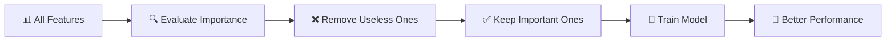
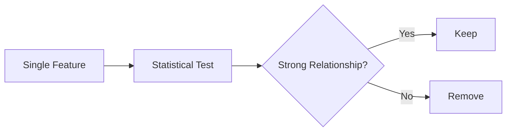
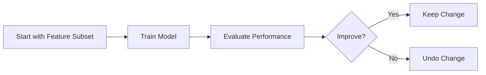
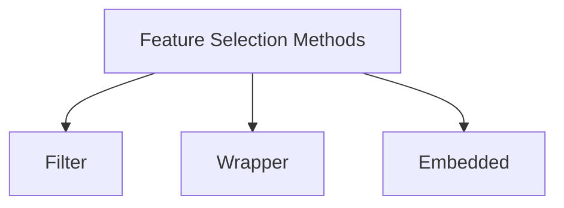

# 🎬 Feature Selection in Machine Learning  
## The Art of Choosing What Truly Matters

---

# 🌌 Scene 1 — The Overwhelmed Model

Imagine you are training a machine learning model.

You give it a dataset with:

- 200 columns
- 500 columns
- Maybe 2000 columns

The model tries to learn from everything.

Some columns help.

Some columns are useless.

Some columns confuse it.

The model becomes:

😵 Slow  
😵 Confused  
😵 Overfitted  

Now imagine something changes.

Instead of 500 features…

You give it only 25 meaningful ones.

Suddenly:

⚡ Training becomes faster  
🎯 Accuracy improves  
🧠 Model becomes smarter  

That magic is called:

# 🧠 Feature Selection

---

# 🧠 What is Feature Selection? (In Very Simple Language)

Feature Selection means:

Choosing only the important columns  
And removing the useless ones.

That’s it.

No transformation.  
No creating new features.  
Just choosing the best ones.

---

# 🍎 Real-Life Analogy

Imagine you are cooking soup.

You have:

- Salt
- Sugar
- Chili
- Chocolate
- Stones
- Sand

Do you put everything into the soup?

No.

You choose only what helps.

Feature Selection is removing:

🪨 Stones  
🏖 Sand  
🍫 Chocolate (if unnecessary)

And keeping:

🧂 Salt  
🌶 Chili  

---

# 🗺 The Big Idea



---

# 🤔 Why Do We Need Feature Selection?

Let’s understand deeply.

## 1️⃣ Improved Accuracy

Too many features = Noise  
Noise = Confusion  
Confusion = Bad Predictions  

Removing noise improves learning.

---

## 2️⃣ Faster Training

Less features = Less calculations  
Less calculations = Faster model  

Simple.

---

## 3️⃣ Easier to Understand

If your model uses:

300 features → Hard to explain  

If it uses:

10 features → Easy to explain  

Especially important in:

- Healthcare
- Finance
- Government systems

---

## 4️⃣ Avoid Curse of Dimensionality

Big term. Simple meaning.

When features increase too much:

Data becomes sparse.  
Patterns become harder to detect.

Feature selection reduces this problem.

---

# 🎯 Types of Feature Selection Methods

There are 3 main families.

Think of them as 3 strategies.

---

# 🟢 1. Filter Methods — The Fast Judge

These methods:

Look at each feature  
Individually  
Without training a model  

They ask:

“Does this feature have a relationship with the target?”

If yes → keep  
If no → remove  

---

## 🔄 How Filter Methods Work



---

## 📌 Common Filter Techniques

### ✔ Information Gain
Measures how much information a feature gives about the target.

### ✔ Chi-Square Test
Used for categorical data.

Checks if feature and target are related.

### ✔ Pearson Correlation
Measures linear relationship between two numeric variables.

### ✔ Variance Threshold
Removes features with very low variation.

If a column barely changes → useless.

---

## 💻 Example: Variance Threshold (Explained Line-by-Line)

```python
# Import the tool
from sklearn.feature_selection import VarianceThreshold

# Create object
# threshold=0.01 means:
# If variance is less than 0.01, remove that feature
selector = VarianceThreshold(threshold=0.01)

# Fit and transform data
# It studies all columns
# Removes columns with very low variance
new_data = selector.fit_transform(X)

# new_data now has fewer columns
```

Very simple logic:

If column barely changes → remove it.

---

## ✅ Advantages of Filter Methods

✔ Very fast  
✔ Works with large datasets  
✔ Easy to implement  
✔ Model independent  

---

## ❌ Limitations

⚠ Does not consider feature interaction  
⚠ May remove useful combined features  

---

# 🟡 2. Wrapper Methods — The Experimenter

Wrapper methods are different.

They:

Train a model  
Test feature combinations  
Choose the best performing subset  

They directly ask:

“Does this subset improve model performance?”

---

## 🔄 Wrapper Workflow



---

## 📌 Common Wrapper Techniques

### ✔ Forward Selection

Start with zero features.

Add one by one.

Keep adding if performance improves.

---

### ✔ Backward Elimination

Start with all features.

Remove one by one.

Stop when performance drops.

---

### ✔ Recursive Feature Elimination (RFE)

Repeatedly:

Train model  
Remove least important feature  

Until best subset remains.

---

## 💻 Example: RFE (Fully Explained)

```python
from sklearn.feature_selection import RFE
from sklearn.linear_model import LogisticRegression

# Create model
# This is the model used to evaluate features
model = LogisticRegression()

# Create RFE object
# n_features_to_select=5 means:
# We want only 5 best features
selector = RFE(model, n_features_to_select=5)

# Fit RFE on data
# It trains model multiple times
# Removes least important feature step by step
selector = selector.fit(X, y)

# Transform data
# Keeps only selected 5 features
X_new = selector.transform(X)
```

Important:

Wrapper methods are powerful  
But computationally expensive.

---

## ✅ Advantages

✔ Often better performance  
✔ Considers feature interaction  
✔ Model-specific optimization  

---

## ❌ Limitations

⚠ Slow for large datasets  
⚠ Risk of overfitting  

---

# 🔵 3. Embedded Methods — The Built-in Intelligence

These methods:

Select features during model training.

They combine:

Filter + Wrapper ideas.

Feature selection happens automatically.

---

## 📌 Common Embedded Techniques

### ✔ L1 Regularization (Lasso)

Shrinks some feature weights to zero.

Zero weight = feature removed.

---

### ✔ Decision Trees

Trees automatically:

Choose important features  
Ignore useless ones  

Based on impurity reduction.

---

### ✔ Random Forest

Uses many trees.

Measures feature importance.

Keeps strong predictors.

---

## 💻 Example: Lasso (Line-by-Line Explained)

```python
from sklearn.linear_model import Lasso

# alpha controls regularization strength
# Higher alpha = more features removed
model = Lasso(alpha=0.1)

# Train model
# During training, it pushes some coefficients to zero
model.fit(X, y)

# Get feature coefficients
# Features with 0 coefficient are not useful
print(model.coef_)
```

If coefficient is 0 → model ignored that feature.

That is embedded feature selection.

---

## ✅ Advantages

✔ Efficient  
✔ Less computational cost than wrapper  
✔ Model-aware selection  

---

## ❌ Limitations

⚠ Works only with specific models  
⚠ Sometimes harder to interpret  

---

# 🧭 How to Choose the Right Method?

Ask yourself:

### 📊 Large dataset?
→ Use Filter methods.

### 🧠 Small dataset + Need high accuracy?
→ Try Wrapper.

### 🌳 Using tree-based models?
→ Embedded works automatically.

### 📖 Need explainability?
→ Filter methods are easier.

---

# 🥊 Quick Comparison



| Method     | Speed | Accuracy | Computation | Best For |
|------------|-------|----------|------------|----------|
| Filter     | Fast  | Medium   | Low        | Large data |
| Wrapper    | Slow  | High     | High       | Small datasets |
| Embedded   | Medium| High     | Medium     | Tree/L1 models |

---

# 🎯 Real-World Applications

- 🏥 Medical diagnosis (select critical biomarkers)
- 💳 Fraud detection (important transaction features)
- 📧 Spam detection (important words)
- 🚗 Autonomous driving (important sensor inputs)
- 🏦 Credit scoring (important financial indicators)

---

# 🏁 Final Understanding

Feature Selection is not magic.

It is discipline.

It teaches the model:

“What to focus on.”

Without it:

- Models overfit
- Training slows
- Interpretability decreases

With it:

- Faster models
- Cleaner patterns
- Better generalization
- Stronger predictions

---

You started this guide maybe thinking:

“It’s just removing columns.”

Now you understand:

It’s choosing intelligence over noise.

And that…

Changes everything. 🚀
