## Watch Data Transform Step-By-Step

---

# 🎬 1️⃣ Feature Extraction — From Chaos to Structure

### 🌀 Step 1: Raw Data (Messy & Complex)

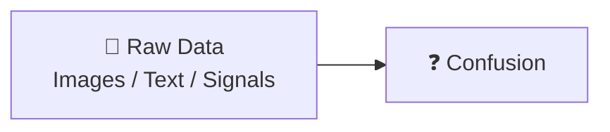

---

### 🧹 Step 2: Remove Noise & Capture Patterns

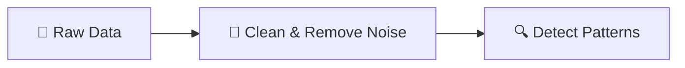

---

### ✨ Step 3: Transformed Features

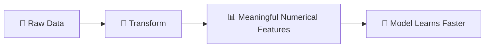

---

### 🎥 Final Animated Flow (Full View)

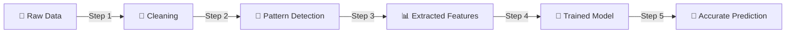

As you scroll, it feels like the transformation is happening.

---

# 🎬 2️⃣ Feature Selection — Removing the Noise

### 🧱 Step 1: Too Many Features

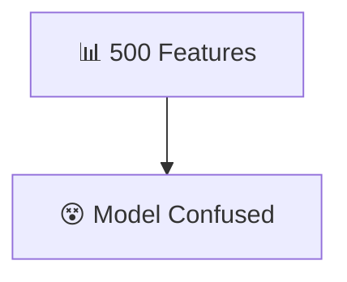

---

### 🔍 Step 2: Evaluate Each Feature

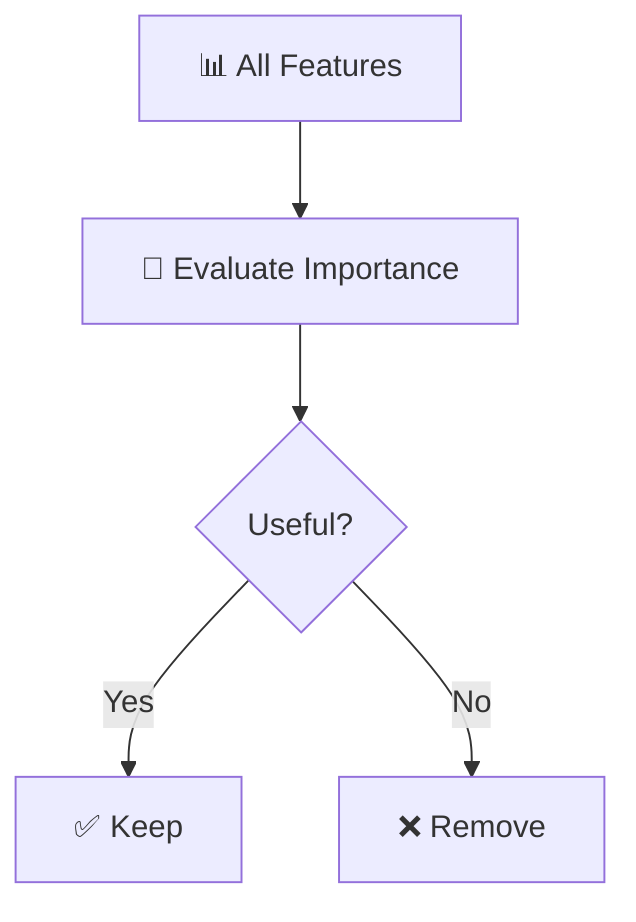

---

### ✂ Step 3: Clean Feature Set

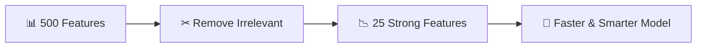

---

# 🎬 3️⃣ Feature Engineering — Creating Intelligence

### 🧪 Step 1: Raw Inputs

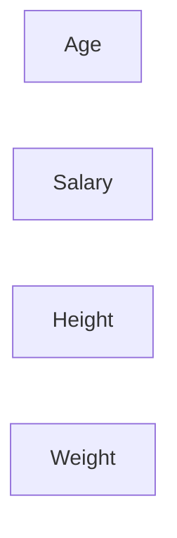

---

### 🛠 Step 2: Create Smart Features

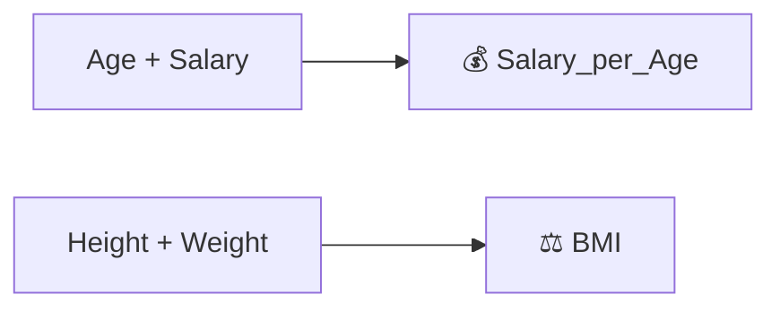

---

### 🚀 Step 3: Enhanced Learning

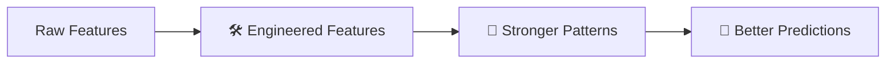

---

# 🎞 Ultimate Trilogy Animation (Full Journey)

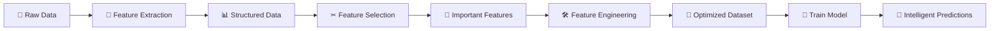

This creates a **cinematic scroll experience**.

---

# 🎨 BONUS: Loop Animation Feel (Continuous Improvement)

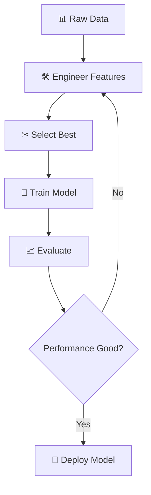

This makes it feel like an infinite improvement loop.

---
