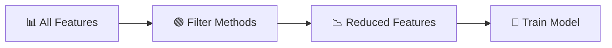
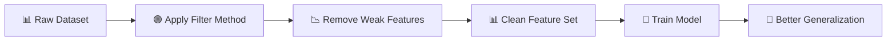

# 🎬 Feature Selection — Filter Methods  
## The Fastest Way to Remove Noise Before Your Model Even Starts

> Part of the Feature Selection Series  
> You need zero prior knowledge to understand this.

---

# 🌌 Scene 1 — The Overloaded Dataset

Imagine you have a dataset with:

- 10,000 rows  
- 500 columns  

Some columns are useful.  
Some are useless.  
Some are completely random.

If you train a model directly:

😵 It learns noise  
🐢 It trains slowly  
📉 It overfits  

So before the model even wakes up…

We clean the stage.

That first cleaning step is often:

# 🟢 Filter Methods

---

# 🧠 What is Feature Selection? (Simple Version)

Feature Selection means:

👉 Choosing only the useful columns  
👉 Removing irrelevant ones  

Unlike Feature Extraction:

- We **do NOT create new features**
- We **keep original columns**
- We just choose the best ones

---

## 📐 Mathematical View (Don’t Panic — Very Simple)

Let:

- **X ∈ ℝⁿˣᵈ** → Data with `n` samples and `d` features  
- **y ∈ ℝⁿ** → Target variable  

Our goal:

Choose a subset of features:

S ⊆ {1, 2, 3, ..., d}

Such that features in S best predict y.

In simple words:

Pick the columns that help predict the output.

---

# 🗺 Where Do Filter Methods Fit?



Filter methods happen:

✔ Before training  
✔ Without using a model  
✔ Very fast  

---

# ⚖ Filter vs Wrapper vs Embedded

| Method     | Uses Model? | Speed | Captures Feature Interaction? |
|------------|------------|-------|-------------------------------|
| Filter     | ❌ No      | ⚡ Fast | ❌ No |
| Wrapper    | ✅ Yes     | 🐢 Slow | ✅ Yes |
| Embedded   | ✅ Yes     | ⚖ Moderate | ✅ Yes |

Filter methods are:

🧹 The first cleaning pass.

---

# 🟢 What Are Filter Methods?

Filter methods:

- Evaluate each feature independently
- Use statistical measures
- Do NOT train a model
- Remove irrelevant features quickly

Think of them like:

A security guard checking IDs one by one  
Instead of interviewing everyone deeply.

---

# 🔎 1️⃣ Variance Threshold

## 🎭 Intuition

If a feature barely changes…

It cannot help prediction.

Example:

If a column has value:

1, 1, 1, 1, 1, 1

Does it help prediction?

No.

Because it contains no variation.

---

## 📐 Formula

Variance of feature Xⱼ:

Var(Xⱼ) = (1/n) Σ (xᵢⱼ − meanⱼ)²

If:

Var(Xⱼ) < threshold

→ Remove it.

---

## 💻 Code (Fully Explained)

```python
# Import the variance filter tool
from sklearn.feature_selection import VarianceThreshold

# Create selector
# threshold=0.01 means:
# If variance is less than 0.01, remove that column
selector = VarianceThreshold(threshold=0.01)

# Fit and transform the data
# It calculates variance for each column
# Then removes low-variance columns
X_selected = selector.fit_transform(X)

# X_selected now contains fewer columns
```

✔ Very fast  
✔ Works for any data  

---

# 🔎 2️⃣ Correlation Coefficient (Pearson)

## 🎭 Intuition

We ask:

“How strongly is this feature related to the target?”

If correlation is near zero:

Feature is weak.

---

## 📐 Formula

ρ = Cov(Xⱼ, y) / (σXⱼ σy)

If:

|ρ| < threshold

→ Remove feature.

---

## 💻 Code (Fully Explained)

```python
import pandas as pd

# Calculate correlation matrix
correlations = df.corr()['target']

# Remove the target itself from list
correlations = correlations.drop('target')

# Select features where correlation is strong
selected_features = correlations[correlations.abs() > 0.1].index

# Keep only those columns
X_selected = df[selected_features]
```

What happened?

- We measured relationship strength
- Kept features with strong correlation

---

# 🔎 3️⃣ Chi-Squared Test (χ²)

Used when:

- Target is categorical
- Features are categorical

---

## 🎭 Intuition

We check:

Are feature and target independent?

If independent → useless  
If dependent → useful  

---

## 📐 Formula

χ² = Σ (O − E)² / E

Where:

O = observed frequency  
E = expected frequency  

Higher χ² → stronger relationship  

---

## 💻 Code (Explained)

```python
from sklearn.feature_selection import SelectKBest, chi2

# Select top 10 features using chi-square
selector = SelectKBest(score_func=chi2, k=10)

# Fit on data
X_new = selector.fit_transform(X, y)

# X_new now has 10 best categorical features
```

---

# 🔎 4️⃣ Mutual Information (MI)

## 🎭 Intuition

Correlation only captures linear relationships.

But what if relationship is curved?

Mutual Information captures:

✔ Linear  
✔ Non-linear  

It measures shared information.

---

## 💻 Code

```python
from sklearn.feature_selection import mutual_info_classif

# Calculate mutual information score for each feature
mi_scores = mutual_info_classif(X, y)

# Keep features with score > 0.1
X_selected = X[:, mi_scores > 0.1]
```

Higher MI → More predictive power.

---

# 🔎 5️⃣ ANOVA F-Test

Used when:

- Target is categorical
- Features are continuous

---

## 🎭 Intuition

It checks:

Are feature means different across classes?

If yes → useful feature.

---

## 💻 Code

```python
from sklearn.feature_selection import f_classif

# Calculate F values and p-values
F_values, p_values = f_classif(X, y)

# Keep features where p-value < 0.05
X_selected = X[:, p_values < 0.05]
```

Low p-value → significant difference → useful.

---

# 📊 Comparison Table

| Method | Target Type | Feature Type | Captures Non-linear? |
|--------|------------|-------------|----------------------|
| Variance | Any | Any | ❌ |
| Correlation | Continuous | Continuous | ❌ |
| Chi-Square | Categorical | Categorical | ❌ |
| Mutual Info | Any | Any | ✅ |
| ANOVA | Categorical | Continuous | ❌ |

---

# 🧪 Full Example — Step-by-Step Pipeline

Let’s use Iris dataset.

```python
from sklearn.datasets import load_iris
from sklearn.preprocessing import StandardScaler
from sklearn.feature_selection import VarianceThreshold, SelectKBest, f_classif

# Load dataset
iris = load_iris()

# Features
X = iris.data

# Target
y = iris.target

# Step 1: Standardize features
# This makes all columns comparable
scaler = StandardScaler()
X_scaled = scaler.fit_transform(X)

# Step 2: Remove low variance features
var_selector = VarianceThreshold(threshold=0.1)
X_var = var_selector.fit_transform(X_scaled)

# Step 3: Apply ANOVA F-test
# Select top 2 best features
f_selector = SelectKBest(score_func=f_classif, k=2)
X_final = f_selector.fit_transform(X_var, y)

print(X_final.shape)
```

Now:

✔ Dataset is smaller  
✔ Model trains faster  
✔ Noise reduced  

---

# 🎯 When Should You Use Filter Methods?

Use them:

✔ At the beginning of your pipeline  
✔ For very large datasets  
✔ During EDA  
✔ Before wrapper/embedded methods  

Especially useful for:

- Text data (thousands of words)
- Genomics
- High-dimensional datasets

---

# ⚠ Limitations (Very Important)

❌ Ignores feature interaction  
❌ Depends on chosen threshold  
❌ Might remove features that work well together  
❌ No model feedback  

Filter methods are fast…

But not always perfect.

---

# 🎬 Final Flow (Animated Style)



---

# 🏁 Final Understanding

Filter Methods are:

🧹 Fast  
⚡ Scalable  
🧠 Simple  
🎯 Effective for first-pass cleaning  

They prepare the battlefield.

So when the model enters…

It sees clarity instead of chaos.

---

You now understand:

- What filter methods are  
- Why they exist  
- When to use them  
- Their mathematical intuition  
- How to implement them  

And most importantly…

Why speed and simplicity sometimes win. 🚀
