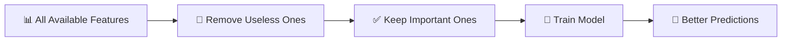
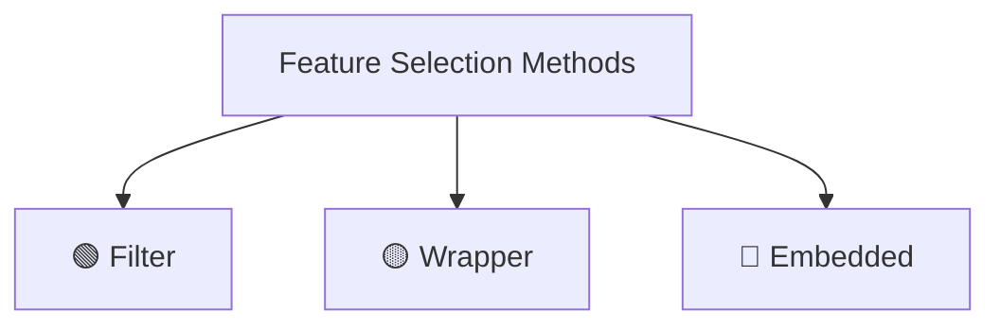
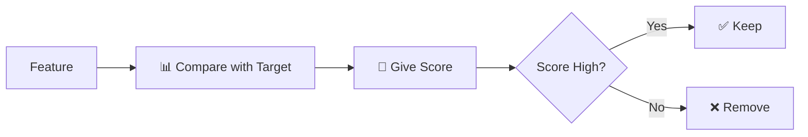
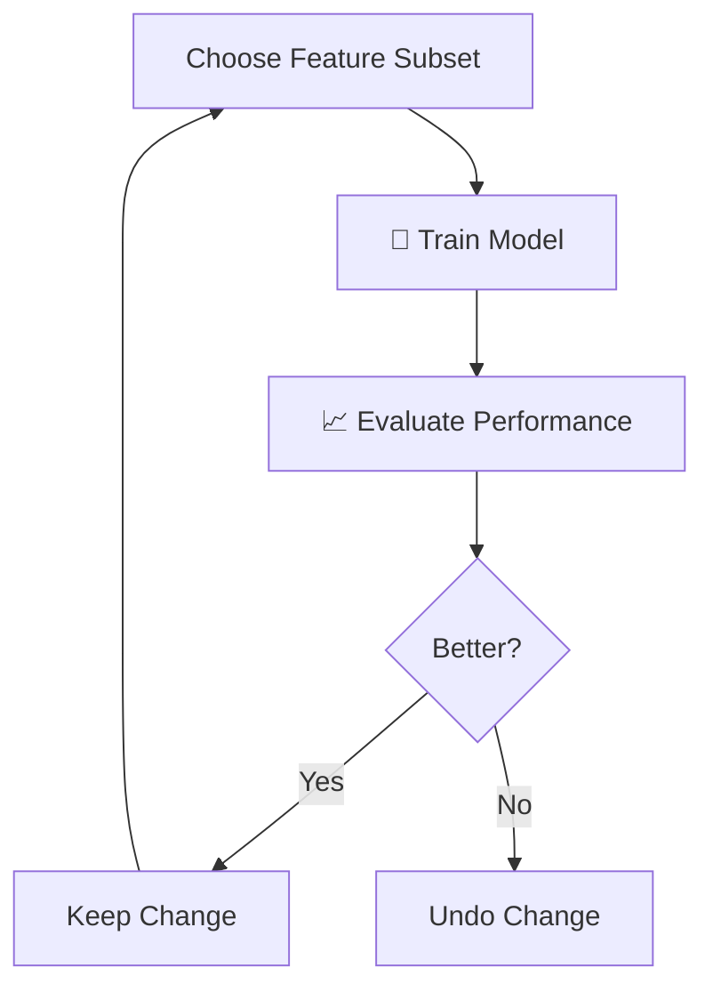
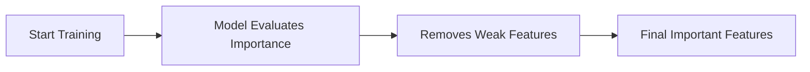
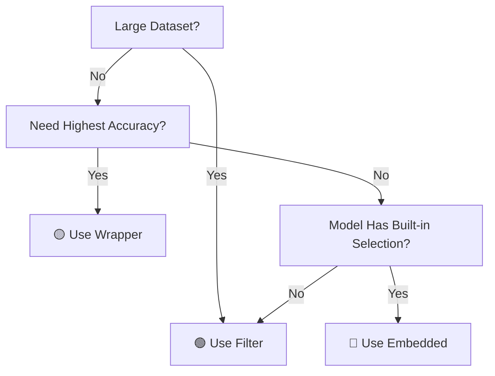
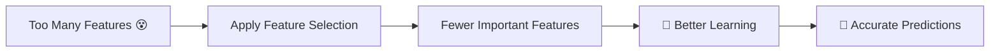

# 🌟 The Story of Feature Selection in Machine Learning

*(Explained for Complete Beginners — With Characters, Flowcharts & Simple Visuals)*

---

## 🎭 Meet Our Characters

* 👩 **Riya** – A curious beginner who just started learning Machine Learning.
* 👨‍🏫 **Professor Arjun** – A patient teacher who explains everything slowly.
* 🤖 **Milo** – A small robot who wants to become smart by learning from data.

---

# 📌 Chapter 1: What is Feature Selection?

One day, Riya walked into the lab.

Milo the robot was confused.

> 🤖 Milo: “I have too much information! I don’t know what is important!”

Riya looked at Professor Arjun.

> 👩 Riya: “Sir, what is happening?”

Professor Arjun smiled.

> 👨‍🏫 “Milo is trying to learn. But he has too many **features**.”

---

## 🧠 First Important Question: What is a Feature?

A **feature** is simply an **input piece of information**.

If we are predicting house prices, features can be:

* Number of rooms
* Size of house
* Location
* Age of house
* Distance from school

Each of these pieces of information = **Feature**

---

## 🤖 What is Machine Learning?

Machine Learning means:

👉 Teaching a computer (like Milo) to learn patterns from data
👉 So it can make predictions

---

## ❓ So What is Feature Selection?

Professor Arjun drew something on the board.




### ✅ Feature Selection means:

> Choosing only the most useful input features for a machine learning model.

In simple words:

🎯 "Keep what matters. Remove what doesn’t."

---

# 📌 Why Do We Need Feature Selection?

Riya asked:

> “Why can’t Milo just use everything?”

Professor Arjun replied:

Imagine Milo trying to study:

* Important notes
* Random scribbles
* Old shopping list
* Phone numbers
* Useful formulas

He would get confused.

---

## 🔎 Problems When We Use Too Many Features

### 1️⃣ Irrelevant Features

Information that does NOT help prediction.

Example:
Predicting house price using:

* Owner’s favorite color ❌

---

### 2️⃣ Redundant Features

Features that repeat the same information.

Example:

* Height in meters
* Height in centimeters
  (They mean the same thing.)

---

## 🎯 Benefits of Feature Selection

| Problem            | Solution            |
| ------------------ | ------------------- |
| Too much noise     | Remove useless data |
| Slow training      | Use fewer features  |
| Overfitting        | Reduce complexity   |
| Hard to understand | Simpler model       |

---

## 🧠 What is Overfitting? 

Overfitting means:

The model memorizes training data instead of learning patterns.

Like:

A student memorizes answers instead of understanding the topic.

Result?

❌ Fails in real exam.

---

## 📉 Curse of Dimensionality 

Big name. Simple meaning.

If we have too many features:

* Data becomes sparse
* Patterns become harder to find
* Model becomes confused

Imagine searching for a friend:

* In 1 room → easy
* In 1000 rooms → difficult

That’s the curse of dimensionality.

---

# 📌 Types of Feature Selection Methods

Professor Arjun said:

“There are 3 main ways to choose features.”



Let’s explore each.

---

# 🟢 1. Filter Methods

### 🎬 Scene: Milo Uses a Checklist

Filter methods:

✔ Check each feature individually  
✔ Do NOT train a model  
✔ Are very fast  

---

## 🔄 How Filter Works



It’s like grading features.

---

If score is high → Keep
If score is low → Remove


---

## 📊 Common Filter Techniques

### 1️⃣ Information Gain

Measures how much uncertainty is reduced.

Simple meaning:

👉 Does this feature help us reduce confusion?

---

### 2️⃣ Chi-Square Test

Used for categorical data.

Checks:
👉 Is there a relationship between feature and target?

---

### 3️⃣ Pearson Correlation

Measures linear relationship between two numbers. Measures how strongly two numbers move together.

Value ranges from:

* -1 (strong negative)
* 0 (no relation)
* +1 (strong positive)

---

### 4️⃣ Variance Threshold

If a feature barely changes → It’s useless.

Example:

If every student has age = 20
Then age gives no useful information.

---

## ✅ Advantages of Filter Methods

✔ Very fast
✔ Good for large datasets
✔ Easy to implement
✔ Works with any model

---

## ❌ Limitations

✖ Ignores interaction between features
✖ Choosing correct metric is important

---

# 🟡 2. Wrapper Methods

🎬 Scene: Milo tries combinations.

Riya noticed something different.

Wrapper methods are smarter.

They:

👉 Try different combinations of features
👉 Train the model
👉 Check performance

---

## 🔄 How Wrapper Works



---

## 📚 Common Wrapper Techniques

### 1️⃣ Forward Selection


Start with NOTHING.

```
No features
   ↓
Add best feature
   ↓
Add next best
   ↓
Stop when no improvement
```

---

### 2️⃣ Backward Elimination

Start with EVERYTHING.

```
All features
    ↓
Remove worst feature
    ↓
Repeat
```

---

### 3️⃣ Recursive Feature Elimination (RFE)

Step-by-step removal of least important features.

---

## ✅ Advantages

✔ Often better performance
✔ Model-specific optimization

---

## ❌ Limitations

✖ Very slow for big datasets
✖ Risk of overfitting
✖ Computationally expensive

---

# 🔵 3. Embedded Methods

🎬 Scene: Milo learns and selects at the same time.

Embedded methods:

✔ Select features DURING training  
✔ Combine filter + wrapper benefits  

Professor Arjun smiled.

“These are clever.”

Embedded methods select features **during model training**.

So feature selection happens automatically.

---

## 🔄 How Embedded Works




---

## 📚 Common Embedded Techniques

### 1️⃣ L1 Regularization (Lasso)

Important one.

It pushes some feature weights to ZERO.

If weight = 0 → Feature removed.

---

### 2️⃣ Decision Trees

Trees choose features that reduce impurity.

More useful feature → Higher in tree.

---

### 3️⃣ Random Forest

Many decision trees working together.

---

### 4️⃣ Gradient Boosting

Focuses on features that reduce prediction error most.

---

## ✅ Advantages

✔ Efficient
✔ Combines benefits of filter + wrapper
✔ Good performance

---

## ❌ Limitations

✖ Harder to interpret
✖ Not available for all models

---

# 📌 How to Choose the Right Method?

Riya asked:

> “Which method should I use?”

Professor Arjun replied:

It depends.

---

## 🎯 Decision Flowchart




```
Is dataset large?
      ↓
   Yes → Use Filter
   No  ↓
Is computation power high?
      ↓
   Yes → Use Wrapper
   No  ↓
Does model support built-in selection?
      ↓
   Yes → Use Embedded
```

---

# 🏁 Final Summary (Milo’s Learning)

Milo finally understood.
Milo finally understood:



He was no longer confused.

He was focused.

---

## 🧠 What We Learned

Feature Selection:

✔ Removes irrelevant features
✔ Removes redundant features
✔ Improves accuracy
✔ Reduces overfitting
✔ Speeds up training
✔ Makes model easier to understand

---

# 🎉 The Moral of the Story

Machine Learning is not about using more data.

It is about using the **right data**.

Just like:

A smart student studies important topics,
not the entire library.

---


