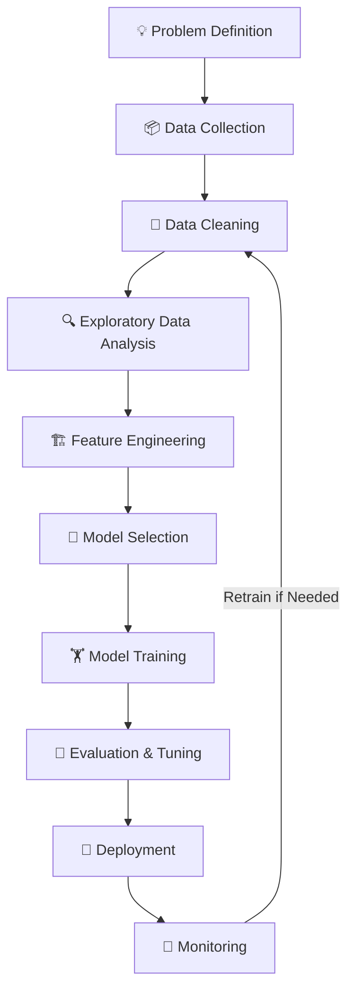

# 🚀 The Machine Learning Lifecycle  
## A Story of How an Idea Becomes an Intelligent System 🤖

---

## 🌟 Once Upon a Time...

Imagine you are sitting with a simple idea:

> “What if I could build a system that predicts house prices?” 🏠  
> “What if I could detect spam emails automatically?” 📧  
> “What if I could recommend the perfect movie?” 🎬  

That small idea...  
is where every Machine Learning project begins.

But how does that idea turn into a working intelligent system?

Welcome to the **Machine Learning Lifecycle** —  
a journey from 💡 idea → 🤖 intelligence → 🌍 real-world impact.

---

# 🧭 Chapter 1: The Question

Every story begins with a question.

Before writing a single line of code, you ask:

- What exactly am I solving?
- Who will use this?
- How will I measure success?

You sit with stakeholders.
You understand business goals.
You define what “success” means.

🎯 This step is called **Problem Definition**.

Without a clear problem, even the smartest model is useless.

---

# 📦 Chapter 2: Gathering the Treasure (Data Collection)

Now you need something powerful.

Data.

Data is the fuel.
Data is the teacher.
Data is the experience.

Without data, your model is just an empty brain.

You carefully collect data that is:

- Relevant to your problem ✅  
- High quality and accurate ✅  
- Large enough to learn from ✅  
- Diverse enough to cover real-world cases ✅  

Bad data leads to bad predictions.
Good data builds strong intelligence.

---

# 🧹 Chapter 3: Cleaning the Chaos

Reality hits.

The data is messy.

Some values are missing.
Some rows are duplicated.
Some numbers look strange.
Some formats don’t match.

Training a model on messy data is like cooking with dirty vegetables 🥦

So you clean it.

You:
- Fix missing values  
- Remove duplicates  
- Standardize formats  
- Convert text into numbers  

✨ This step is called **Data Cleaning & Preprocessing**.

Now the data is ready to teach.

---

# 🔍 Chapter 4: Becoming a Detective (EDA)

Before building the model, you pause.

You explore.

You ask:
- Are there patterns hidden inside?
- Do certain features relate strongly?
- Are there unusual values?

You create graphs.
You visualize trends.
You analyze distributions.

You become a data detective 🕵️‍♂️

This stage is called **Exploratory Data Analysis (EDA)**.

And often…  
this is where the real insights appear.

---

# 🏗️ Chapter 5: Choosing the Right Ingredients (Feature Engineering)

Now you think deeper.

Which pieces of information truly matter?

These pieces are called **features**.

Example (House Price Prediction 🏠):
- Size
- Location
- Number of rooms

But maybe you can create something smarter:
- Price per square foot
- Age of the house

You:
- Create better features  
- Remove useless ones  
- Keep only what matters  

This step makes your model sharper and faster.

This is **Feature Engineering & Selection**.

---

# 🧠 Chapter 6: Choosing the Brain (Model Selection)

Now comes an important decision.

Which algorithm should power your system?

Different problems need different brains:

- Classification → Yes/No problems  
- Regression → Predicting numbers  

You experiment.
You compare.
You evaluate.

Accuracy matters.
Speed matters.
Explainability matters.

Finally, you choose the best model for the job 🏆

---

# 🏋️ Chapter 7: Teaching the Brain (Model Training)

Now the real training begins.

You feed historical data to the model.

It studies patterns.
It makes mistakes.
It adjusts.
It improves.

Like teaching a child:

1. Show examples  
2. Correct mistakes  
3. Repeat  
4. Improve  

This is not magic.
It’s mathematics and iteration.

Train → Check Error → Adjust → Repeat 🔄

The model slowly becomes smarter.

---

# 🧪 Chapter 8: The Test

Now you challenge it.

You give it data it has never seen before.

You ask:

- How accurate are you?
- Can we trust you?
- Where do you fail?

You measure performance using:

- Accuracy 🎯  
- Precision 🎯  
- Recall 🎯  
- F1 Score 🎯  

If it’s not good enough?

You tune it.
You adjust hyperparameters.
You retrain.

And improve again.

---

# 🚀 Chapter 9: Entering the Real World (Deployment)

The model is ready.

It leaves the lab.

Now it lives inside:
- Apps 📱  
- Websites 🌐  
- APIs 🔗  

Users interact with it.

It predicts.
It recommends.
It detects fraud.
It filters spam.

Your idea is now real.

---

# 🔄 Chapter 10: The Never-Ending Journey (Monitoring)

But here’s the twist…

The world changes.

User behavior changes.
Market conditions change.
Data patterns shift.

This is called **Data Drift**.

If ignored, your model slowly becomes inaccurate 📉

So you monitor it.
You track performance.
You retrain when needed.

Machine Learning is not “build once and forget.”

It is:

Build → Deploy → Monitor → Improve → Repeat 🔁

---

# 🔄 The Complete Journey (Flowchart)

Notice something important:

It’s a cycle.

Not a straight line.

---

# 🏁 The Moral of the Story

Machine Learning is not magic.

It is:
- Structured  
- Iterative  
- Logical  
- Continuous  

Every intelligent system you see today —  
from recommendation engines to fraud detection —  
follows this lifecycle.

And now…

You understand the journey.

---

## 🌟 If This Helped You

- ⭐ Star this repository  
- 📢 Share it with others  
- 🤝 Contribute improvements  

Because learning is better when shared.

Happy Building 🤖✨
