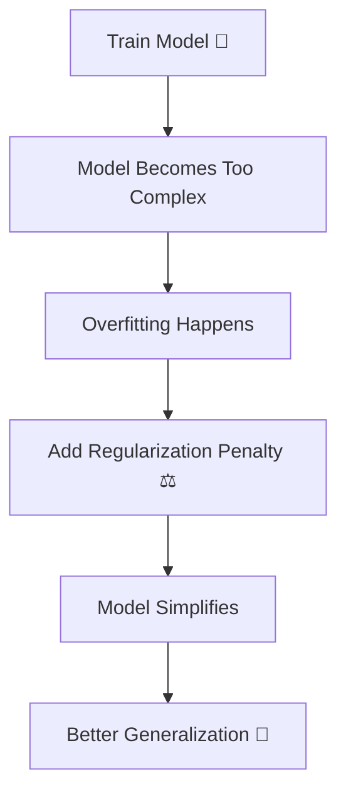
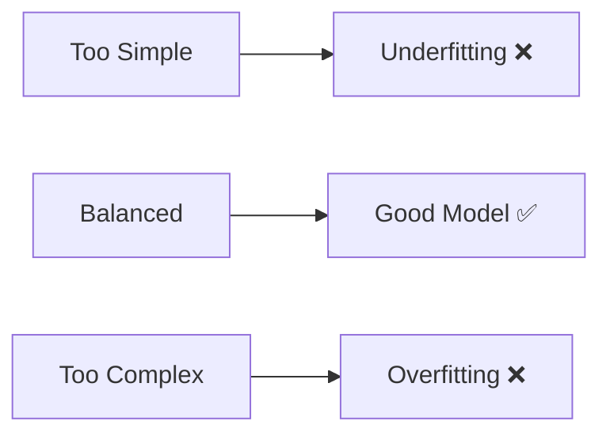

# 🎬 Regularization  
## 🧠 The Day Kabir’s Model Memorized Everything… and Understood Nothing

---

## 🌟 Meet the New Characters

👨‍🎓 **Kabir** – Commerce student. Zero coding background.  
👩‍🏫 **Dr. Ananya** – Machine learning mentor. Calm but dramatic.  
🤖 **Echo** – The machine learning model. Very obedient… maybe too obedient.

---

# 🌌 Chapter 1: The Perfect Student (Who Failed in Real Life)

Kabir trained a model.

Training Accuracy: **100%** 🎉  
Test Accuracy: **62%** 😨  

Kabir panicked.

> “How can it be perfect… and still be bad?”

Dr. Ananya smiled.

> “Because Echo memorized the textbook.  
> It didn’t understand the concept.”

And that’s where the real story begins.

---

# 🧠 First — What Problem Are We Solving?

The problem is called:

# 🎯 Overfitting

Overfitting means:

> The model memorizes training data  
> instead of learning patterns.

It becomes too complex.

---

# 🎴 Real-Life Analogy

Imagine a student:

Instead of understanding math…

He memorizes:

- Question 1 answer
- Question 2 answer
- Question 3 answer

In exam:

Questions change slightly.

He fails.

That’s overfitting.

---

# 🔥 Why Overfitting Happens

Because the model is:

- Too flexible
- Too powerful
- Too complex

It tries to fit **every small noise**.

---

# 🎬 Enter: Regularization

Dr. Ananya said:

> “We need to discipline Echo.”

Regularization means:

> Adding a penalty for being too complex.

It forces the model to stay simple.

---

# 🧠 Simple Definition

Regularization =  
“Don’t become unnecessarily complicated.”

---

# 🔄 Big Concept Flow



---

# 🧠 Where Does Regularization Work?

Mostly in:

- Linear Regression
- Logistic Regression
- Neural Networks

It works by modifying the **loss function**.

---

# 🧩 What Is Loss Function? (Very Simple)

Loss function =  
A number that tells how wrong the model is.

Smaller loss = Better model.

---

# 🎯 Without Regularization

Loss = Error

---

# 🎯 With Regularization

Loss = Error + Penalty for complexity

If model becomes too complex → penalty increases.

So model avoids complexity.

---

# 🧠 Two Famous Types

# 1️⃣ L1 Regularization (Lasso)

Adds penalty using absolute values.

Effect:

- Pushes some weights to zero.
- Removes unnecessary features.

It acts like:

🧹 Feature cleaner.

---

# 2️⃣ L2 Regularization (Ridge)

Adds penalty using squared values.

Effect:

- Shrinks weights.
- Makes them smaller.
- But rarely zero.

It acts like:

🎚 Volume controller.

---

# 🎴 Analogy for L1 vs L2

Imagine you have 10 friends in a project.

L1 says:

> “Some of you are useless. Leave.”

L2 says:

> “Everyone stay. But speak less.”

---

# 💻 Simple Code Example (With Beginner Comments)

Let’s use Linear Regression with L2 regularization.

```python
from sklearn.linear_model import Ridge
from sklearn.model_selection import train_test_split
from sklearn.metrics import mean_squared_error

# Step 1: Split data into training and testing
# This ensures we test on unseen data
X_train, X_test, y_train, y_test = train_test_split(X, y, test_size=0.2)

# Step 2: Create Ridge model
# alpha controls strength of regularization
# higher alpha = stronger penalty
model = Ridge(alpha=1.0)

# Step 3: Train the model
model.fit(X_train, y_train)

# Step 4: Make predictions on test data
predictions = model.predict(X_test)

# Step 5: Measure error
error = mean_squared_error(y_test, predictions)

print("Test Error:", error)
```

---

# 🧠 What Does Alpha Mean?

Alpha = strength of discipline.

Small alpha → Almost no penalty  
Large alpha → Heavy penalty  

Too small → Overfitting  
Too large → Underfitting  

We choose balanced value.

---

# 🔥 What Happens If Alpha Is Too Large?

Model becomes too simple.

It underfits.

Underfitting means:

> Model is too basic to capture patterns.

---

# ⚖ Overfitting vs Underfitting



---

# 🎬 Chapter 2: Kabir Experiments

No Regularization:

Training Accuracy: 100%  
Test Accuracy: 62%

With Regularization:

Training Accuracy: 88%  
Test Accuracy: 85%

Kabir was confused.

> “Why did training accuracy drop?”

Dr. Ananya smiled.

> “Because now it is learning properly.”

---

# 🧠 Why Regularization Improves Real-World Performance

Because real-world data is messy.

Noise exists.

Regularization prevents model from chasing noise.

---

# 🌍 Real-World Example

In stock prediction:

Market has noise.

If model tries to memorize small fluctuations…

It fails next day.

Regularization keeps it stable.

---

# 🎯 When Should You Use Regularization?

✔ When model overfits  
✔ When dataset has many features  
✔ When training accuracy >> test accuracy  
✔ In neural networks  

Almost always useful in linear models.

---

# 🧠 Mathematical Intuition (Very Light)

Normal Loss:

Error

With L2:

Error + alpha × (sum of weights²)

With L1:

Error + alpha × (sum of |weights|)

That extra part = penalty.

---

# 🎬 Final Scene

Kabir looked at Echo.

Before:

Echo memorized.

After Regularization:

Echo understood patterns.

Dr. Ananya said:

> “Simplicity is power.”

---

# 🧠 What You Now Understand

✔ What overfitting is  
✔ What regularization does  
✔ Difference between L1 and L2  
✔ What alpha means  
✔ When to use it  

---


Where should Kabir go next? 🎬
