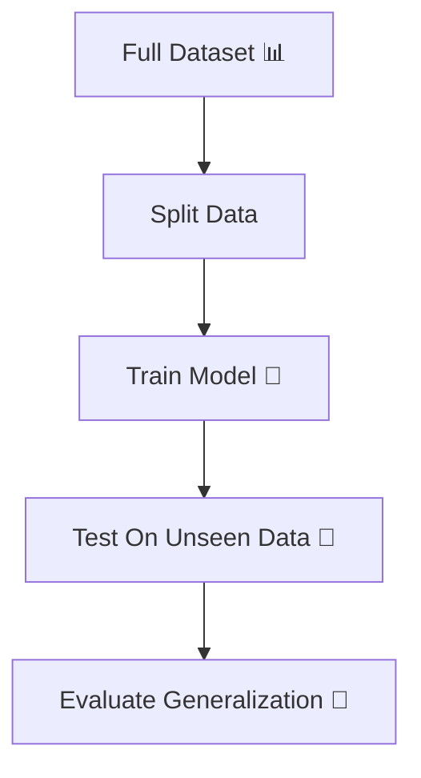
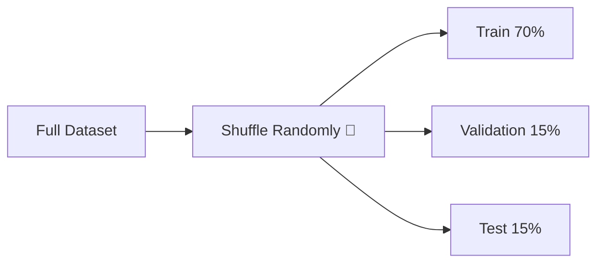
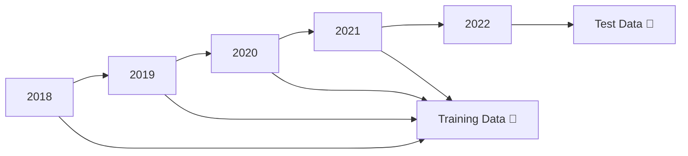
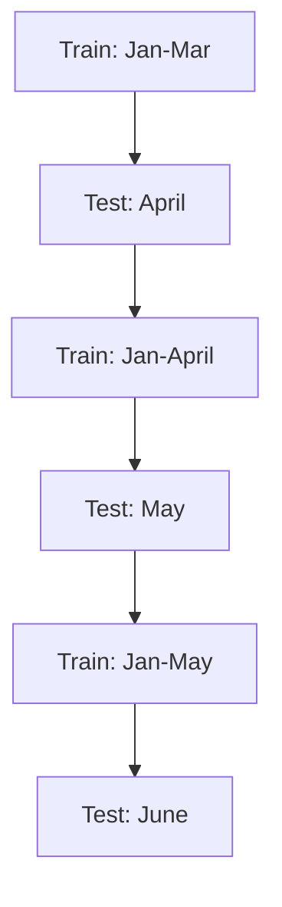
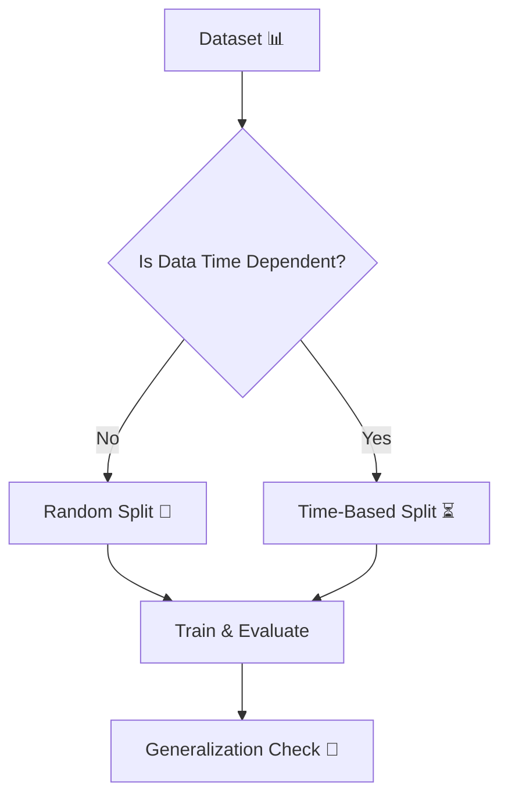

# 🎬 Resampling Methods  
## 🤖 The Day Milo Learned How to Test the Future

---

## 🌌 Chapter 1: The Illusion of Accuracy

Milo trained his model.

Accuracy?

🔥 95%

He celebrated.

Then Professor Arjun asked:

> 👨‍🏫 “Did your model see this data before?”

Milo froze.

Because if a model is tested on data it has already seen…

It’s not intelligence.

It’s memory.

And that’s when Milo discovered:

# 🔁 Resampling Methods

---

# 🧠 What Are Resampling Methods? (Absolute Beginner Version)

Resampling means:

> Rearranging your dataset into different pieces  
> So you can test whether your model truly generalizes.

In simple words:

We pretend some data is “future”  
Even though we already have it.

---

# 🎯 Why Resampling Is Important

Without resampling:

- Model may memorize data
- Performance looks amazing
- Real-world performance becomes terrible

Resampling answers:

> “Will this model work on new unseen data?”

---

# 🔄 Big Picture Flow



---

# 🧪 Method 1: Random Split

---

## 🌟 What Is Random Split?

Randomly divide data into:

- 📘 Training Set
- 🧪 Test Set
- 📦 (Optional) Validation Set

Like shuffling cards before dealing.

---

## 🎴 Real-World Analogy

Imagine a deck of cards.

If you don’t shuffle:

- One player might get all aces
- Another gets all low cards

That’s biased sampling.

Shuffling ensures fairness.

Random split does the same.

---

## 📊 Visual Flow



---

# 🧠 Why Use Validation Set?

Milo once asked:

> 🤖 “Why two test sets? Isn’t one enough?”

Professor Arjun explained:

## ⚠ What Happens During Tuning

When we:

- Select features
- Tune hyperparameters
- Try multiple models

We keep checking performance on the **test set**.

Over time…

We indirectly optimize for that test set.

It becomes “less unseen”.

---

## 🎯 So We Use:

- **Test Set** → For model comparison & tuning  
- **Validation Set** → Final evaluation (completely untouched)

---

## 🔥 Simple Rule

If your model has seen data during tuning,

It is no longer pure test data.

---

## 💻 Random Split Example (With Simple Comments)

```python
from sklearn.model_selection import train_test_split

# X = input features
# y = target variable

# First split: Train and Temp (test + validation)
X_train, X_temp, y_train, y_temp = train_test_split(
    X, y,
    test_size=0.3,        # 30% reserved for later
    random_state=42       # ensures same random split every time
)

# Second split: Split temp into test and validation
X_test, X_val, y_test, y_val = train_test_split(
    X_temp, y_temp,
    test_size=0.5         # split 30% into 15% test and 15% validation
)

# Now we have:
# 70% training
# 15% testing
# 15% validation
```

Even a beginner can now:

✔ Split data safely  
✔ Avoid biased sampling  
✔ Preserve generalization  

---

# ⏳ Method 2: Time-Based Split

Now things get serious.

Milo started working on weather prediction.

He randomly split the data.

Professor Arjun almost fainted.

---

## ❌ Why Random Split Fails for Time Data

Time series data has:

- Order
- Sequence
- Dependency

If you shuffle time:

You destroy reality.

---

## 🌦 Example

Imagine:

2019 → Normal weather  
2020 → Pandemic  
2021 → Economic changes  

If you randomly mix them:

Model sees the future during training.

That’s cheating.

---

# ⏳ What Is Time-Based Split?

Instead of randomizing,

We split by date.

---

## 📊 Example Split



Train on past.  
Test on future.

Just like real life.

---

## 💻 Time-Based Split Example

```python
# Suppose dataset is already sorted by date

# Let's say first 80% is training
split_index = int(len(X) * 0.8)

X_train = X[:split_index]  # older data
X_test = X[split_index:]   # newer data

y_train = y[:split_index]
y_test = y[split_index:]

# No shuffling!
# We preserve chronological order.
```

---

# 🪟 Window Method (Advanced but Simple)

Professor Arjun introduced something powerful:

# Rolling Window (Expanding Window)

---

## 🧠 Idea

Train on past → Predict next few days  
Then expand training window → Predict next few days  

Repeat.

---

## 🔄 Visual Flow



Training window keeps growing.

This:

✔ Stabilizes model  
✔ Prevents overfitting on tiny test sets  
✔ Simulates real-world forecasting  

---

# ⚠ The Big Limitation of Time Series

Time data is not independent.

One event changes everything.

---

## 🌍 Real Examples

- Change in government
- Financial crash
- Pandemic
- Natural disaster

Data before event ≠ Data after event

No ML model can perfectly predict such structural breaks.

Because:

The future truly changes.

---

# 🎬 Milo’s Realization

Random split works for:

✔ Image classification  
✔ Customer churn  
✔ Fraud detection  

Time-based split works for:

✔ Weather forecasting  
✔ Stock prices  
✔ Sales forecasting  
✔ Economic indicators  

---

# 🧠 Final Comparison

| Situation | Use Random Split | Use Time-Based Split |
|------------|------------------|----------------------|
| Independent data | ✅ | ❌ |
| Sequential data | ❌ | ✅ |
| Forecasting future | ❌ | ✅ |
| General classification | ✅ | ❌ |

---

# 🎯 Final Resampling Master Flow



---

# 🎉 Moral of the Story

A model is only as good as how you test it.

If you test incorrectly,

Even a bad model looks brilliant.

Resampling protects you  
from fooling yourself.

---

# 🧠 What You Now Understand

✔ What resampling methods are  
✔ Why random split prevents bias  
✔ Why validation set is crucial  
✔ Why time-series cannot be shuffled  
✔ What rolling windows do  
✔ Why real-world events break models  

---


Where does Milo go next?
