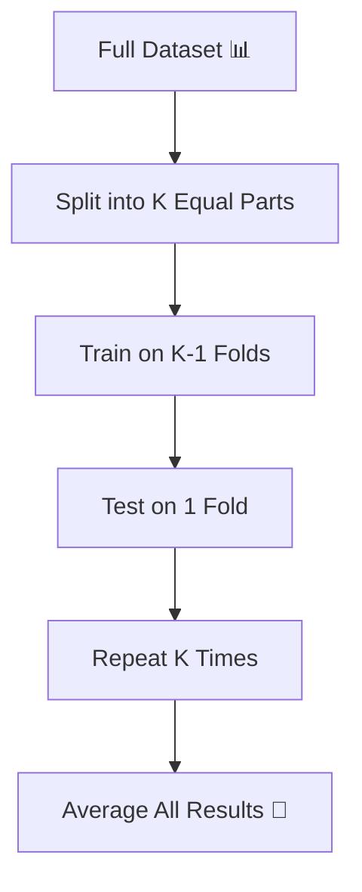
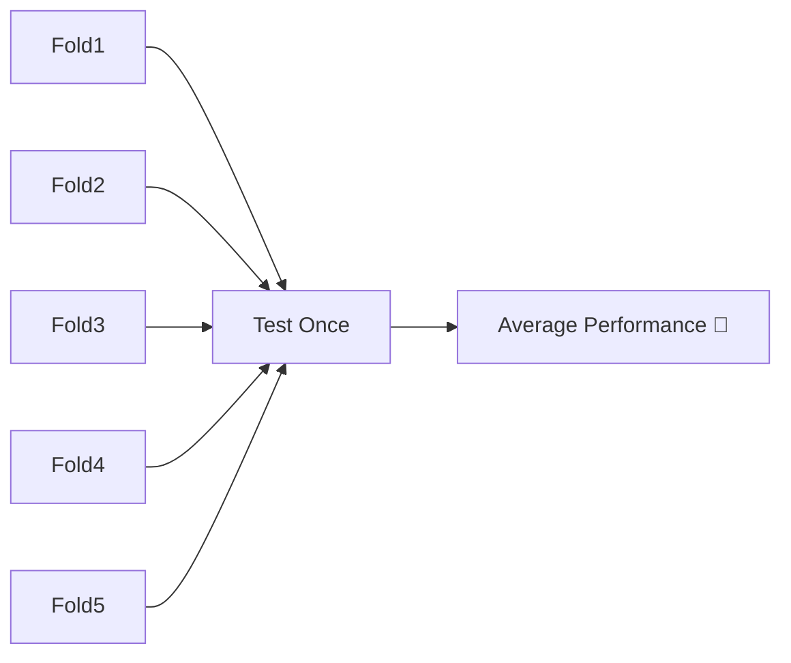
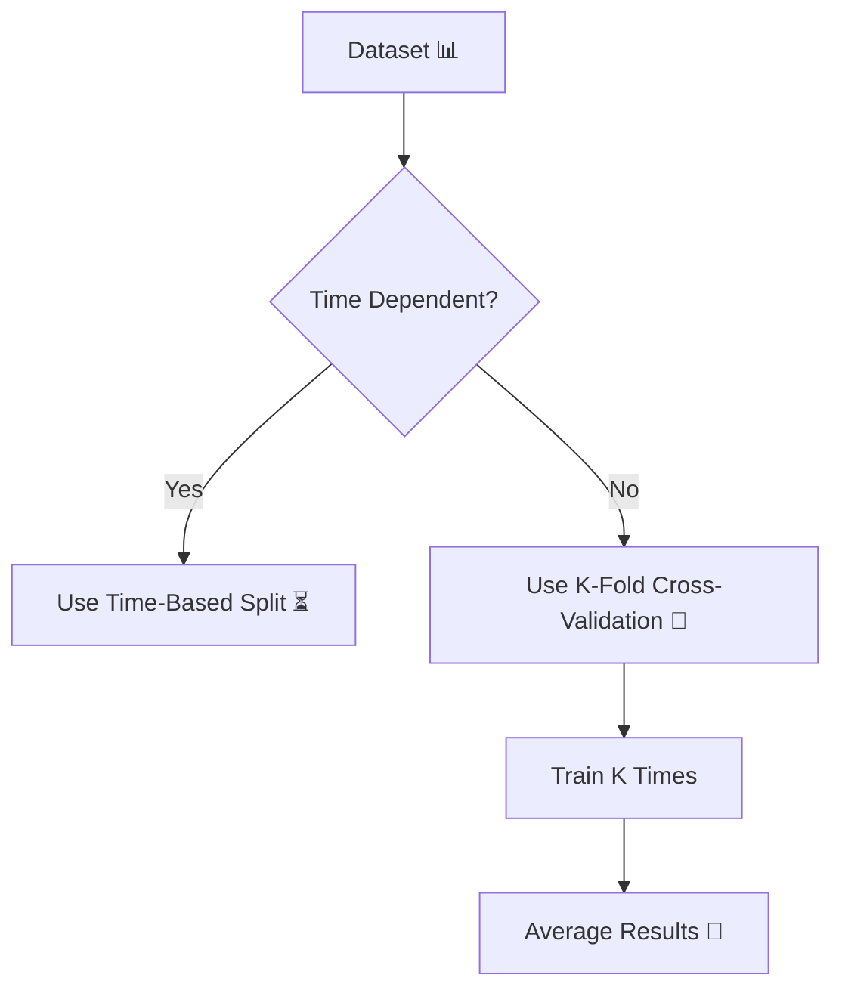
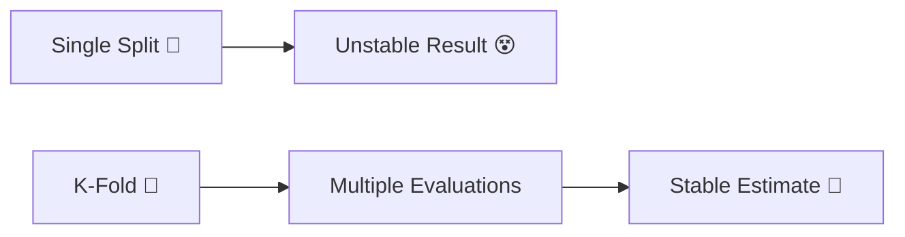

# 🎬 K-Fold Cross-Validation  
## 🤖 The Day Milo Stopped Trusting Just One Split

---

## 🌌 Chapter 1: The Dangerous Coin Toss

Milo used a random split.

70% training.  
30% testing.

His model scored:

🎉 91% Accuracy

He ran it again.

This time:

😐 84% Accuracy

He ran it again.

😵 88%

Milo was confused.

> 🤖 “Why does my accuracy keep changing?”

Professor Arjun smiled calmly.

> 👨‍🏫 “Because one split is like flipping a coin.”

And that day, Milo discovered:

# 🔁 K-Fold Cross-Validation

---

# 🧠 What Is K-Fold Cross-Validation? (Super Simple)

Instead of splitting data once…

We split it into **K equal parts**.

Then:

- Train on K-1 parts  
- Test on the remaining part  
- Repeat K times  

And finally…

We average the results.

---

# 🎴 Real-Life Analogy

Imagine you’re judging a singing competition.

Would you:

- Hear just one song? ❌  
OR  
- Hear multiple performances? ✅  

K-Fold means:

We test the model multiple times  
so performance becomes stable.

---

# 🔄 The Core Idea



---

# 🧩 Example: 5-Fold Cross-Validation

Let’s say K = 5.

Dataset is split into:

- Fold 1  
- Fold 2  
- Fold 3  
- Fold 4  
- Fold 5  

---

## 🔁 Iteration Process

### Round 1
Train: 2,3,4,5  
Test: 1  

### Round 2
Train: 1,3,4,5  
Test: 2  

### Round 3
Train: 1,2,4,5  
Test: 3  

### Round 4
Train: 1,2,3,5  
Test: 4  

### Round 5
Train: 1,2,3,4  
Test: 5  

---

## 📊 Visual Representation



Each fold gets a turn to be the test set.

No data is wasted.

---

# 🎯 Why Is This Powerful?

Because:

✔ Every data point is tested exactly once  
✔ Reduces randomness  
✔ Gives stable performance estimate  
✔ Prevents lucky/unlucky splits  

---

# 📉 Why Single Split Is Risky

If by chance:

- Test set contains easy samples → Accuracy high  
- Test set contains hard samples → Accuracy low  

K-Fold averages everything.

More reliable.

---

# 💻 K-Fold Example (Beginner-Friendly Code)

```python
from sklearn.model_selection import cross_val_score
from sklearn.tree import DecisionTreeClassifier

# Create model
model = DecisionTreeClassifier()

# Perform 5-fold cross-validation
scores = cross_val_score(
    model,   # the model to evaluate
    X,       # full feature dataset
    y,       # full target dataset
    cv=5     # number of folds
)

# Print results
print("Accuracy in each fold:", scores)

# Average accuracy
print("Average Accuracy:", scores.mean())
```

What just happened?

- Data automatically split into 5 parts
- Model trained 5 times
- Accuracy recorded 5 times
- Final result = average accuracy

No manual splitting needed.

---

# 🧠 What Does “cv=5” Mean?

`cv=5` means:

Split data into 5 folds.

Common values:

- 5 (most common)
- 10 (more stable, more computation)

---

# ⚖ Bias-Variance Connection

Smaller K (like 2):

- Faster
- More biased estimate

Larger K (like 10):

- More stable
- More computation

Extreme case:

## Leave-One-Out Cross-Validation (LOOCV)

If dataset has 100 samples:

- Train on 99
- Test on 1
- Repeat 100 times

Very accurate estimate.

But slow.

---

# 🧪 When Should You Use K-Fold?

Use K-Fold when:

✔ Dataset is not time-based  
✔ Data points are independent  
✔ Dataset size is moderate  
✔ You want reliable evaluation  

Do NOT use K-Fold for time series.

Why?

Because it shuffles time order.

And that breaks reality.

---

# 🔥 Full Comparison Flow



---

# 🎬 The Turning Point

Milo reran his experiment using 5-Fold.

Fold Results:

- 88%
- 90%
- 89%
- 91%
- 87%

Average = 89%

Now he trusted the result.

Not because it was high.

But because it was stable.

---

# 🧠 Final Summary Table

| Concept | Meaning |
|----------|----------|
| K-Fold | Split data into K parts |
| Each Fold | Used once as test |
| Final Score | Average of all folds |
| Advantage | Stable evaluation |
| Limitation | Not for time-series data |

---

# 🏁 Final Cinematic Flow



---

# 🎉 Moral of the Story

One split can lie.

Multiple splits reveal truth.

K-Fold Cross-Validation  
is how machine learning avoids self-deception.

---


Where does Milo go next?
