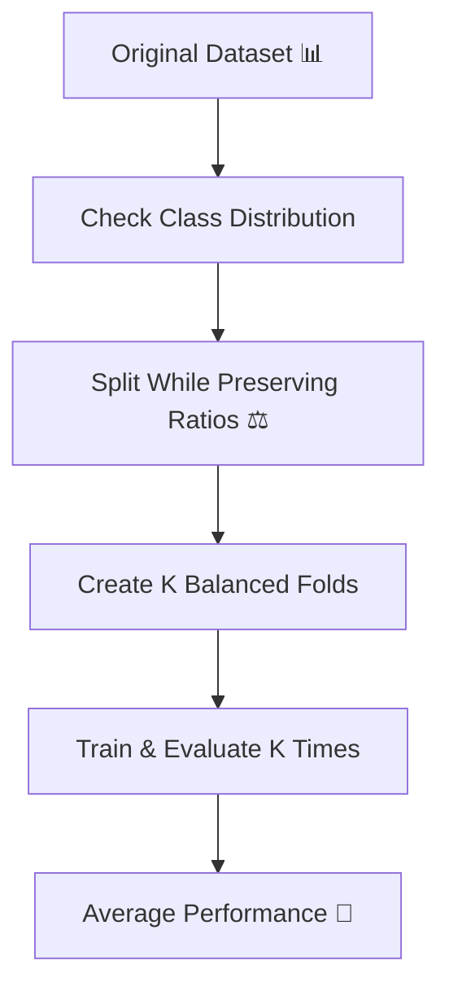
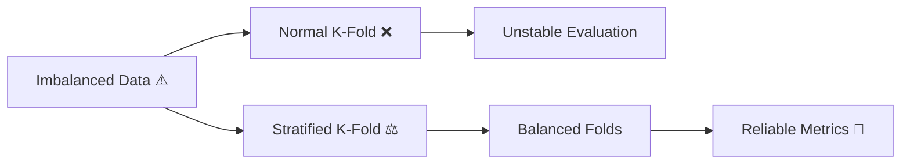

# 🎬 Stratified K-Fold  
## 🤖 The Day Milo Discovered the Danger of Imbalanced Data

---

## 🌌 Chapter 1: The Strange Accuracy

Milo built a disease detection model.

Accuracy?

🔥 95%

He was proud.

Professor Arjun asked:

> 👨‍🏫 “How many patients were actually sick?”

Milo checked.

Out of 1000 patients:

- 950 were healthy  
- 50 were sick  

His model predicted:

“Everyone is healthy.”

Accuracy = 95%.

But the model detected **zero sick patients**.

Milo realized something terrifying:

> 🤖 “My model isn’t smart… the data is imbalanced!”

And that day, he discovered:

# ⚖ Stratified K-Fold

---

# 🧠 First — What Is Class Imbalance?

Class imbalance means:

One class appears much more than another.

Example:

- Fraud detection → 99% normal, 1% fraud  
- Disease detection → 95% healthy, 5% sick  
- Spam detection → 90% normal, 10% spam  

If we split randomly…

Some folds may contain very few minority samples.

That makes evaluation unreliable.

---

# 🔥 The Problem With Normal K-Fold

Let’s say we use 5-Fold.

But minority class is very small.

One fold might look like:

- 100 samples
- Only 1 sick patient

Another fold:

- 100 samples
- 10 sick patients

That’s unstable evaluation.

---

# 🎴 Real-Life Analogy

Imagine testing a medicine.

Would you test:

- One group with 1 sick patient  
- Another group with 20 sick patients  

That’s unfair.

We need balance.

---

# 🧠 What Is Stratified K-Fold?

Stratified K-Fold ensures:

> Each fold maintains the same class proportion  
> as the original dataset.

If dataset has:

- 95% healthy  
- 5% sick  

Then every fold will also have:

- 95% healthy  
- 5% sick  

Balanced and fair.

---

# 🔄 Visual Flow



---

# 📊 Example

Suppose dataset:

1000 samples  
- 900 Class A  
- 100 Class B  

Using 5-fold Stratified:

Each fold (200 samples) will have:

- 180 Class A  
- 20 Class B  

Perfect proportion.

---

# 🆚 Normal K-Fold vs Stratified K-Fold

| Feature | K-Fold | Stratified K-Fold |
|----------|--------|-------------------|
| Maintains class ratio | ❌ | ✅ |
| Good for imbalanced data | ❌ | ✅ |
| Used in classification | ✅ | ✅ (Preferred) |
| Used in regression | ✅ | ❌ (Not needed) |

---

# 💻 Simple Code Example (With Beginner Comments)

```python
from sklearn.model_selection import StratifiedKFold
from sklearn.model_selection import cross_val_score
from sklearn.tree import DecisionTreeClassifier

# Create classification model
model = DecisionTreeClassifier()

# Create Stratified K-Fold object
skf = StratifiedKFold(
    n_splits=5,   # number of folds
    shuffle=True, # shuffle before splitting
    random_state=42
)

# Perform cross-validation using stratified splits
scores = cross_val_score(
    model,  # model to train
    X,      # feature dataset
    y,      # target labels
    cv=skf  # stratified k-fold strategy
)

print("Accuracy for each fold:", scores)
print("Average Accuracy:", scores.mean())
```

What happened here?

- Data split into 5 folds
- Each fold kept same class distribution
- Model trained 5 times
- Accuracy averaged

Fair evaluation.

---

# 🎯 When Should You Use Stratified K-Fold?

Use it when:

✔ Classification problem  
✔ Imbalanced dataset  
✔ Small minority class  
✔ You want stable evaluation  

Do NOT use it for:

❌ Regression (no class labels)  
❌ Time series data  

---

# 🎬 Milo’s Realization

Milo switched from K-Fold to Stratified K-Fold.

Before:

Accuracy varied wildly.

After:

- Stable scores  
- Reliable recall  
- Better minority detection  

Now his model actually detected sick patients.

He smiled.

> 🤖 “Accuracy alone isn’t enough. Fair splitting matters.”

Professor Arjun nodded.

> 👨‍🏫 “Evaluation must reflect reality.”

---

# 🧠 Final Concept Flow



---

# 🎉 Moral of the Story

If your data is imbalanced,

Normal splitting can lie.

Stratified K-Fold  
protects minority classes  
and gives fair evaluation.

---

# 🏁 Final Summary

✔ Stratified K-Fold preserves class distribution  
✔ Essential for classification problems  
✔ Especially important for imbalanced datasets  
✔ Produces stable and fair performance estimates  

---


Where does Milo go next?
