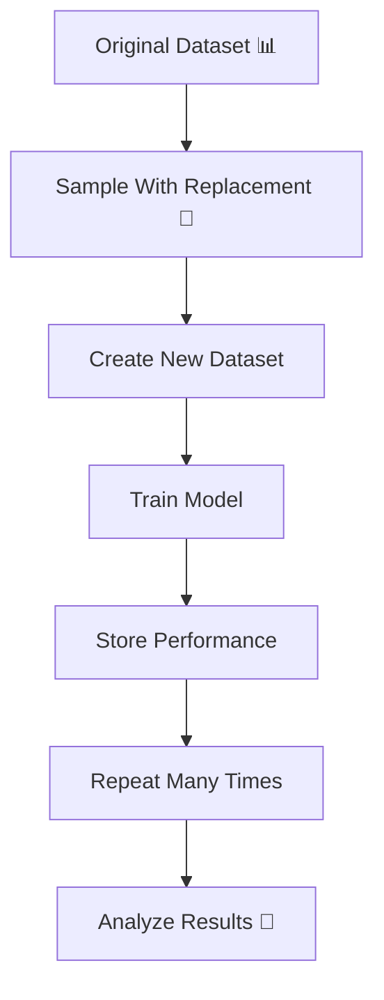
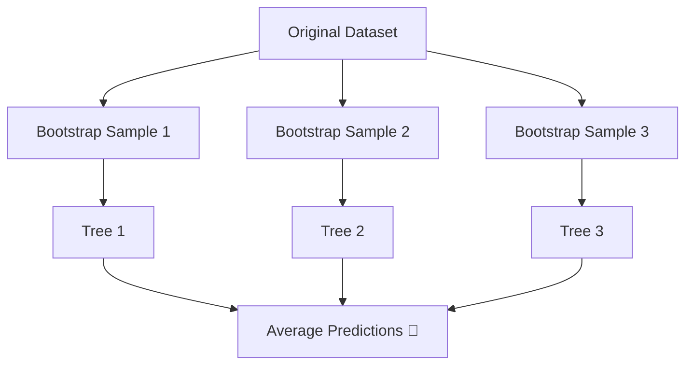
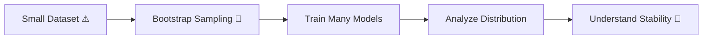

# 🎬 Bootstrap  
## 🤖 The Day Milo Learned to Create Data From Data

---

## 🌌 Chapter 1: The Small Dataset Problem

Milo had a problem.

His dataset had only **120 samples**.

He trained a model.

Results looked unstable.

Sometimes accuracy was 82%.  
Sometimes 74%.  
Sometimes 88%.

He asked:

> 🤖 “I don’t have more data… what do I do?”

Professor Arjun smiled mysteriously.

> 👨‍🏫 “If you cannot collect more data…  
> learn to reuse what you have.”

And that’s when Milo discovered:

# 🥾 Bootstrap

---

# 🧠 What Is Bootstrap? (Absolute Beginner Version)

Bootstrap is a resampling method where:

> We create new datasets  
> By randomly sampling from the original dataset  
> **With replacement**

Let’s break that down.

---

# 🎴 What Does “With Replacement” Mean?

Imagine you have 5 cards:

[A, B, C, D, E]

If you pick a card and put it back before picking again:

That’s **sampling with replacement**.

Example new sample:

[A, C, C, E, B]

Notice:

- C appears twice  
- D might not appear at all  

That’s allowed.

---

# 🎯 Why Do We Do This?

Because it lets us:

✔ Estimate model stability  
✔ Estimate confidence intervals  
✔ Understand variance  
✔ Work with small datasets  

---

# 🔄 Bootstrap Flow



We don’t do this once.

We repeat it many times.

Maybe 100 times.

Maybe 1000 times.

---

# 🎴 Real-Life Analogy

Imagine tasting soup.

Instead of cooking 100 new soups…

You stir the same soup  
and taste different spoonfuls each time.

Bootstrap is like tasting multiple spoonfuls  
to estimate overall flavor.

---

# 🧪 Step-by-Step Example

Suppose we have 5 data points:

| ID | Value |
|----|-------|
| 1  | 10 |
| 2  | 20 |
| 3  | 30 |
| 4  | 40 |
| 5  | 50 |

Bootstrap sample might look like:

[10, 30, 30, 50, 20]

Same size.  
But some repeated.  
Some missing.

---

# 💻 Simple Bootstrap Code (Beginner Friendly)

```python
import numpy as np
from sklearn.utils import resample
from sklearn.tree import DecisionTreeClassifier
from sklearn.metrics import accuracy_score

# Suppose X and y are our full dataset

n_iterations = 100  # number of bootstrap samples
scores = []         # store model performance

for i in range(n_iterations):

    # Step 1: Create bootstrap sample
    X_boot, y_boot = resample(
        X, y,
        replace=True   # THIS means sampling with replacement
    )

    # Step 2: Train model on bootstrap sample
    model = DecisionTreeClassifier()
    model.fit(X_boot, y_boot)

    # Step 3: Test on original data
    y_pred = model.predict(X)

    # Step 4: Measure performance
    acc = accuracy_score(y, y_pred)

    # Store accuracy
    scores.append(acc)

# Average performance across bootstrap runs
print("Average Accuracy:", np.mean(scores))
```

Let’s explain clearly:

- `resample()` → creates new dataset  
- `replace=True` → allows duplicates  
- Loop runs 100 times  
- We average accuracy  

This gives stable performance estimate.

---

# 🧠 What Makes Bootstrap Powerful?

Because it helps us measure:

✔ Variance of model  
✔ Confidence interval of metric  
✔ Model stability  

Instead of one accuracy number…

We get a distribution.

---

# 📊 Example Output

Instead of:

Accuracy = 85%

We get:

Accuracy range = 82% to 88%  
Mean = 85%  
Standard deviation = 2%

Now we understand uncertainty.

---

# 🎯 Bootstrap vs K-Fold

| Feature | K-Fold | Bootstrap |
|----------|--------|------------|
| Sampling type | Without replacement | With replacement |
| Data size | Same size | Same size |
| Repeats | K times | Many times |
| Used for | Model evaluation | Stability & uncertainty |

---

# 🌳 Bonus: Random Forest Uses Bootstrap!

Here’s something powerful:

Random Forest uses bootstrap internally.

Each tree:

- Gets its own bootstrap sample  
- Trains independently  

That’s called:

Bagging (Bootstrap Aggregating)



That’s how Random Forest reduces variance.

---

# 🎬 Milo’s Realization

Milo had small data.

Instead of giving up,

He:

- Bootstrapped
- Measured stability
- Estimated confidence intervals

Now he didn’t just know performance.

He knew reliability.

---

# 🧠 When Should You Use Bootstrap?

Use Bootstrap when:

✔ Dataset is small  
✔ You want confidence intervals  
✔ You want to measure stability  
✔ You are studying model variance  

Do NOT use blindly for:

❌ Time-series forecasting (breaks order)  

---

# 🎉 Moral of the Story

If data is limited…

You don’t always need more data.

Sometimes,

You need smarter resampling.

Bootstrap teaches us:

One dataset can reveal many realities.

---

# 🏁 Final Concept Flow



---

# 🧠 What You Now Understand

✔ What bootstrap means  
✔ What sampling with replacement means  
✔ Why duplicates are allowed  
✔ How bootstrap measures stability  
✔ Why Random Forest uses bootstrap  
✔ When to use and when not to use it  

---


Where does Milo go next?
