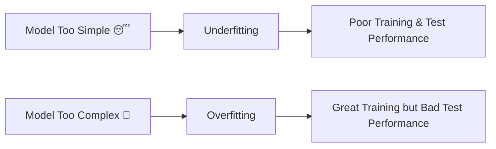
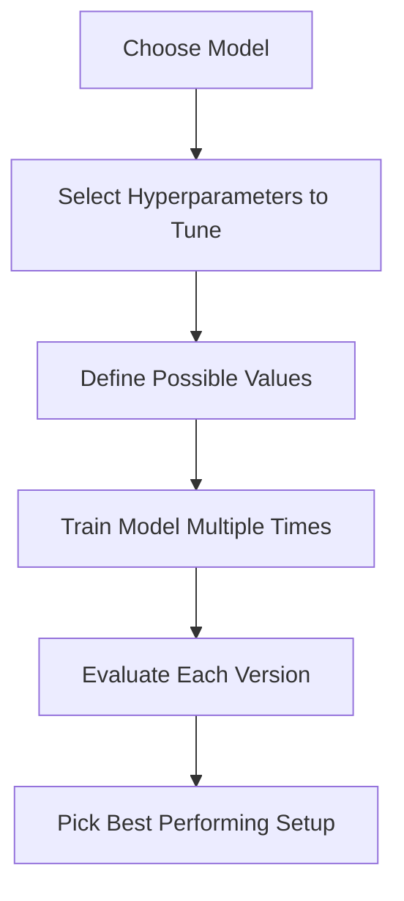
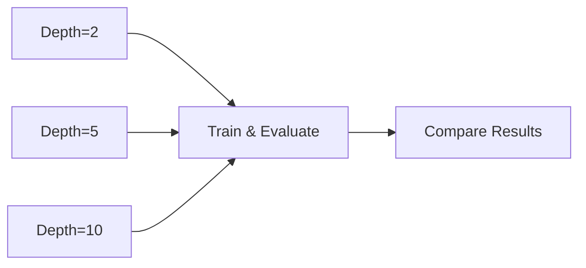
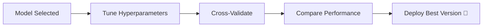

# 🎬 The Story of Hyperparameter Tuning  
## 🤖 How Milo Learned to Adjust the Dials of Intelligence

---

## 🌌 Chapter 1: The Model Works… But Not Well Enough

Milo finally selected a model.

He trained a 🌳 Decision Tree.

It worked.

But something felt wrong.

Sometimes it predicted perfectly.  
Sometimes it made ridiculous mistakes.

Milo asked:

> 🤖 “Why is my model behaving so strangely?”

Professor Arjun walked in, holding a mysterious control panel.

> 👨‍🏫 “Because, Milo… you haven’t tuned the knobs yet.”

And that’s when Milo discovered…

# 🎛 Hyperparameter Tuning

---

# 🧠 First — What Is a Hyperparameter?

Let’s make this SUPER simple.

When you train a model, two types of things exist:

### 1️⃣ Parameters  
These are learned automatically from data.  
Example: weights in linear regression.

You DO NOT set these manually.

---

### 2️⃣ Hyperparameters  
These are settings you choose BEFORE training.

Example in Decision Tree:

- max_depth
- min_samples_split
- criterion

These control HOW the model learns.

You must set them manually.

---

# 🚗 Real-World Analogy

Think of a model like a car engine.

Parameters = internal combustion happening automatically  
Hyperparameters =  

- Fuel level  
- Gear mode  
- Engine tuning  
- Turbo boost  

If you tune incorrectly:

- Engine overheats (overfitting)
- Engine too weak (underfitting)

Perfect tuning = smooth ride.

---

# 🔥 The Core Problem

If hyperparameters are:

Too simple → Model underfits  
Too complex → Model overfits  

Milo saw this clearly.

---

# 🎭 Underfitting vs Overfitting



---

# 🧪 Example: Decision Tree max_depth

Imagine:

```python
from sklearn.tree import DecisionTreeRegressor

# max_depth controls how deep the tree can grow
# Small depth = simple model
# Large depth = very complex model

model = DecisionTreeRegressor(max_depth=2)  # tree allowed only 2 levels
```

### What does this mean?

`max_depth=2`  
→ The tree can only split twice  
→ Very simple  
→ Might miss important patterns  

Now imagine:

```python
model = DecisionTreeRegressor(max_depth=50)  # extremely deep tree
```

Now:

- Model memorizes training data  
- Performs badly on new data  

That is overfitting.

---

# 🎯 So What Is Hyperparameter Tuning?

Hyperparameter Tuning means:

> Trying different hyperparameter values to find the best performing combination.

We systematically test combinations.

---

# 🔄 The Hyperparameter Tuning Flow



---

# 🎮 Method 1: Manual Tuning (Beginner Way)

Milo first tried manually:

```python
# Try depth 2
model1 = DecisionTreeRegressor(max_depth=2)
model1.fit(X_train, y_train)

# Try depth 5
model2 = DecisionTreeRegressor(max_depth=5)
model2.fit(X_train, y_train)

# Try depth 10
model3 = DecisionTreeRegressor(max_depth=10)
model3.fit(X_train, y_train)
```

Then compare performance.

Simple.

But inefficient.

---

# 🤖 Method 2: Grid Search (Systematic Way)

Professor Arjun showed him magic:

## Grid Search

Grid Search tries ALL combinations.



---

## 💻 Code Example (Very Clear Comments)

```python
from sklearn.model_selection import GridSearchCV
from sklearn.tree import DecisionTreeRegressor

# Step 1: Define model (no hyperparameters yet)
model = DecisionTreeRegressor()

# Step 2: Define hyperparameters we want to test
param_grid = {
    'max_depth': [2, 5, 10],          # try these tree depths
    'min_samples_split': [2, 5, 10]   # try these split conditions
}

# Step 3: Create GridSearch object
grid_search = GridSearchCV(
    model,              # the base model
    param_grid,         # hyperparameters to test
    cv=5,               # 5-fold cross-validation
    scoring='neg_mean_absolute_error'  # metric to optimize
)

# Step 4: Run search
grid_search.fit(X_train, y_train)

# Step 5: Get best model
best_model = grid_search.best_estimator_

print("Best Hyperparameters:", grid_search.best_params_)
```

What just happened?

- It tried every combination
- Evaluated using cross-validation
- Selected best setup automatically

Magic.

---

# ⚡ Method 3: Random Search (Faster Way)

Instead of trying ALL combinations,
Random Search tries random combinations.

Faster for large problems.


---

# 🧠 When Should You Tune?

Always tune when:

- Model underfits
- Model overfits
- You want better performance

But don’t tune forever.

Remember:

Good enough > Perfect but never deployed

---

# 🎬 The Emotional Turning Point

Milo tuned his tree.

Before tuning:

- MAE = 65

After tuning:

- MAE = 42

Huge improvement.

Same model.

Better settings.

---

# 🧠 What Milo Learned

✔ Hyperparameters control learning behavior  
✔ Bad tuning causes under/overfitting  
✔ Grid Search automates tuning  
✔ Cross-validation improves reliability  
✔ Perfection is not required — stability is  

---

# 🏁 Final Hyperparameter Tuning Summary



---

# 🎉 Final Moral

A model is like a musical instrument.

Even a grand piano sounds terrible  
if it’s not tuned.

Hyperparameter tuning  
is the art of tuning intelligence.

---
