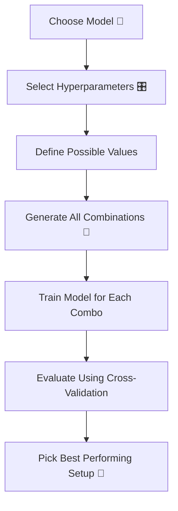

# 🎬 Grid Search  
## 🤖 The Day Milo Stopped Guessing and Started Systematically Searching

---

## 🌌 Chapter 1: The Guessing Game

Milo trained a Decision Tree.

He set:

```python
max_depth = 5
```

Accuracy = 82%

He changed it:

```python
max_depth = 10
```

Accuracy = 86%

He changed again:

```python
max_depth = 3
```

Accuracy = 79%

He kept guessing.

Professor Arjun watched silently.

Finally he said:

> 👨‍🏫 “Milo… stop guessing.  
> Let the machine try everything.”

And that’s when Milo discovered:

# 🔍 Grid Search

---

# 🧠 What Is Grid Search? (Absolute Beginner Version)

Grid Search means:

> Trying ALL possible combinations  
> of selected hyperparameter values  
> in a systematic way.

No guessing.  
No randomness.  
Just structured search.

---

# 🎛 First — What Are Hyperparameters?

Hyperparameters are settings you choose BEFORE training.

Example in Decision Tree:

- max_depth
- min_samples_split
- criterion

They control how the model learns.

---

# 🎴 Real-Life Analogy

Imagine you are buying shoes online.

You filter by:

- Size: 8, 9, 10  
- Color: Black, White  
- Brand: A, B  

Grid Search tries:

All combinations.

- (8, Black, A)
- (8, Black, B)
- (8, White, A)
- ...
- (10, White, B)

It tests every possible combination.

Then picks the best one.

---

# 🔄 How Grid Search Works



---

# 📊 Example

Suppose we define:

```python
max_depth = [2, 5, 10]
min_samples_split = [2, 5]
```

Total combinations:

3 × 2 = 6 models

Grid Search will train 6 models.

If using 5-fold CV:

6 × 5 = 30 trainings.

That’s systematic power.

---

# 💻 Simple Grid Search Example (With Very Clear Comments)

```python
from sklearn.model_selection import GridSearchCV
from sklearn.tree import DecisionTreeClassifier

# Step 1: Create base model
model = DecisionTreeClassifier()

# Step 2: Define hyperparameter values we want to test
param_grid = {
    'max_depth': [2, 5, 10],        # try small, medium, large trees
    'min_samples_split': [2, 5]     # minimum samples required to split node
}

# Step 3: Create GridSearch object
grid_search = GridSearchCV(
    estimator=model,        # model to tune
    param_grid=param_grid,  # hyperparameter combinations
    cv=5,                   # 5-fold cross-validation
    scoring='accuracy'      # metric to optimize
)

# Step 4: Start searching
grid_search.fit(X, y)

# Step 5: Get best model automatically
best_model = grid_search.best_estimator_

# Best hyperparameters found
print("Best Parameters:", grid_search.best_params_)

# Best cross-validation score
print("Best Accuracy:", grid_search.best_score_)
```

---

# 🧠 What Just Happened?

- Grid Search created all combinations.
- For each combination:
  - Performed 5-fold cross-validation.
- Measured average accuracy.
- Selected best performing combination.
- Returned trained best model.

You didn’t manually test anything.

---

# 🎯 Why Grid Search Is Powerful

✔ No guessing  
✔ Fully systematic  
✔ Works well for small search spaces  
✔ Integrates with cross-validation  

---

# ⚠ But There Is a Cost

Grid Search can be slow.

If:

5 parameters  
Each with 5 values  

Total combinations:

5⁵ = 3125 models

With 5-fold CV:

3125 × 5 = 15,625 trainings

That’s heavy.

---

# ⚡ When To Use Grid Search?

Use it when:

✔ Dataset is moderate size  
✔ Hyperparameter space is small  
✔ You want exhaustive search  
✔ You need reliable tuning  

Avoid when:

❌ Too many hyperparameters  
❌ Huge datasets  
❌ Real-time constraints  

Then use Random Search instead.

---

# 🎬 Milo’s Turning Point

Before Grid Search:

He guessed hyperparameters.

After Grid Search:

He saw:

Best Parameters:
```
max_depth = 5
min_samples_split = 2
```

Accuracy improved from:

82% → 89%

Same model.

Better tuning.

He smiled.

> 🤖 “It wasn’t the model that was weak…  
> it was my tuning.”

Professor Arjun nodded.

> 👨‍🏫 “Optimization is intelligence.”

---

# 🧠 Grid Search + Cross-Validation Together

This is important:

Grid Search DOES NOT just test on one split.

It usually uses Cross-Validation internally.

That makes performance stable.

---

# 🔄 Complete Concept Flow


---

# 🎉 Moral of the Story

Guessing is human.

Grid Search is systematic.

When you stop guessing  
and start searching properly,

Your model becomes stronger  
without changing the algorithm.

---

# 🧠 What You Now Understand

✔ What Grid Search is  
✔ How it tests all combinations  
✔ Why cross-validation is used inside  
✔ When to use it  
✔ Its computational cost  

---


Where does Milo go next?
