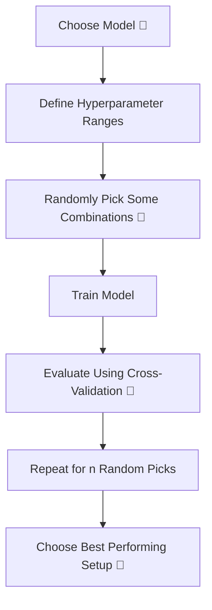

# 🎬 Random Search  
## 🎲 The Day Aarav Discovered That Trying Everything Is Not Always Smart

---

## 🌟 New Characters

👨‍🎓 **Aarav** – A beginner. Not from CS. Just curious.  
👩‍🔬 **Dr. Meera** – Data scientist. Calm. Smart. Practical.  
🤖 **Robo** – The machine learning model they are training.  

---

# 🌌 Chapter 1: The Slow Disaster

Aarav used **Grid Search** yesterday.

He told Robo:

> “Try all combinations. Don’t miss anything.”

Robo started training.

1 hour…  
2 hours…  
3 hours…

Laptop fan screaming. 🔥

Aarav panicked.

> “Why is this taking forever?!”

Dr. Meera smiled.

> “Because you asked Robo to try *everything*.”

And then she said something surprising:

> “Sometimes… trying randomly is smarter.”

And that’s when Aarav learned about…

# 🎲 Random Search

---

# 🧠 First — What Are We Even Searching?

Let’s slow down.

In machine learning, we have:

- A model (like Decision Tree, Random Forest, etc.)
- Settings that control how it learns

Those settings are called:

# ⚙️ Hyperparameters

You choose them BEFORE training.

Example:

- max_depth (how deep the tree can grow)
- learning_rate (how fast model learns)

These affect performance.

---

# 🧩 The Problem With Grid Search

Let’s say:

We have 4 hyperparameters.  
Each has 5 possible values.

Total combinations:

5 × 5 × 5 × 5 = 625 models

If using 5-fold cross-validation:

625 × 5 = 3125 trainings 😳

That’s heavy.

---

# 🎴 Real-Life Analogy

Imagine you’re at an ice cream shop 🍦

There are:

- 10 flavors  
- 5 toppings  
- 4 cone types  

Would you try all combinations?

No.

You randomly try some.

If one tastes amazing…

You stop.

That is Random Search.

---

# 🎲 What Is Random Search?

Instead of trying all combinations…

It:

- Randomly picks some combinations
- Tests only those
- Chooses the best among them

It saves time.
It still finds good results.

---

# 🔄 How It Works (Visual Flow)



---

# 🎯 Why Random Search Can Be Better

Here’s something surprising:

Not all hyperparameters matter equally.

Example:

Maybe only `learning_rate` really matters.

If Grid Search wastes time testing 100 useless combinations…

Random Search may accidentally find the good region faster.

Sometimes:

🎲 Random > Exhaustive

---

# 💻 Simple Random Search Code (With Beginner Comments)

```python
from sklearn.model_selection import RandomizedSearchCV
from sklearn.tree import DecisionTreeClassifier
import numpy as np

# Step 1: Create the base model
model = DecisionTreeClassifier()

# Step 2: Define possible values (ranges)
param_dist = {
    'max_depth': np.arange(1, 20),   # try tree depths from 1 to 19
    'min_samples_split': np.arange(2, 10)  # try splits from 2 to 9
}

# Step 3: Create Random Search object
random_search = RandomizedSearchCV(
    estimator=model,            # the model we want to tune
    param_distributions=param_dist,  # possible values to randomly choose from
    n_iter=10,                  # number of random combinations to try
    cv=5,                       # use 5-fold cross-validation
    scoring='accuracy',         # measure performance using accuracy
    random_state=42             # ensures same random picks every run
)

# Step 4: Start searching
random_search.fit(X, y)

# Step 5: Get best model found
best_model = random_search.best_estimator_

# Show best hyperparameters
print("Best Parameters:", random_search.best_params_)

# Show best accuracy
print("Best Accuracy:", random_search.best_score_)
```

---

# 🧠 What Just Happened?

- Instead of 200+ combinations
- We tried only 10
- Used cross-validation
- Picked the best

Much faster.

---

# 📊 Grid Search vs Random Search

| Feature | Grid Search | Random Search |
|----------|-------------|---------------|
| Tries all combinations | ✅ Yes | ❌ No |
| Faster | ❌ Slower | ✅ Faster |
| Good for small search space | ✅ Yes | ✅ Yes |
| Good for large search space | ❌ No | ✅ Yes |
| Smarter use of time | ❌ Not always | ✅ Often |

---

# 🎬 Chapter 2: Aarav’s Realization

Aarav trained using Random Search.

Time taken: 15 minutes.

Accuracy: 90%

Yesterday with Grid Search:

Time taken: 2 hours.

Accuracy: 91%

Dr. Meera asked:

> “Is 1% worth 1 hour?”

Aarav smiled.

> “No.”

---

# 🧠 When Should You Use Random Search?

Use it when:

✔ Many hyperparameters  
✔ Large dataset  
✔ Limited time  
✔ Want fast experimentation  
✔ Early-stage model building  

Avoid only when:

❌ Very small search space  
❌ You truly need exact best combination  

---

# 🌍 Real-World Example

Companies like:

- Netflix 🎬  
- Amazon 🛒  
- Google 🔍  

Often use smarter sampling instead of brute-force search.

Because:

Time = Money.

---

# 🎯 Key Insight

Grid Search = Try Everything  
Random Search = Try Smartly  

If hyperparameters = 10 dimensions  
Grid Search grows exponentially 😵  

Random Search grows linearly 🚀  

---

# 🔥 The Moral

Optimization is not about trying harder.

It’s about trying smarter.

Sometimes randomness is intelligent.

---

# 🧠 What You Now Understand

✔ What hyperparameters are  
✔ Why Grid Search can be slow  
✔ What Random Search does  
✔ Why Random Search is efficient  
✔ When to use it  

---


Where should Aarav go next? 🎬
