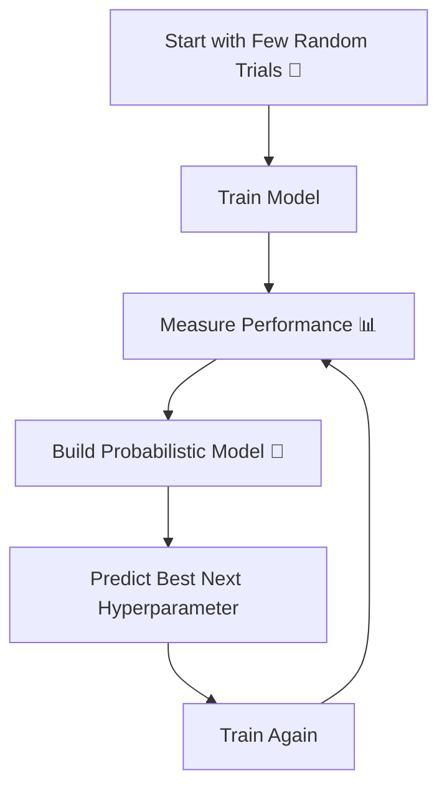

# 🎬 Bayesian Optimization  
## 🧠 The Day Riya Stopped Guessing… and Started Thinking Like a Strategist

---

## 🌟 Meet the New Characters

👩‍🎓 **Riya** – A biology student. Zero coding background. Just curious.  
👨‍🔬 **Professor Kabir** – Calm. Logical. Loves probability.  
🤖 **Nova** – The machine learning model they’re training.  

---

# 🌌 Chapter 1: The Frustration

Riya tried:

- Grid Search 🔲 → Too slow  
- Random Search 🎲 → Faster, but still guessing  

She asked:

> “Is there a smarter way?  
> One that learns while searching?”

Professor Kabir smiled.

> “Yes.  
> Instead of randomly searching…  
> what if the search itself becomes intelligent?”

And that’s when she discovered:

# 🧠 Bayesian Optimization

---

# 🧠 First — The Core Idea (Super Simple)

Bayesian Optimization means:

> “Use past results to decide what to try next.”

Unlike Random Search:

- It doesn’t blindly guess.
- It learns from previous trials.

---

# 🎴 Real-Life Analogy

Imagine you're searching for the best coffee shop ☕

First shop: 6/10  
Second shop: 8/10  

Now you think:

> “Maybe shops near the second one are better.”

You don’t randomly go to the opposite side of the city.

You search near promising areas.

That is Bayesian Optimization.

---

# 🧩 The Problem It Solves

Hyperparameter tuning is expensive.

Each training:

- Takes time
- Uses CPU/GPU
- Costs money

So instead of testing 100 combinations…

Bayesian Optimization may find a great solution in 20.

---

# 🔄 How It Works (Big Picture)



It keeps repeating.

Each time:

It becomes smarter.

---

# 🧠 What Makes It “Bayesian”?

It uses probability.

Instead of saying:

> “This hyperparameter gives 90% accuracy.”

It says:

> “There is high probability this region gives better results.”

It models uncertainty.

---

# 🧠 The Two Main Parts (Simplified)

1️⃣ Surrogate Model  
→ A simple model that approximates performance  

2️⃣ Acquisition Function  
→ Decides where to try next  

Think of it like:

- Surrogate = map of the land 🗺  
- Acquisition = strategy for next move 🎯  

---

# 🎯 Step-by-Step in Simple Words

1. Try a few random hyperparameters.
2. Observe results.
3. Build a probability model of performance.
4. Predict where performance may improve.
5. Try that region.
6. Repeat.

It balances:

- Exploration (try new areas)
- Exploitation (focus on good areas)

---

# 💻 Simple Example Using Scikit-Optimize

```python
from skopt import BayesSearchCV
from sklearn.tree import DecisionTreeClassifier

# Step 1: Create the base model
model = DecisionTreeClassifier()

# Step 2: Define the search space
# Instead of listing every value, we give ranges
search_spaces = {
    'max_depth': (1, 20),           # tree depth between 1 and 20
    'min_samples_split': (2, 10)    # split between 2 and 10 samples
}

# Step 3: Create Bayesian Search object
bayes_search = BayesSearchCV(
    estimator=model,          # model to tune
    search_spaces=search_spaces,  # hyperparameter ranges
    n_iter=20,                # number of intelligent tries
    cv=5,                     # 5-fold cross-validation
    scoring='accuracy',       # metric to optimize
    random_state=42
)

# Step 4: Start training
bayes_search.fit(X, y)

# Step 5: Get best model
best_model = bayes_search.best_estimator_

# Show best hyperparameters
print("Best Parameters:", bayes_search.best_params_)

# Show best score
print("Best Accuracy:", bayes_search.best_score_)
```

---

# 🧠 What Just Happened?

- It didn’t test all combinations.
- It didn’t guess randomly every time.
- It learned from previous results.
- It intelligently picked next combination.

Fewer trials.  
Better results.

---

# 📊 Grid vs Random vs Bayesian

| Method | Strategy | Speed | Intelligence Level |
|---------|----------|--------|--------------------|
| Grid Search | Try everything | Slow | Low |
| Random Search | Try randomly | Medium | Medium |
| Bayesian Optimization | Learn while searching | Fast | High |

---

# 🎬 Chapter 2: Riya’s Realization

Grid Search → 3 hours  
Random Search → 40 minutes  
Bayesian Optimization → 25 minutes  

Accuracy almost same.

Professor Kabir said:

> “The goal is not to try everything.  
> The goal is to try wisely.”

Riya nodded.

She finally understood.

Optimization is strategy.

---

# 🧠 When Should You Use Bayesian Optimization?

Use it when:

✔ Training is expensive  
✔ Many hyperparameters  
✔ Deep learning models  
✔ Cloud computing costs matter  
✔ You want faster convergence  

Avoid only when:

❌ Model training is very cheap  
❌ Very small search space  

---

# 🌍 Real-World Usage

Bayesian Optimization is used in:

- Hyperparameter tuning for deep learning  
- AutoML systems  
- Drug discovery  
- Engineering simulations  

It is powerful when evaluations are expensive.

---

# 🎯 Core Insight

Grid Search = Exhaustive  
Random Search = Lucky  
Bayesian Optimization = Strategic  

---

# 🔥 Final Moral

If Random Search is throwing darts…

Bayesian Optimization is aiming with memory.

It doesn’t just search.

It learns how to search.

---

# 🧠 What You Now Understand

✔ What Bayesian Optimization is  
✔ Why it is smarter  
✔ How it balances exploration and exploitation  
✔ When to use it  
✔ How it compares with other methods  

---


Where should Riya go next? 🎬
