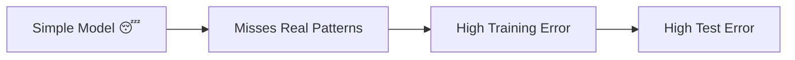
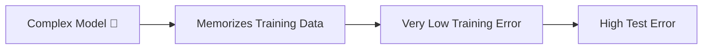
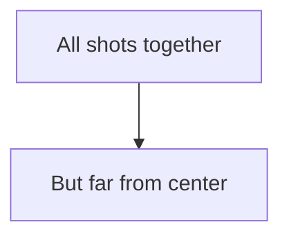
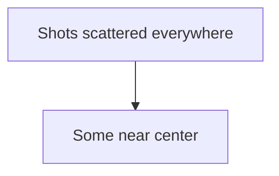
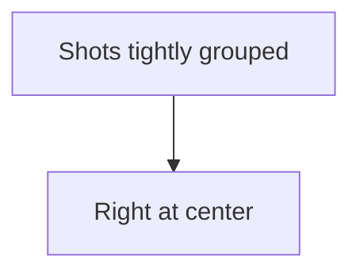
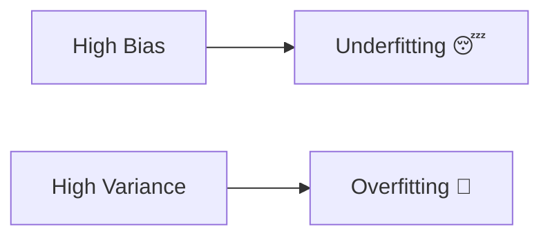
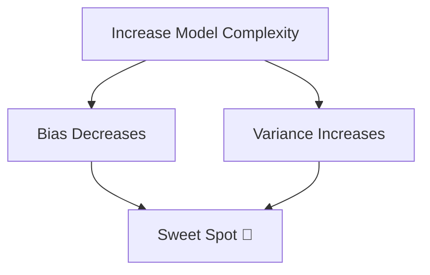
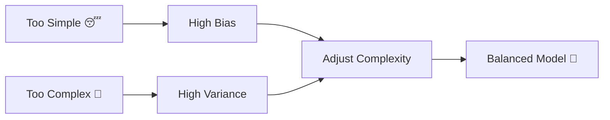

# 🎬 Bias vs Variance  
## 🤖 The Day Milo Discovered Why His Model Was Failing

---

## 🌌 Chapter 1: The Confusing Results

Milo built a model.

On training data?

🔥 98% accuracy.

On test data?

💀 61% accuracy.

Milo panicked.

> 🤖 “It was perfect yesterday! What happened?!”

Professor Arjun drew two words on the board:

# ⚖ BIAS & VARIANCE

> 👨‍🏫 “Every machine learning model struggles with these two forces.”

And thus began the most important lesson of Milo’s journey.

---

# 🧠 First: What Is Bias? (Super Simple)

Bias means:

> The model is too simple to understand the real pattern.

It makes strong assumptions.

It ignores complexity.

---

## 🎯 Real-Life Analogy (Bias)

Imagine trying to draw a circle using only a straight line.

Impossible.

No matter how much you try,  
the line can never become a circle.

That is **High Bias**.

---

## 📉 In Machine Learning

High Bias model:

- Underfits
- Performs poorly on training data
- Performs poorly on test data
- Oversimplifies

---

## 🔍 Visual Representation



---

# 🧠 What Is Variance?

Variance means:

> The model is too sensitive to training data.

It memorizes instead of learning.

---

## 🎯 Real-Life Analogy (Variance)

Imagine a student memorizing past exam questions.

If exam changes slightly?

They fail.

That is **High Variance**.

---

## 📉 In Machine Learning

High Variance model:

- Overfits
- Performs very well on training data
- Performs poorly on test data
- Too complex

---

## 🔍 Visual Representation



---

# 🎯 The Target Practice Analogy (Classic & Powerful)

Imagine shooting arrows at a target.

## 🎯 High Bias, Low Variance



➡ Consistently wrong.

---

## 🎯 Low Bias, High Variance



➡ Unstable & unpredictable.

---

## 🎯 Low Bias, Low Variance (Perfect World)



➡ Accurate & consistent.

---

# 🔥 Underfitting vs Overfitting

Now Milo finally understood:



---

# 💻 Simple Code Example

Let’s see this in action.

### Example: Polynomial Regression

```python
import numpy as np
import matplotlib.pyplot as plt
from sklearn.preprocessing import PolynomialFeatures
from sklearn.linear_model import LinearRegression

# Generate simple dataset
X = np.array([1, 2, 3, 4, 5]).reshape(-1, 1)
y = np.array([1, 4, 9, 16, 25])  # y = x^2 pattern

# Case 1: Degree 1 (Too simple → High Bias)
poly1 = PolynomialFeatures(degree=1)  # only straight line
X_poly1 = poly1.fit_transform(X)

model1 = LinearRegression()
model1.fit(X_poly1, y)

# This model cannot capture curve properly
```

Why is this high bias?

Because:

- Data is quadratic (x²)
- Model only fits straight line

It misses the real pattern.

---

Now let’s increase complexity.

```python
# Case 2: Degree 10 (Too complex → High Variance)
poly10 = PolynomialFeatures(degree=10)  # very complex curve
X_poly10 = poly10.fit_transform(X)

model10 = LinearRegression()
model10.fit(X_poly10, y)

# This model may perfectly memorize 5 points
# But perform badly on new unseen data
```

Why high variance?

Because:

- Too flexible
- Fits noise
- Not generalizable

---

# 🧠 The Bias-Variance Tradeoff

Professor Arjun drew a curve.



As complexity increases:

- Bias ↓
- Variance ↑

We must find the sweet spot.

---

# 📊 Error Decomposition (Big Idea)

Total Error =  

Bias² + Variance + Irreducible Error

Irreducible Error = noise in data  
We cannot remove it.

We can only balance bias & variance.

---

# 🔥 How To Reduce High Bias?

If model underfits:

✔ Increase model complexity  
✔ Add more features  
✔ Reduce regularization  
✔ Train longer  

---

# 🔥 How To Reduce High Variance?

If model overfits:

✔ Get more data  
✔ Reduce model complexity  
✔ Add regularization  
✔ Use cross-validation  
✔ Use ensemble methods  

---

# 🎬 The Turning Point

Milo adjusted:

- Reduced tree depth
- Added cross-validation
- Tuned hyperparameters

Training Accuracy: 92%  
Test Accuracy: 90%

Finally balanced.

He smiled.

> 🤖 “Not perfect… but stable.”

Professor Arjun nodded.

> 👨‍🏫 “That’s machine learning.”

---

# 🧠 Final Summary

| Concept | Meaning |
|----------|----------|
| Bias | Model too simple |
| Variance | Model too complex |
| Underfitting | High bias |
| Overfitting | High variance |
| Goal | Balance both |

---

# 🏁 Final Cinematic Flow



---

# 🎉 Moral of the Story

Machine learning is not about:

✨ Most complex model  
✨ Most accurate training score  

It is about:

🎯 Generalization

A good model is not the one that memorizes.

It is the one that understands.

---


Where does Milo go next?
