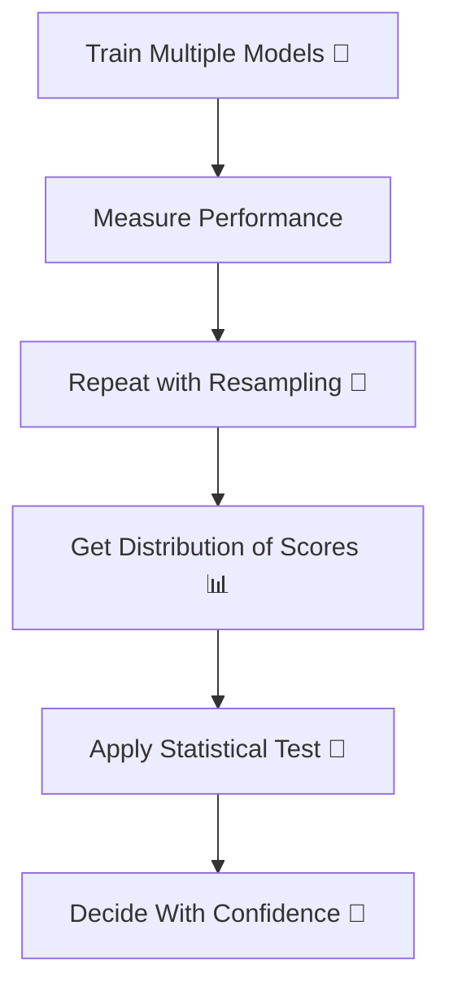
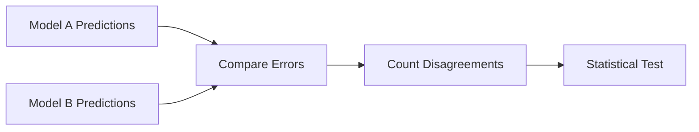
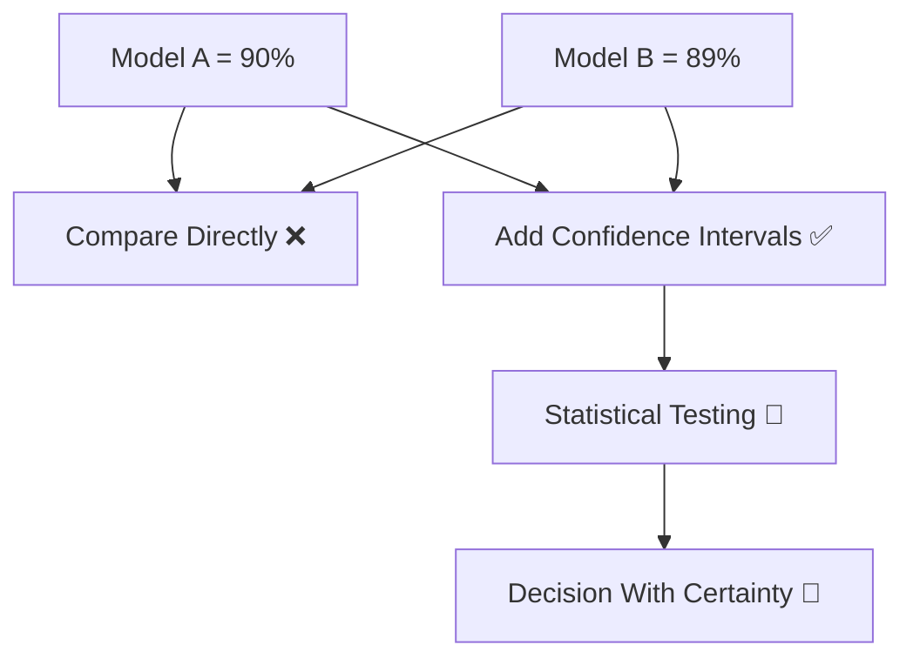

# 🎬 Probabilistic Measures in Model Selection  
## 🤖 The Day Milo Stopped Asking “Which Model Is Best?” and Started Asking “How Sure Am I?”

---

## 🌌 Chapter 1: Two Models. Almost Same Accuracy.

Milo trained two models.

Model A → 89% accuracy  
Model B → 90% accuracy  

He was ready to declare Model B the winner.

Professor Arjun stopped him.

> 👨‍🏫 “Is 1% difference real…  
> or just randomness?”

Milo froze.

He had never asked:

> 🤖 “How confident am I in this result?”

And that’s when he discovered:

# 🎲 Probabilistic Measures in Model Selection

---

# 🧠 What Does “Probabilistic Measure” Mean?

In simple words:

Instead of saying:

> “Model B is better.”

We say:

> “There is a high probability that Model B is better.”

It’s about **uncertainty**.

Because data is random.  
Splits are random.  
Sampling is random.

So model performance is also random.

---

# 🎯 Why This Matters

If performance difference is tiny:

- It may just be noise.
- It may change next time.

We need statistical confidence.

---

# 🔄 Big Picture Flow



---

# 🧠 Key Probabilistic Tools in Model Selection

We’ll explore:

1️⃣ Confidence Intervals  
2️⃣ Hypothesis Testing  
3️⃣ p-values  
4️⃣ McNemar’s Test  
5️⃣ Bayesian Model Comparison (simple idea)

Let’s go step by step.

---

# 1️⃣ Confidence Intervals

Instead of:

Accuracy = 90%

We say:

Accuracy = 90% ± 2%

Meaning:

We are confident true performance lies between:

88% and 92%

---

## 🎴 Real-Life Analogy

If you measure your weight 5 times:

- 70 kg
- 70.5 kg
- 69.8 kg
- 70.2 kg

You don’t say:

“I weigh exactly 70.12 kg.”

You say:

“About 70 kg.”

That range is your confidence interval.

---

## 💻 Example Using Cross-Validation

```python
import numpy as np
from sklearn.model_selection import cross_val_score
from sklearn.tree import DecisionTreeClassifier

model = DecisionTreeClassifier()

scores = cross_val_score(model, X, y, cv=10)

mean_score = np.mean(scores)
std_score = np.std(scores)

print("Average Accuracy:", mean_score)
print("Standard Deviation:", std_score)

# 95% Confidence Interval approximation
lower = mean_score - 2 * std_score
upper = mean_score + 2 * std_score

print("Approximate 95% CI:", (lower, upper))
```

What this tells us:

If Model A = 90% ± 3%  
And Model B = 89% ± 1%

Their intervals overlap.

So difference may not be significant.

---

# 2️⃣ Hypothesis Testing

Now we get more formal.

We create two hypotheses:

H0 (Null Hypothesis):  
Both models perform the same.

H1 (Alternative Hypothesis):  
Model B performs better.

Then we test statistically.

---

# 3️⃣ p-value (Very Simple Meaning)

p-value answers:

> If models were actually equal,  
> what is the probability we observe this difference by chance?

If p-value < 0.05:

We say difference is statistically significant.

If p-value > 0.05:

Difference may just be random noise.

---

## 🎯 Example Idea

Model A scores: [88, 89, 90, 91, 92]  
Model B scores: [89, 90, 91, 92, 93]

Difference is consistent.

p-value will likely be small.

Meaning:

Model B truly better.

---

# 4️⃣ McNemar’s Test (For Classification)

Used when:

- Comparing two classifiers
- On same test dataset

It checks:

Where they disagree.

---

## 🧠 Idea

Instead of comparing accuracy only,

We check:

- Cases where A was correct but B wrong
- Cases where B was correct but A wrong

If one consistently beats the other,

Then difference is meaningful.

---

# 🔄 Concept Flow



---

# 5️⃣ Bayesian Model Comparison (Simple Idea)

Instead of p-values,

Bayesian approach asks:

> What is the probability that Model A is better than Model B?

It gives:

P(Model A > Model B) = 0.92

Much more intuitive.

But more computationally complex.

---

# 🎬 Milo’s Turning Point

Before:

He saw 90% vs 89%.

He picked 90%.

After learning probabilistic measures:

He saw:

Model A: 90% ± 4%  
Model B: 89% ± 1%

Confidence intervals overlapped heavily.

p-value = 0.38

Conclusion:

Difference NOT significant.

He chose simpler model.

Why?

Because simpler + same performance = better generalization.

---

# 🧠 Why This Is Powerful

Without probabilistic thinking:

You overreact to tiny differences.

With probabilistic thinking:

You measure confidence.

---

# 🎯 When Should You Use Probabilistic Measures?

Use them when:

✔ Comparing multiple models  
✔ Differences are small  
✔ Data size is limited  
✔ Research or production-critical systems  

Especially important in:

- Medical AI  
- Financial modeling  
- Scientific research  

---

# 🏁 Final Comparison Mindset



---

# 🎉 Moral of the Story

In machine learning:

Accuracy is a number.

But confidence is wisdom.

The smartest data scientists don’t ask:

“Which model is best?”

They ask:

“How sure am I?”

---

# 🧠 What You Now Understand

✔ Why small metric differences can be misleading  
✔ What confidence intervals mean  
✔ What p-value represents  
✔ Why statistical testing matters  
✔ Why uncertainty is part of ML  

---


Where does Milo go next?
