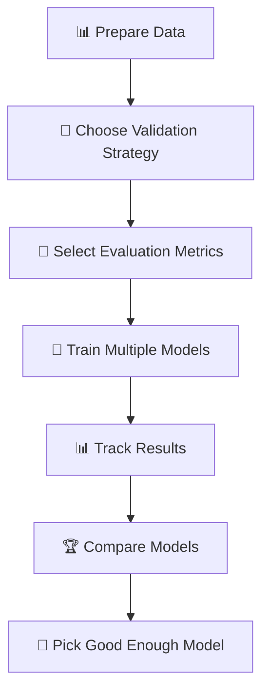
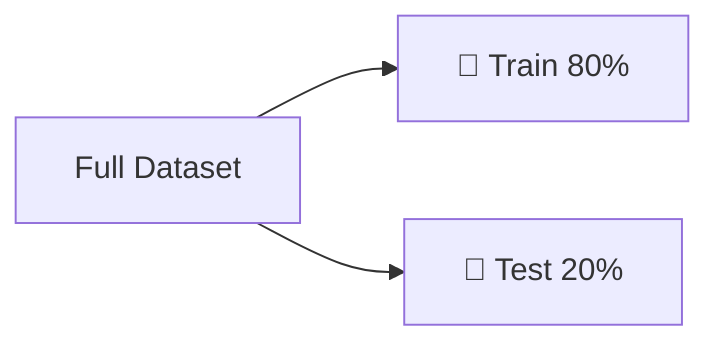
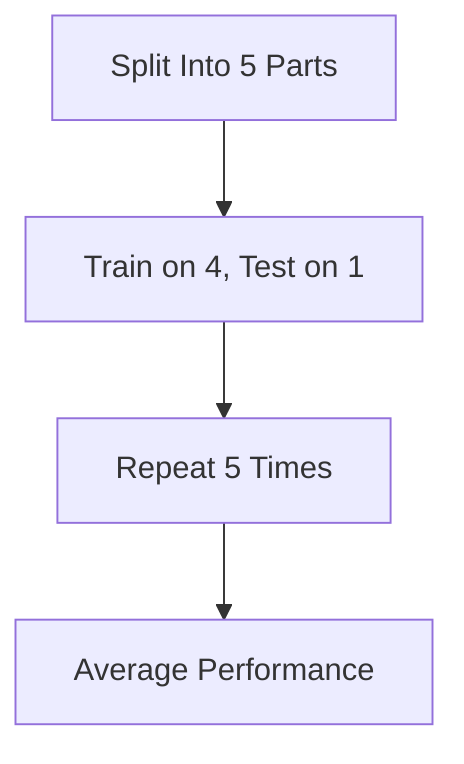
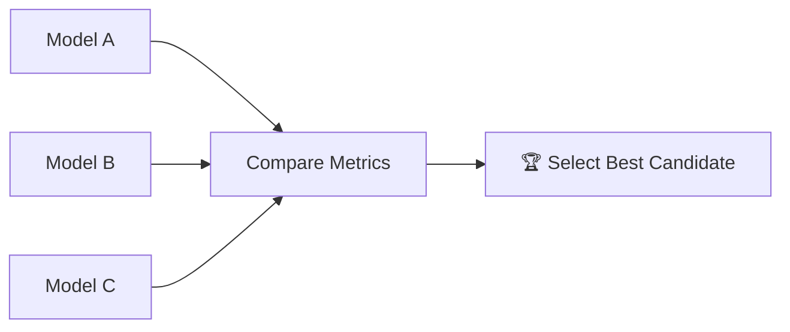
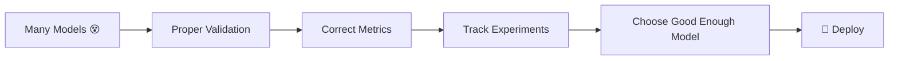

# 🎬 The Story of Model Selection in Machine Learning  
### 🤖 How Milo Chose the Right Brain

---

## 🌌 Chapter 1: Milo Has Too Many Brains

Milo had trained multiple models:

- 🧠 Linear Regression  
- 🌳 Decision Tree  
- 🌲 Random Forest  
- 🚀 Gradient Boosting  

Each one gave different results.

Milo looked confused.

> 🤖 “Which one is the best? They all say different things!”

Professor Arjun smiled.

> 👨‍🏫 “Welcome to **Model Selection**.”

---

# 🧠 What is Model Selection? (Super Simple)

Model Selection means:

> Choosing the most suitable machine learning model for your problem.

Important:

🚨 There is no universal best model.  
Only the best model **for your specific problem**.

---

# 🚗 Real-World Analogy

Imagine you need a vehicle.

| Situation | Best Choice |
|------------|------------|
| City delivery | 🛵 Bike |
| Family trip | 🚗 Car |
| Heavy goods | 🚚 Truck |
| Racing | 🏎 Sports Car |

Is a truck bad?  
No.

Is a sports car always best?  
No.

It depends on the goal.

Machine learning models are the same.

---

# 🎯 Why Model Selection Is Important

If you choose the wrong model:

- ❌ Poor predictions  
- ❌ Wasted time  
- ❌ Overfitting  
- ❌ Business loss  

If you choose wisely:

- ✅ Reliable predictions  
- ✅ Stable performance  
- ✅ Better decisions  

---

# 🔄 The Complete Model Selection Flow



Let’s break this down slowly.

---

# 🧪 Step 1: Choose a Proper Validation Strategy

Professor Arjun said seriously:

> “If you validate incorrectly, everything else becomes meaningless.”

---

## 🧠 What is Validation?

Validation means:

> Testing the model on data it has NEVER seen before.

If you test on training data:

That is cheating.

---

## 📚 Method 1: Train-Test Split



- Train on 80%
- Test on 20%

Simple and beginner friendly.

---

## 📚 Method 2: Cross-Validation

Better for smaller datasets.



More reliable estimate.

---

## 💻 Simple Example (With Comments)

```python
from sklearn.model_selection import train_test_split

# X = input features (house size, rooms, etc.)
# y = target (house price)

# Split dataset into training and testing
X_train, X_test, y_train, y_test = train_test_split(
    X, y,              # our full dataset
    test_size=0.2,     # 20% data for testing
    random_state=42    # ensures same split every time
)

# Now:
# X_train → data model learns from
# X_test  → data model is evaluated on
```

---

# 📏 Step 2: Choose the Right Evaluation Metric

Milo once chose accuracy blindly.

It failed.

Professor Arjun explained:

> “The metric must match the business goal.”

---

## 🧠 Example

### Disease Detection

If model misses sick patient → dangerous  

So we care more about:

✔ Recall  

---

### Fraud Detection

If model wrongly blocks customer → problem  

So we care more about:

✔ Precision  

---

### House Price Prediction

We care about:

✔ MAE  
✔ RMSE  
✔ R²  

---

## 🎯 Important Rule

🚨 No single metric is perfect.

Use multiple metrics.

Sometimes combine:

- ML metrics  
- Domain expert feedback  

And that is completely fine.

---

# 🧾 Step 3: Track Your Experiments

Milo trained 15 models.

Then forgot:

- Which hyperparameters were used?
- Which dataset version?
- Which performed best?

Disaster.

---

## 📊 What to Track?

- Model type  
- Hyperparameters  
- Metrics  
- Dataset version  
- Learning curves  

Even a simple Excel sheet works.

Advanced tools:

- MLflow  
- Weights & Biases  
- Neptune  

But beginners can use spreadsheets.

---

# 🏆 Step 4: Compare and Pick a Winner



But remember…

No model is perfect.

Some are just:

✔ Stable  
✔ Reliable  
✔ Good enough  

---

# 🧠 What Does “Good Enough” Mean?

It depends on business.

Example:

If 92% accuracy saves company millions,
maybe 93% is not worth 3 extra months of work.

Model selection is practical.

Not theoretical perfection.

---

# 💻 Simple Multi-Model Example (Beginner Friendly)

```python
from sklearn.linear_model import LinearRegression
from sklearn.tree import DecisionTreeRegressor
from sklearn.metrics import mean_absolute_error

# Create two models
model1 = LinearRegression()
model2 = DecisionTreeRegressor()

# Train both models
model1.fit(X_train, y_train)
model2.fit(X_train, y_train)

# Make predictions
pred1 = model1.predict(X_test)
pred2 = model2.predict(X_test)

# Evaluate using MAE
mae1 = mean_absolute_error(y_test, pred1)
mae2 = mean_absolute_error(y_test, pred2)

print("Linear Regression MAE:", mae1)
print("Decision Tree MAE:", mae2)

# Lower MAE is better
```

Even a beginner can now:

- Train multiple models  
- Compare them  
- Choose better one  

---

# 🔥 The Biggest Mistake Beginners Make

They:

- Try fancy models  
- Tune hyperparameters  
- Ignore validation  

Without proper validation:

Everything becomes meaningless.

---

# 🎬 Final Scene

Milo now understands:



He no longer asks:

“Which model is smartest?”

He asks:

“Which model works best for THIS problem?”

---

# 🎉 Moral of the Story

Model selection is not about:

✨ Most complex model  
✨ Newest model  
✨ Most popular model  

It is about:

🎯 The right model for the right problem.

---

# 🧠 What You Now Understand

✔ What model selection means  
✔ Why validation strategy is crucial  
✔ Why metric choice matters  
✔ Why experiment tracking is essential  
✔ Why “best” depends on context  

---


