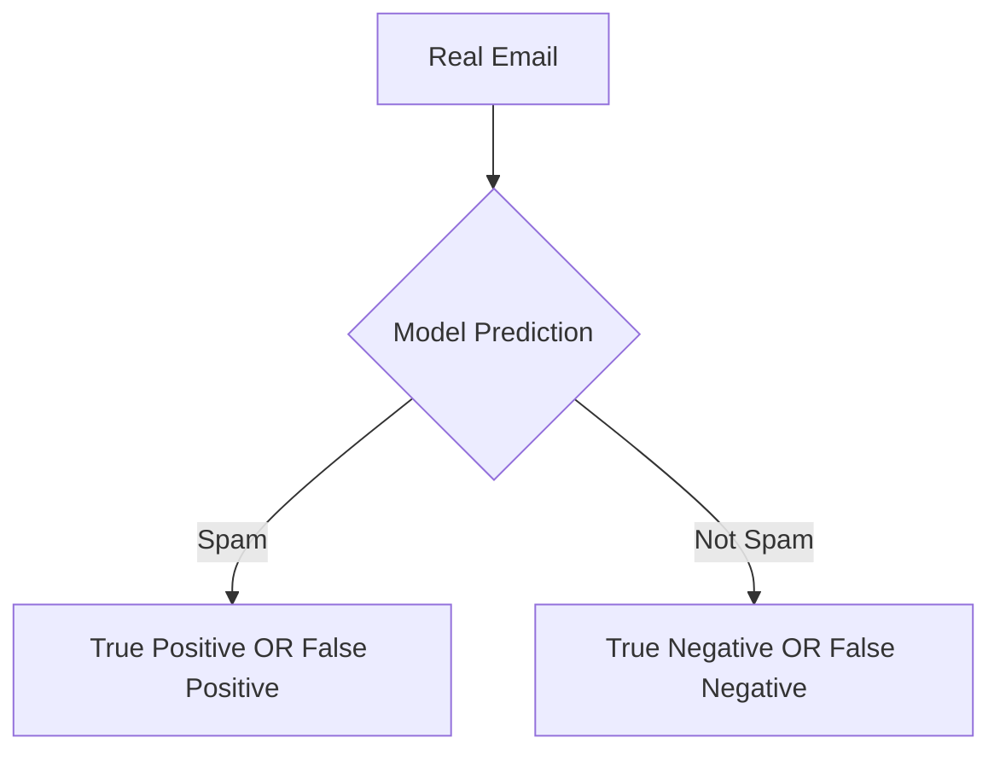
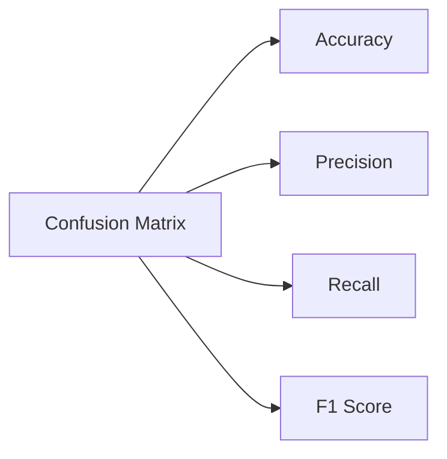
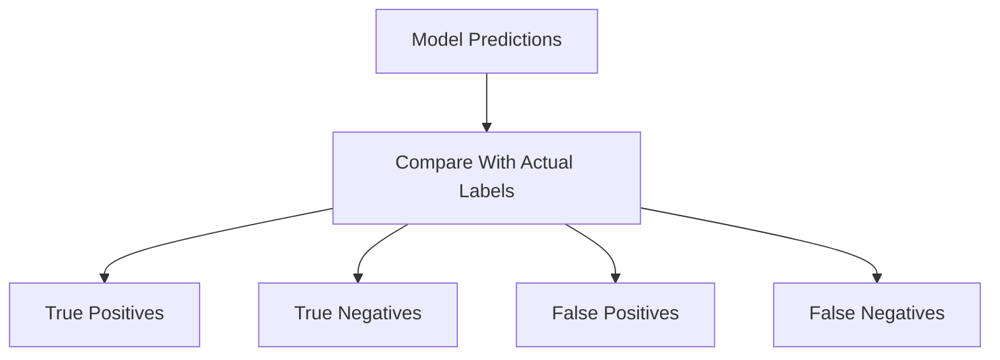

# 🎬 The Story of the Confusion Matrix  
## 🤖 How Milo Learned to Understand Model Mistakes

---

# 🌌 Chapter 1: The Model That Looked Perfect

Milo had finally built a **classification model**.

Its job was simple:

> Detect whether an email is **Spam** or **Not Spam**.

After training the model, Milo checked the result.

The screen said:

```

Accuracy = 95%

````

Milo jumped from his chair.

> 🤖 “Professor Arjun! My model is AMAZING!”

Professor Arjun slowly walked in, looked at the screen, and smiled.

Then he asked a strange question.

> 👨‍🏫 “Milo… do you know **what mistakes your model is making**?”

Milo froze.

He had **no idea**.

And that’s when Professor Arjun introduced a powerful tool.

# 🧠 The Confusion Matrix

---

# 🧠 First — What Is a Confusion Matrix?

A **Confusion Matrix** is a simple table that shows:

> **How many predictions were correct and how many were wrong.**

But it does something even better.

It tells us **WHAT KIND of mistakes the model made**.

---

# 🍎 Real-World Analogy

Imagine a **medical test for a disease**.

The doctor’s AI predicts:

- Patient **has disease**
- Patient **does NOT have disease**

But sometimes the AI is wrong.

There are **four possible outcomes**.

---

# 🔎 The Four Possible Prediction Outcomes

| Reality | Model Prediction | Meaning |
|------|------|------|
| Sick | Sick | Correct detection |
| Healthy | Healthy | Correct rejection |
| Healthy | Sick | False alarm |
| Sick | Healthy | Missed disease |

These four outcomes create the **Confusion Matrix**.

---

# 📊 The Confusion Matrix Table

```mermaid
flowchart TB
    A[Actual Class] --> B[Predicted Class]
    B --> C[True Positive]
    B --> D[False Positive]
    B --> E[False Negative]
    B --> F[True Negative]
````


Now let's see the actual matrix.

---

# 📦 Confusion Matrix Structure

|                | Predicted YES  | Predicted NO   |
| -------------- | -------------- | -------------- |
| **Actual YES** | True Positive  | False Negative |
| **Actual NO**  | False Positive | True Negative  |

This table tells the **entire story of the model’s predictions**.

---

# 🔍 The 4 Important Terms

## 1️⃣ True Positive (TP)

The model predicted **YES**, and the answer was **actually YES**.

Example:

A patient **has disease**
AI correctly predicts **disease**

Correct prediction.

---

## 2️⃣ True Negative (TN)

The model predicted **NO**, and the answer was **actually NO**.

Example:

Patient **is healthy**
AI predicts **healthy**

Correct again.

---

## 3️⃣ False Positive (FP)

The model predicted **YES**, but reality was **NO**.

Example:

Patient **healthy**
AI says **disease**

This is called a **False Alarm**.

---

## 4️⃣ False Negative (FN)

The model predicted **NO**, but reality was **YES**.

Example:

Patient **has disease**
AI says **healthy**

This is **very dangerous**.

The disease was **missed**.

---

# 🎭 Milo's First Confusion Matrix

Milo tested his spam classifier on **165 emails**.

Results:

|                 | Predicted NOT SPAM | Predicted SPAM |
| --------------- | ------------------ | -------------- |
| Actual NOT SPAM | 50                 | 10             |
| Actual SPAM     | 5                  | 100            |

Let’s decode it.

---

# 🧠 Understanding the Numbers

```
True Negatives = 50
False Positives = 10
False Negatives = 5
True Positives = 100
```

Meaning:

* 100 spam emails detected correctly
* 50 normal emails detected correctly
* 10 normal emails incorrectly marked spam
* 5 spam emails missed

Now Milo finally understood **where the model fails**.

---

# 🔄 Visual Flow of Predictions



---

# 💻 Python Example (Super Beginner Friendly)

Let’s generate a confusion matrix using **Scikit-Learn**.

```python
from sklearn.metrics import confusion_matrix

# y_test = actual labels from test dataset
# y_pred = predictions made by the model

cm = confusion_matrix(y_test, y_pred)

# Print the confusion matrix
print(cm)
```

---

# 🧠 What Each Line Does

```python
from sklearn.metrics import confusion_matrix
```

👉 Import the function that calculates the confusion matrix.

---

```python
cm = confusion_matrix(y_test, y_pred)
```

👉 Compare **actual labels** with **model predictions**.

This calculates:

```
TN FP
FN TP
```

---

```python
print(cm)
```

👉 Displays the matrix.

Example output:

```
[[50 10]
 [5 100]]
```

---

# 📊 Visualizing the Confusion Matrix

We can make it easier to understand using a heatmap.

```python
import seaborn as sns
import matplotlib.pyplot as plt
from sklearn.metrics import confusion_matrix

# Generate confusion matrix
cm = confusion_matrix(y_test, y_pred)

# Create heatmap
sns.heatmap(cm, annot=True, fmt="d")

# Add labels for clarity
plt.xlabel("Predicted Label")
plt.ylabel("Actual Label")

plt.show()
```

---

# 🧠 Code Explanation

```python
sns.heatmap(cm)
```

👉 Converts the matrix into a **visual grid**.

---

```python
annot=True
```

👉 Shows numbers inside each box.

---

```python
fmt="d"
```

👉 Displays numbers as integers.

---

# 🔄 How Confusion Matrix Connects to Other Metrics

Many famous metrics come from this matrix.



Without the **Confusion Matrix**, none of these metrics exist.

---

# 🎬 Milo’s Realization

Before learning this, Milo only saw:

```
Accuracy = 95%
```

But the confusion matrix revealed:

* Some spam emails were missed
* Some normal emails were wrongly blocked

Now Milo understood the **model’s behavior deeply**.

---

# 🏁 Confusion Matrix Summary



---

# 🎉 Final Moral

Accuracy tells you **how good your model is**.

But the **Confusion Matrix tells you WHY**.

And in Machine Learning…

Understanding **mistakes** is more important than celebrating **success**.

---


