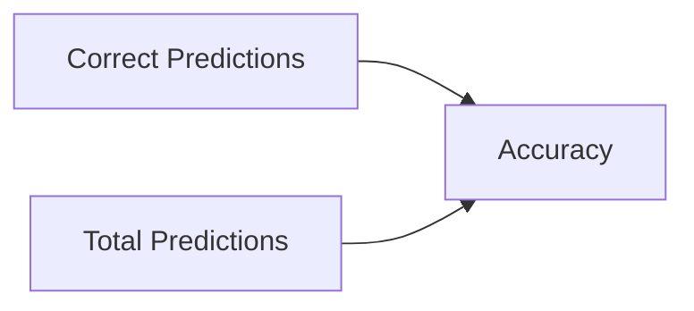
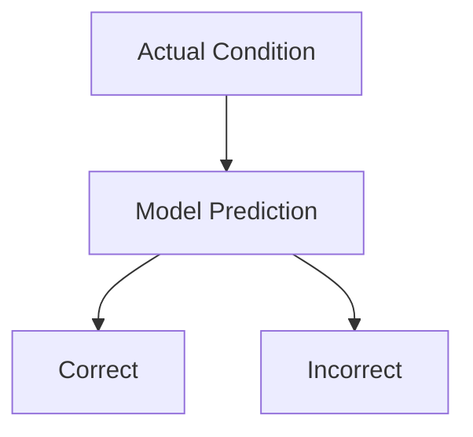
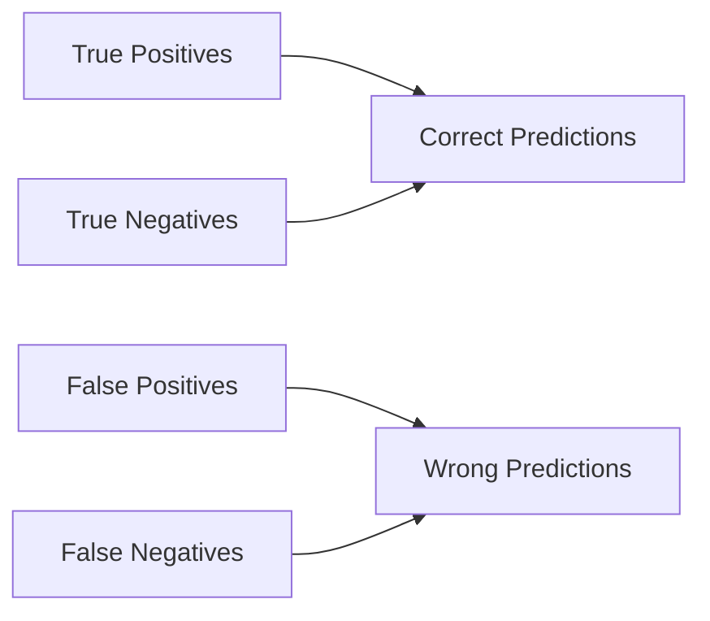
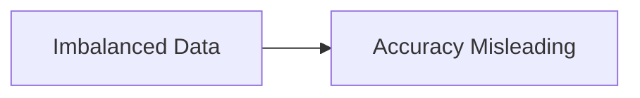
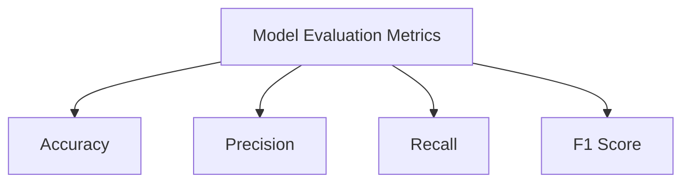
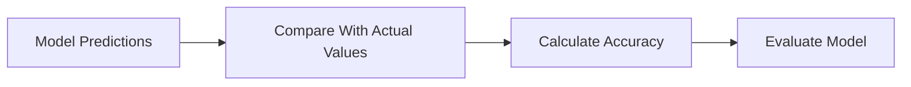

# 🌟 The Story of Accuracy in Machine Learning

### 🎬 A Cinematic Beginner’s Guide

---

## 🎭 Meet Our Characters

* 👩 **Riya** – A curious beginner learning Machine Learning.
* 👨‍🏫 **Professor Arjun** – A calm teacher who explains everything clearly.
* 🤖 **Milo** – A small robot trying to become intelligent using data.

---

# 🌌 Chapter 1: Milo’s First Prediction

One afternoon in the lab…

Professor Arjun gave Milo a task.

> 👨‍🏫 “Milo, predict whether an email is **Spam or Not Spam**.”

Milo quickly analyzed the data and replied.

> 🤖 “Prediction complete!”

Riya looked excited.

> 👩 “But how do we know if Milo predicted correctly?”

Professor Arjun smiled.

> 👨‍🏫 “That’s where **Accuracy** comes in.”

And thus began Riya’s next learning adventure.

---

# 🧠 What is Accuracy?

Professor Arjun wrote on the board:

> **Accuracy measures how many predictions the model got correct.**

Simple idea:

✔ Correct predictions → Good
❌ Wrong predictions → Bad

### 🎯 Formula

Mathematically:

**Accuracy = Correct Predictions / Total Predictions**

---

# 🎬 Example: Milo’s Exam

Milo predicted results for **10 emails**.

| Email | Actual   | Predicted |
| ----- | -------- | --------- |
| 1     | Spam     | Spam      |
| 2     | Spam     | Spam      |
| 3     | Not Spam | Spam      |
| 4     | Not Spam | Not Spam  |
| 5     | Spam     | Spam      |
| 6     | Not Spam | Not Spam  |
| 7     | Spam     | Spam      |
| 8     | Not Spam | Not Spam  |
| 9     | Spam     | Spam      |
| 10    | Not Spam | Spam      |

Let’s count.

Correct predictions = **8**

Total predictions = **10**

Accuracy = **8 / 10 = 0.8**

🎯 **Accuracy = 80%**

---

# 🎉 What Does 80% Accuracy Mean?

Professor Arjun explained:

> Out of 100 predictions, Milo will be correct about **80 times**.

That sounds pretty good, right?

Riya nodded.

But the professor raised a finger.

> 👨‍🏫 “Accuracy can sometimes be **misleading**.”

---

# ⚠ Chapter 2: The Accuracy Trap

Imagine Milo is detecting a rare disease.

Dataset:

* 990 healthy people
* 10 sick people

Now suppose Milo predicts:

> “Everyone is healthy.”

Result:

✔ 990 correct
❌ 10 wrong

Accuracy:

**990 / 1000 = 99%**

Riya gasped.

> 👩 “That sounds amazing!”

Professor Arjun shook his head.

> 👨‍🏫 “But Milo failed to detect **every sick patient**.”

That’s a huge problem.

---

# 📊 Understanding Predictions: The Confusion Matrix

To understand predictions better, Professor Arjun introduced a table.

But scientists prefer a structured table called a **Confusion Matrix**.

---

## 📋 Confusion Matrix

|                     | Predicted Positive | Predicted Negative |
| ------------------- | ------------------ | ------------------ |
| **Actual Positive** | True Positive      | False Negative     |
| **Actual Negative** | False Positive     | True Negative      |

Let’s understand each.

---

# 🟢 True Positive (TP)

Model predicts **positive**, and it is actually positive.

Example:

Disease detection

* Patient has disease
* Model says **disease**

✔ Correct prediction

---

# 🔴 False Positive (FP)

Model predicts **positive**, but actually negative.

Example:

* Patient healthy
* Model says **disease**

⚠ False alarm.

---

# 🔵 True Negative (TN)

Model predicts **negative**, and it is actually negative.

Example:

* Patient healthy
* Model says **healthy**

✔ Correct.

---

# 🟠 False Negative (FN)

Model predicts **negative**, but actually positive.

Example:

* Patient sick
* Model says **healthy**

🚨 Dangerous mistake.

---

# 🎯 Accuracy Using Confusion Matrix

Professor Arjun rewrote the formula.

### Formula

**Accuracy = (TP + TN) / (TP + TN + FP + FN)**

In simple words:

Correct predictions divided by total predictions.

---

# 🎬 Chapter 3: Milo Improves

Riya trained Milo again.

This time results were:

| Prediction Type | Count |
| --------------- | ----- |
| True Positive   | 40    |
| True Negative   | 50    |
| False Positive  | 5     |
| False Negative  | 5     |

Total predictions = **100**

Accuracy:

**(40 + 50) / 100 = 90%**

🎯 Milo achieved **90% Accuracy**

Riya clapped.

> 👩 “Milo is getting smarter!”

---

# 🧠 When is Accuracy Useful?

Professor Arjun explained that **accuracy works best when classes are balanced**.

Example:

Predicting:

* Cats vs Dogs
* Apples vs Oranges
* Spam vs Not Spam (balanced dataset)

---

# ⚠ When Accuracy is Not Enough

Accuracy becomes unreliable when:

* Classes are **imbalanced**
* One class dominates the dataset

Example:

* Fraud detection
* Disease diagnosis
* Rare event prediction

---

# 🎬 Chapter 4: Beyond Accuracy

Professor Arjun told Riya:

> “Accuracy is only one piece of the puzzle.”

Other important metrics exist.

Quick idea:

* **Precision** → How many predicted positives were correct
* **Recall** → How many actual positives were detected
* **F1 Score** → Balance between precision and recall

But that’s a story for another day.

---

# 🏁 Final Scene: Milo’s Confidence

Milo looked much happier now.

He understood that predicting is not enough.

He must **measure performance**.

Now Milo could judge how good he really was.

---

# 🎉 Moral of the Story

Accuracy answers a simple question:

> **“Out of all predictions, how many were correct?”**

But wise data scientists remember:

Accuracy alone does **not always tell the full story**.

---

