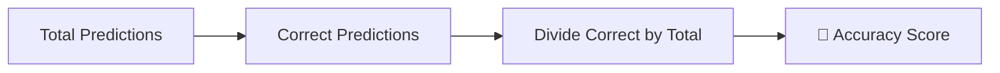
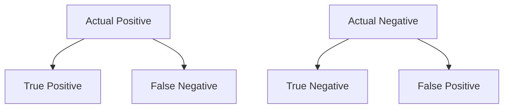
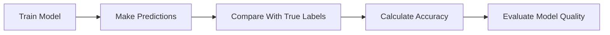
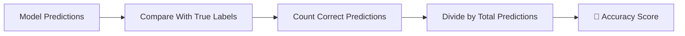

# 🌟 The Story of Accuracy in Machine Learning

### 🎬 A Cinematic Beginner’s Guide

---

## 🎭 Meet Our Characters

* 👩 **Riya** – A curious beginner learning Machine Learning.
* 👨‍🏫 **Professor Arjun** – A calm teacher who explains everything clearly.
* 🤖 **Milo** – A small robot trying to make correct predictions.

---

# 🌌 Chapter 1: Milo’s First Test

One afternoon in the lab…

Milo had just finished training on a dataset.

He looked excited.

> 🤖 Milo: “I’m ready! Ask me questions!”

Professor Arjun gave him a task.

“Predict whether an email is **spam or not spam**.”

Milo answered **100 emails**.

Riya checked the results.

She counted.

> 👩 Riya: “Milo got **90 answers correct!**”

Milo jumped with joy.

> 🤖 Milo: “That means I’m smart now, right?”

Professor Arjun smiled.

> 👨‍🏫 “Maybe… but we need to measure something called **Accuracy**.”

And that’s where our journey begins.

---

# 🧠 What is Accuracy?

Professor Arjun wrote on the board:

> **Accuracy measures how often a model’s predictions are correct.**

In simple words:

📊 **Accuracy = Correct Predictions / Total Predictions**

---

## 📌 The Formula



Or mathematically:

```
Accuracy = (Number of Correct Predictions) / (Total Predictions)
```

---

# 🎯 Example: Milo’s Spam Detector

Riya checked Milo’s answers.

| Email | Actual   | Milo Predicted |
| ----- | -------- | -------------- |
| 1     | Spam     | Spam           |
| 2     | Not Spam | Not Spam       |
| 3     | Spam     | Spam           |
| 4     | Spam     | Not Spam       |
| 5     | Not Spam | Not Spam       |

Out of **5 emails**, Milo predicted **4 correctly**.

So:

```
Accuracy = 4 / 5 = 0.80
```

🎯 **Accuracy = 80%**

---

# 🤖 Why Accuracy Matters

Accuracy helps us answer one big question:

> “How reliable is the model?”

If accuracy is:

| Accuracy | Meaning                  |
| -------- | ------------------------ |
| 50%      | Model is guessing        |
| 70%      | Model is learning        |
| 90%+     | Model is performing well |

But Professor Arjun raised a finger.

> 👨‍🏫 “Accuracy is useful… but it can sometimes **mislead us**.”

Riya looked confused.

---

# ⚠ The Accuracy Trap

Professor Arjun showed a strange example.

Imagine a hospital dataset:

* 990 patients → **Healthy**
* 10 patients → **Disease**

Now Milo builds a model.

But he predicts:

> “Everyone is healthy.”

---

## What Happens?

Out of **1000 patients**:

* Correct = **990**
* Wrong = **10**

So accuracy becomes:

```
Accuracy = 990 / 1000 = 99%
```

Riya was shocked.

> 👩 Riya: “99% accuracy?! That sounds amazing!”

Professor Arjun shook his head.

> 👨‍🏫 “But Milo **missed every sick patient**.”

So the model is actually **useless**.

---

# 📉 The Problem: Imbalanced Data

This happens when one class dominates.

Example:

| Class   | Count |
| ------- | ----- |
| Healthy | 990   |
| Disease | 10    |

When data is imbalanced:

🚨 Accuracy becomes misleading.

---

# 🧠 Understanding Predictions Deeper

Professor Arjun introduced a powerful tool.

> **Confusion Matrix**

It helps us see exactly what the model predicted.

---

## 📊 Confusion Matrix



Let’s understand each.

---

## ✅ True Positive (TP)

Model predicts **Positive**
Actual result is **Positive**

Example:

Disease predicted → Patient actually sick.

Correct.

---

## ❌ False Positive (FP)

Model predicts **Positive**
Actual result is **Negative**

Example:

Model says patient is sick → but they are healthy.

This is a **false alarm**.

---

## ❌ False Negative (FN)

Model predicts **Negative**
Actual result is **Positive**

Example:

Model says patient is healthy → but they are sick.

This is **dangerous**.

---

## ✅ True Negative (TN)

Model predicts **Negative**
Actual result is **Negative**

Example:

Healthy predicted → Patient actually healthy.

Correct.

---

# 🎯 Accuracy Using Confusion Matrix

Professor Arjun rewrote the formula.

```
Accuracy = (TP + TN) / (TP + TN + FP + FN)
```

Meaning:

✔ Correct positives
✔ Correct negatives

Divided by total predictions.

---

# 🎬 Chapter 2: Milo Learns From Mistakes

Milo looked worried.

> 🤖 Milo: “What if my accuracy is high but I still make bad mistakes?”

Professor Arjun nodded.

> 👨‍🏫 “That’s why accuracy is **only the first metric** we check.”

There are other important metrics too.

---

# 📊 Accuracy in Model Evaluation

Accuracy is most useful when:

✔ Classes are balanced
✔ Errors have similar cost
✔ Dataset is evenly distributed

---

## Example: Image Classification

If a model predicts:

🐶 Dog
🐱 Cat
🐰 Rabbit

And the dataset is balanced.

Then **accuracy works well**.

---

# ⚠ When Accuracy Fails

Accuracy can be misleading in:

🚑 Medical diagnosis
💳 Fraud detection
📧 Spam detection
🔐 Security systems

Because **some mistakes are more serious than others**.

Example:

Missing a fraud transaction is worse than blocking a normal one.

---

# 🧭 How Accuracy Fits in Machine Learning

Professor Arjun drew a simple evaluation pipeline.



---

# 🎬 Chapter 3: Improving Accuracy

Riya asked:

> 👩 “How can Milo improve his accuracy?”

Professor Arjun listed a few strategies.

---

## 🧹 1. Better Data

Garbage data → garbage predictions.

Clean data improves accuracy.

Examples:

* Remove missing values
* Fix incorrect labels
* Balance dataset

---

## 🎯 2. Better Features

Good features help models understand patterns.

Example:

Predicting house price using:

✔ Size
✔ Location
✔ Number of rooms

Instead of useless information.

---

## ⚙ 3. Better Algorithms

Different models perform differently.

Examples:

* Decision Trees
* Random Forest
* Neural Networks
* Gradient Boosting

Trying multiple models can improve accuracy.

---

## 🔁 4. Hyperparameter Tuning

Small parameter changes can improve performance.

Example:

* Tree depth
* Learning rate
* Number of estimators

---

# 🤖 Milo’s Final Test

After improving his model:

Milo predicted **100 emails** again.

Results:

* Correct → **94**
* Incorrect → **6**

```
Accuracy = 94 / 100
Accuracy = 94%
```

Riya smiled.

> 👩 “Now Milo is truly improving!”

---

# 🏁 Final Scene: Milo Understands Accuracy

Professor Arjun summarized everything.



Milo finally understood:

Accuracy is the **first step** to judging a model.

But not always the **only step**.

---

# 🎉 Moral of the Story

A model is not good because it **looks confident**.

A model is good because its predictions are **correct**.

Accuracy helps us measure that.

But a wise data scientist always looks **beyond accuracy**.

---

# 🧠 What You Learned

✔ What accuracy means
✔ Accuracy formula explained
✔ Real examples of accuracy
✔ Confusion matrix basics
✔ True Positive, False Positive, False Negative, True Negative
✔ When accuracy works well
✔ When accuracy can mislead
✔ Ways to improve model accuracy

---


