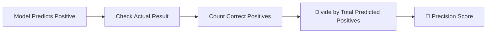
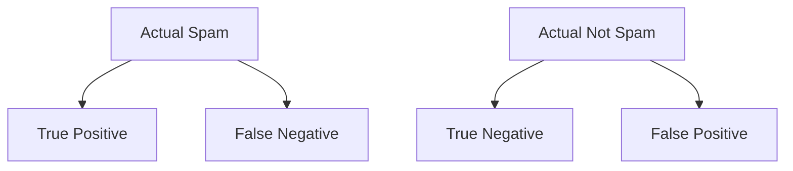
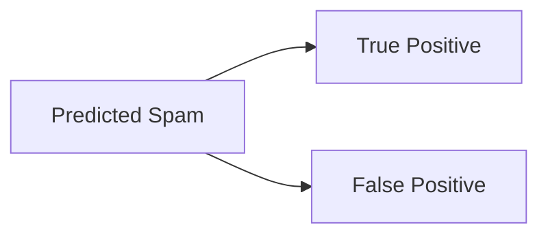
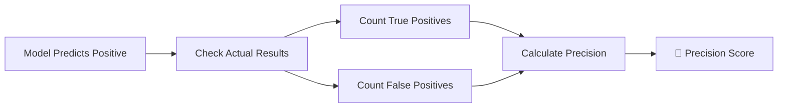

# 🌟 The Story of Precision in Machine Learning

### 🎬 A Cinematic Beginner’s Guide

---

## 🎭 Meet Our Characters

* 👩 **Riya** – A curious beginner exploring Machine Learning.
* 👨‍🏫 **Professor Arjun** – A calm teacher who explains difficult ideas simply.
* 🤖 **Milo** – A small robot learning how to make smarter predictions.

---

# 🌌 Chapter 1: The Spam Detector Problem

One morning in the lab…

Milo had built a **spam email detector**.

His task was simple:

👉 Decide whether an email is **Spam** or **Not Spam**.

Milo started predicting quickly.

But something strange happened.

Many **normal emails were marked as spam**.

Riya looked confused.

> 👩 Riya: “Milo is catching spam… but he’s also blocking important emails!”

Professor Arjun nodded.

> 👨‍🏫 “That’s exactly why we need a metric called **Precision**.”

And that begins our story.

---

# 🧠 What is Precision?

Professor Arjun wrote on the board:

> **Precision tells us how many predicted positives are actually correct.**

In simple words:

👉 Out of everything the model **predicted as positive**,
👉 How many were **truly positive**?

---

## 📌 The Formula



Mathematically:

```
Precision = True Positives / (True Positives + False Positives)
```

---

# 🎯 Understanding the Idea

Professor Arjun explained it like this:

Imagine Milo says:

📧 “These 10 emails are spam.”

But after checking:

* 7 were actually spam ✅
* 3 were normal emails ❌

So Milo made **3 false alarms**.

---

### 📊 Precision Calculation

```
Precision = 7 / (7 + 3)
Precision = 7 / 10
Precision = 70%
```

🎯 **Precision = 70%**

This means:

> When Milo says something is spam, he is correct **70% of the time**.

---

# 📊 The Confusion Matrix

To understand precision better, Professor Arjun introduced a helpful tool.

> **Confusion Matrix**

It shows how predictions compare with reality.

---

## 🔍 Confusion Matrix Structure



---

## ✅ True Positive (TP)

Model predicts **Spam**
Email is actually **Spam**

Correct detection.

---

## ❌ False Positive (FP)

Model predicts **Spam**
But email is **Not Spam**

This is a **false alarm**.

---

## ❌ False Negative (FN)

Model predicts **Not Spam**
But email is actually **Spam**

Spam slipped through.

---

## ✅ True Negative (TN)

Model predicts **Not Spam**
Email is actually **Not Spam**

Correct rejection.

---

# 🎯 Precision Focuses on These

Professor Arjun circled two parts.



Precision only looks at:

✔ True Positives
❌ False Positives

---

### Precision Formula Again

```
Precision = TP / (TP + FP)
```

Meaning:

Out of everything predicted positive →
How many were actually correct.

---

# 🎬 Chapter 2: The False Alarm Problem

Riya tested Milo again.

This time Milo labeled **20 emails as spam**.

After checking:

* 12 were actually spam
* 8 were normal emails

---

### Precision Calculation

```
Precision = 12 / (12 + 8)
Precision = 12 / 20
Precision = 60%
```

Riya frowned.

> 👩 “So 40% of the time Milo blocks normal emails?”

Professor Arjun nodded.

> 👨‍🏫 “Exactly. Low precision means **too many false alarms**.”

---

# ⚠ Why Precision Matters

Precision becomes important when **false positives are costly**.

Let’s see some examples.

---

## 📧 Spam Detection

If precision is low:

❌ Important emails go to spam.

Bad user experience.

---

## 🔐 Face Recognition Security

Low precision means:

❌ System unlocks for the **wrong person**.

Dangerous.

---

## 💳 Fraud Detection

Low precision means:

❌ Normal transactions blocked as fraud.

Customers get frustrated.

---

# 🧠 High Precision Means

If a model has **high precision**:

✔ When it predicts positive → it’s usually correct
✔ Very few false alarms
✔ Predictions are reliable

---

# 📊 Precision Example Table

| Model   | True Positives | False Positives | Precision |
| ------- | -------------- | --------------- | --------- |
| Model A | 80             | 20              | 80%       |
| Model B | 80             | 5               | 94%       |

Model B is better.

Why?

Because it produces **fewer false alarms**.

---

# 🎬 Chapter 3: Precision vs Accuracy

Riya had another question.

> 👩 “But we already learned **Accuracy**. Isn’t that enough?”

Professor Arjun shook his head.

> 👨‍🏫 “Accuracy and Precision measure different things.”

---

## 📊 Accuracy Formula

```
Accuracy = (TP + TN) / Total Predictions
```

Accuracy measures **overall correctness**.

---

## 📊 Precision Formula

```
Precision = TP / (TP + FP)
```

Precision measures **quality of positive predictions**.

---

### Example

Imagine a dataset with **100 emails**.

Model predicts:

* Spam predicted = 20
* Correct spam = 10

Accuracy might still look good.

But precision shows:

```
Precision = 10 / 20 = 50%
```

Half of spam predictions are wrong.

---

# 🎯 Precision in Model Evaluation

Professor Arjun explained when to prioritize precision.

Use **Precision** when:

✔ False positives are costly
✔ Predictions must be trustworthy
✔ We want fewer false alarms

---

# 📈 Improving Precision

Riya asked:

> 👩 “How can Milo improve precision?”

Professor Arjun gave a few strategies.

---

## ⚙ 1. Adjust Decision Threshold

Instead of predicting positive easily:

Raise the confidence requirement.

Example:

Spam only if probability > **0.8**.

---

## 🧹 2. Better Data Quality

Better labeled data helps models learn correctly.

Remove noisy examples.

---

## 🎯 3. Feature Engineering

Add meaningful features.

Example:

* Email sender reputation
* Suspicious keywords
* Link patterns

---

## 🤖 4. Better Algorithms

Try models that reduce false positives.

Examples:

* Random Forest
* Gradient Boosting
* Neural Networks

---

# 🤖 Milo’s Improved Detector

After improvements, Milo tested again.

Out of **15 predicted spam emails**:

* 14 were actually spam
* 1 was normal

---

### Precision Calculation

```
Precision = 14 / (14 + 1)
Precision = 14 / 15
Precision ≈ 93%
```

Riya clapped.

> 👩 “Now Milo rarely blocks normal emails!”

---

# 🏁 Final Scene: Milo Masters Precision

Professor Arjun summarized everything.



Milo finally understood:

Precision measures the **trustworthiness of positive predictions**.

---

# 🎉 Moral of the Story

A good model doesn’t just predict positives.

A good model predicts positives **correctly**.

Precision tells us:

> “When the model says YES…
> how often is it right?”

---

# 🧠 What You Learned

✔ What precision means
✔ Precision formula explained
✔ Confusion matrix components
✔ True Positive and False Positive
✔ Difference between precision and accuracy
✔ When precision is important
✔ Ways to improve precision

---


