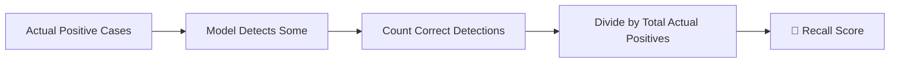
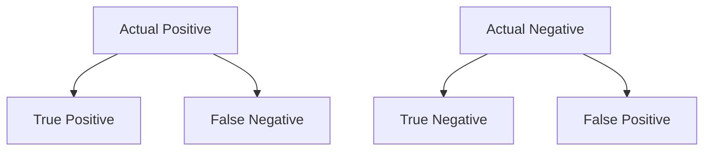
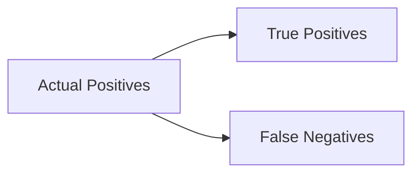
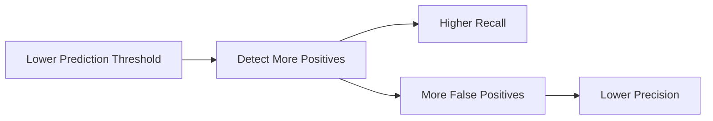
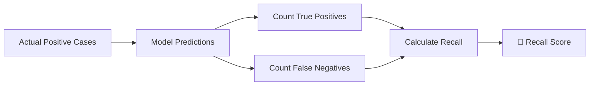

# 🌟 The Story of Recall in Machine Learning

### 🎬 A Cinematic Beginner’s Guide

---

## 🎭 Meet Our Characters

* 👩 **Riya** – A curious beginner exploring Machine Learning.
* 👨‍🏫 **Professor Arjun** – A calm teacher who explains complex ideas simply.
* 🤖 **Milo** – A small robot trying to detect important patterns in data.

---

# 🌌 Chapter 1: The Dangerous Miss

One day in the lab…

Milo was given a new task.

👉 Detect **fraudulent transactions** in a bank system.

Thousands of transactions flowed through Milo.

Most were normal.

But a few were **fraud**.

After testing, Riya looked at the results.

> 👩 Riya: “Milo caught some frauds… but he missed several too.”

Milo looked worried.

> 🤖 Milo: “Missing fraud sounds bad…”

Professor Arjun nodded seriously.

> 👨‍🏫 “Very bad. That’s why we measure something called **Recall**.”

And the story begins.

---

# 🧠 What is Recall?

Professor Arjun wrote on the board:

> **Recall measures how many actual positives the model successfully found.**

In simple terms:

👉 Out of all the **real positive cases**,
👉 How many did the model correctly detect?


---

## 📌 The Formula



Mathematically:

```
Recall = True Positives / (True Positives + False Negatives)
```

---

# 🎯 Understanding the Idea

Professor Arjun gave an example.

Suppose there are **10 fraud transactions** in the system.

Milo detects **7 of them**.

But **3 fraud cases slip through**.

---

### 📊 Recall Calculation

```
Recall = 7 / (7 + 3)
Recall = 7 / 10
Recall = 70%
```

🎯 **Recall = 70%**

Meaning:

> Milo successfully detected **70% of all fraud cases**.

But **30% escaped detection**.

---

# 📊 The Confusion Matrix

To understand Recall clearly, Professor Arjun brought back a helpful tool.

> **Confusion Matrix**

---

## 🔍 Confusion Matrix Structure



---

## ✅ True Positive (TP)

Model predicts **Positive**
Actual result is **Positive**

Example:

Fraud predicted → Transaction is actually fraud.

Correct detection.

---

## ❌ False Negative (FN)

Model predicts **Negative**
Actual result is **Positive**

Example:

Transaction is fraud → but Milo says normal.

This is a **missed fraud**.

Very dangerous.

---

## ❌ False Positive (FP)

Model predicts **Positive**
Actual result is **Negative**

False alarm.

---

## ✅ True Negative (TN)

Model predicts **Negative**
Actual result is **Negative**

Correct rejection.

---

# 🎯 Recall Focuses on These

Professor Arjun circled two parts.



Recall only cares about:

✔ True Positives
❌ False Negatives

---

### Recall Formula Again

```
Recall = TP / (TP + FN)
```

Meaning:

Out of all **actual positives**,
how many did we detect?

---

# 🎬 Chapter 2: The Missed Disease

Professor Arjun gave another example.

Imagine a hospital using Milo to detect **disease**.

There are **100 patients with disease**.

Milo identifies **85 patients correctly**.

But **15 sick patients are missed**.

---

### Recall Calculation

```
Recall = 85 / (85 + 15)
Recall = 85 / 100
Recall = 85%
```

🎯 **Recall = 85%**

Riya looked serious.

> 👩 “So 15 sick patients go undetected?”

Professor Arjun nodded.

> 👨‍🏫 “Exactly. That’s why **recall is critical in healthcare**.”

---

# ⚠ Why Recall Matters

Recall becomes important when **missing a positive case is dangerous**.

---

## 🚑 Medical Diagnosis

Low recall means:

❌ Sick patients go untreated.

---

## 💳 Fraud Detection

Low recall means:

❌ Fraud transactions slip through.

Money is lost.

---

## 🔐 Security Systems

Low recall means:

❌ Threats go unnoticed.

Security risks increase.

---

# 🧠 High Recall Means

If a model has **high recall**:

* ✔ It detects most positive cases
* ✔ Very few positives are missed
* ✔ System is sensitive to important events

---

# 🎬 Chapter 3: Precision vs Recall

Riya remembered something.

> 👩 “We learned **Precision** earlier. How is Recall different?”

Professor Arjun explained.

---

## 📊 Precision Formula

```
Precision = TP / (TP + FP)
```

Precision asks:

👉 When the model says **positive**,
👉 How often is it correct?

---

## 📊 Recall Formula

```
Recall = TP / (TP + FN)
```

Recall asks:

👉 Out of all **real positives**,
👉 How many did we catch?

---

### Simple Comparison

| Metric    | Focus                   |
| --------- | ----------------------- |
| Precision | Avoid false alarms      |
| Recall    | Avoid missing positives |

---

### Example

Fraud Detection System:

| Prediction     | Meaning                                  |
| -------------- | ---------------------------------------- |
| High Precision | Few normal transactions flagged as fraud |
| High Recall    | Most fraud transactions detected         |

---

# 🎯 The Trade-Off Problem

Professor Arjun showed Milo something interesting.

Improving recall sometimes **reduces precision**.

---

## Why?

If Milo flags **more transactions as fraud**, then:

* ✔ More fraud is detected → Recall increases
* ❌ More normal transactions flagged → Precision decreases

---



So data scientists must **balance both metrics**.

---

# 📈 Improving Recall

Riya asked:

> 👩 “How can Milo improve recall?”

Professor Arjun listed several techniques.

---

## ⚙ 1. Lower Decision Threshold

Allow the model to classify positives more easily.

Example:

Fraud probability > **0.4** instead of **0.7**.

---

## 📊 2. Collect More Positive Data

More fraud examples help the model learn patterns better.

---

## 🧠 3. Feature Engineering

Add features that help detect positives.

Example:

* Transaction location
* Purchase frequency
* Time of purchase

---

## 🤖 4. Use Better Algorithms

Some models detect rare events better.

Examples:

* Random Forest
* Gradient Boosting
* Neural Networks

---

# 🤖 Milo’s Improved Fraud Detector

After improvements, Milo tested again.

There were **50 fraud transactions**.

He detected **47 of them**.

Only **3 were missed**.

---

### Recall Calculation

```
Recall = 47 / (47 + 3)
Recall = 47 / 50
Recall = 94%
```

Riya smiled.

> 👩 “Now almost every fraud is detected!”

---

# 🏁 Final Scene: Milo Understands Recall

Professor Arjun summarized the idea.



Milo finally understood:

Recall measures **how many real positives we successfully detect**.

---

# 🎉 Moral of the Story

In many real-world systems,

Missing a positive case can be **more dangerous than a false alarm**.

Recall helps us measure:

> “Did we catch all the important cases?”

---

# 🧠 What You Learned

* ✔ What recall means
* ✔ Recall formula explained
* ✔ True Positive and False Negative
* ✔ Confusion matrix basics
* ✔ Difference between precision and recall
* ✔ When recall is important
* ✔ Precision vs recall trade-off
* ✔ Ways to improve recall

---


