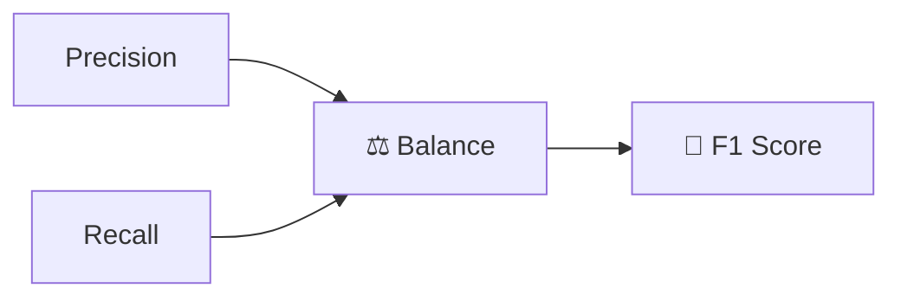
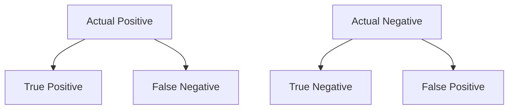
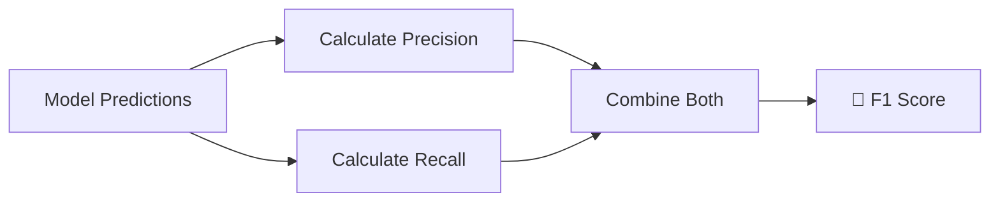

# 🌟 The Story of F1 Score in Machine Learning

### 🎬 A Cinematic Beginner’s Guide

---

## 🎭 Meet Our Characters

* 👩 **Riya** – A curious beginner learning Machine Learning.
* 👨‍🏫 **Professor Arjun** – A calm teacher who simplifies complex ideas.
* 🤖 **Milo** – A small robot learning how to make reliable predictions.

---

# 🌌 Chapter 1: The Precision vs Recall Dilemma

One afternoon in the lab…

Riya tested Milo’s **fraud detection system**.

Two models were competing.

### Model A

* Precision → **95%**
* Recall → **40%**

### Model B

* Precision → **70%**
* Recall → **80%**

Riya scratched her head.

> 👩 Riya: “Model A is very precise… but misses many frauds.”

> 👩 Riya: “Model B catches more fraud… but makes more mistakes.”

Milo beeped nervously.

> 🤖 Milo: “So which model is better?”

Professor Arjun smiled.

> 👨‍🏫 “That’s why we use a metric called **F1 Score**.”

And our story begins.

---

# 🧠 What is F1 Score?

Professor Arjun wrote on the board:

> **F1 Score balances Precision and Recall into one single metric.**

In simple terms:

👉 It tells us how well the model performs
when **both precision and recall matter**.

---

## 🎯 Why F1 Score Exists

Precision focuses on:

✔ Avoiding false alarms

Recall focuses on:

✔ Catching all real positives

But sometimes we need **both**.

So F1 Score combines them.

---

# 📊 Precision and Recall Refresher

Professor Arjun reminded Riya.

### Precision

```text
Precision = TP / (TP + FP)
```

Meaning:

Out of predicted positives →
how many were correct?

---

### Recall

```text
Recall = TP / (TP + FN)
```

Meaning:

Out of actual positives →
how many did we detect?

---

# 📌 The F1 Score Formula

Professor Arjun revealed the formula.

```text
F1 Score = 2 × (Precision × Recall) / (Precision + Recall)
```

This formula calculates the **harmonic mean** of precision and recall.

---

## 📊 Visual Idea



F1 Score only becomes **high** when:

* ✔ Precision is high
* ✔ Recall is high

---

# 🎯 Understanding With Example

Riya tested a model.

Results:

* Precision = **80%**
* Recall = **60%**

Let’s calculate F1 Score.

---

### Step-by-Step Calculation

```text
F1 = 2 × (0.8 × 0.6) / (0.8 + 0.6)
```

```text
F1 = 2 × 0.48 / 1.4
```

```text
F1 ≈ 0.69
```

🎯 **F1 Score = 69%**

---

# 🧠 Why Harmonic Mean?

Riya asked an interesting question.

> 👩 “Why not just average precision and recall?”

Professor Arjun explained.

Normal average can hide problems.

Example:

| Precision | Recall | Average | F1 Score |
| --------- | ------ | ------- | -------- |
| 100%      | 0%     | 50%     | **0%**   |

The model predicts **almost nothing**.

But average still shows **50%**.

F1 Score punishes this imbalance.

---

# 🎬 Chapter 2: The Model Comparison

Professor Arjun returned to the earlier models.

---

## Model A

* Precision = **95%**
* Recall = **40%**

### F1 Score

```text
F1 = 2 × (0.95 × 0.40) / (0.95 + 0.40)
```

```text
F1 ≈ 0.56
```

🎯 **F1 Score ≈ 56%**

---

## Model B

* Precision = **70%**
* Recall = **80%**

### F1 Score

```text
F1 = 2 × (0.70 × 0.80) / (0.70 + 0.80)
```

```text
F1 ≈ 0.75
```

🎯 **F1 Score ≈ 75%**

---

Riya smiled.

> 👩 “Now it’s clear! Model B is better overall.”

Professor Arjun nodded.

> 👨‍🏫 “Exactly. F1 Score rewards **balanced performance**.”

---

# 📊 F1 Score Using Confusion Matrix

Professor Arjun connected everything together.

---

## Confusion Matrix



From this matrix we calculate:

* Precision → TP / (TP + FP)
* Recall → TP / (TP + FN)

Then combine them to get **F1 Score**.

---

# 🎯 When Should We Use F1 Score?

F1 Score is very useful when:

* ✔ Dataset is **imbalanced**
* ✔ Both precision and recall are important
* ✔ False positives and false negatives both matter

---

## Example Applications

### 💳 Fraud Detection

We want:

* ✔ Catch fraud (high recall)
* ✔ Avoid blocking normal users (high precision)

---

### 🚑 Medical Diagnosis

We want:

* ✔ Detect disease cases
* ✔ Avoid wrong diagnoses

---

### 📧 Spam Detection

We want:

* ✔ Catch spam
* ✔ Avoid blocking real emails

---

# ⚠ When F1 Score Is Less Important

F1 Score is less useful when:

* ✔ Dataset is balanced
* ✔ One type of error matters more than the other

Example:

Airport security may prioritize **recall over precision**.

---

# 🎬 Chapter 3: Improving F1 Score

Riya asked Milo:

> 👩 “How can we increase your F1 Score?”

Professor Arjun listed a few strategies.

---

## ⚙ 1. Adjust Model Threshold

Changing the prediction threshold can balance precision and recall.

---

## 📊 2. Handle Imbalanced Data

Techniques like:

* Oversampling
* Undersampling
* SMOTE

---

## 🧠 3. Feature Engineering

Better features help the model identify patterns.

---

## 🤖 4. Try Different Algorithms

Some models naturally balance precision and recall better.

Examples:

* Random Forest
* Gradient Boosting
* Neural Networks

---

# 🤖 Milo’s Improved Model

After tuning the model:

* Precision = **85%**
* Recall = **82%**

Let’s calculate F1 Score.

---

### Final Calculation

```text
F1 = 2 × (0.85 × 0.82) / (0.85 + 0.82)
```

```text
F1 ≈ 0.835
```

🎯 **F1 Score ≈ 83.5%**

Riya clapped.

> 👩 “Now Milo is both accurate and balanced!”

---

# 🏁 Final Scene: Milo Masters F1 Score

Professor Arjun summarized the idea.



Milo finally understood:

F1 Score measures **balance between precision and recall**.

---

# 🎉 Moral of the Story

A great model doesn’t just:

* ✔ Avoid mistakes
or
* ✔ Catch every case

A great model **balances both**.

That balance is measured by **F1 Score**.

---

# 🧠 What You Learned

* ✔ What F1 Score means
* ✔ Why F1 Score exists
* ✔ F1 Score formula explained
* ✔ Harmonic mean concept (simple explanation)
* ✔ How F1 compares models
* ✔ When to use F1 Score
* ✔ How to improve F1 Score

---


