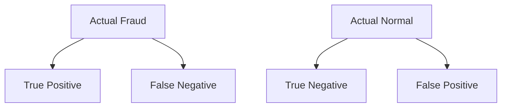
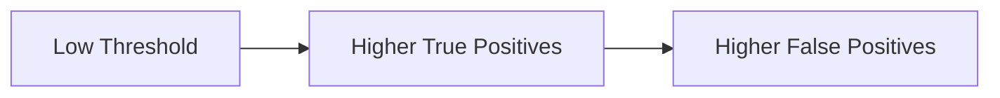
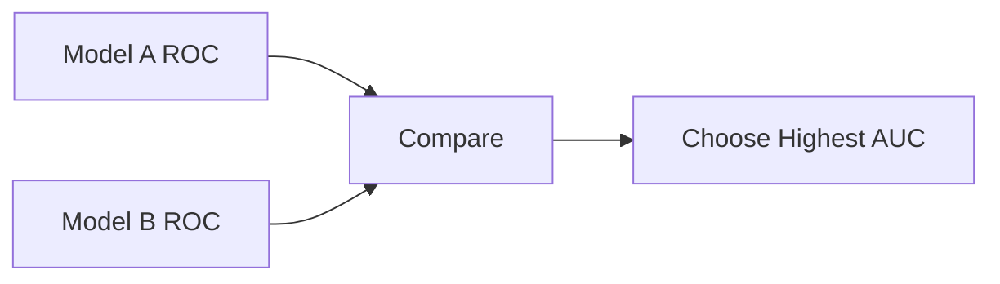
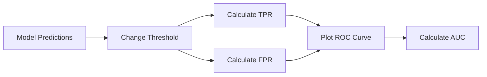

# 🌟 The Story of ROC Curve & AUC in Machine Learning

---

## 🎭 Meet Our Characters

* 👩 **Riya** – A curious beginner who asks too many questions.
* 👨‍🏫 **Professor Arjun** – A calm teacher who has seen every ML disaster possible.
* 🤖 **Milo** – A tiny robot who panics whenever there are too many numbers.

---

# 🌌 Chapter 1: The Great Fraud Hunt

One dramatic morning in the lab…

Milo received an urgent mission.

🚨 **Detect fraudulent bank transactions.**

Millions of transactions.

Thousands of features.

And somewhere inside…

💀 **Fraudsters hiding like villains in a movie.**

Milo began scanning transactions.

But instead of saying simply **Fraud / Not Fraud**, Milo produced something strange.

Numbers like this:

| Transaction | Fraud Probability |
| ----------- | ----------------- |
| T1          | 0.95              |
| T2          | 0.81              |
| T3          | 0.63              |
| T4          | 0.42              |
| T5          | 0.10              |

Milo beeped loudly.

> 🤖 Milo: “I don’t say YES or NO… I say **how suspicious** something is!”

Riya leaned closer.

> 👩 Riya: “Okay… but when do we actually call it fraud?”

Professor Arjun slowly turned around.

(Dramatic music plays)

> 👨‍🏫 “That… depends on the **threshold**.”

---

# 🧠 The Mysterious Threshold

The **threshold** decides when suspicion becomes **accusation**.

Example rule:

| Probability | Prediction |
| ----------- | ---------- |
| > 0.5       | Fraud      |
| ≤ 0.5       | Normal     |

But we can change the threshold.

And chaos begins.

---

## 🎬 Scenario 1: Super Strict Milo

Threshold = **0.9**

Only the **most suspicious transactions** are called fraud.

Result:

✔ Very few false alarms
❌ Many fraudsters escape

Fraudsters celebrating:

🎉 “Milo is too polite!”

---

## 🎬 Scenario 2: Super Paranoid Milo

Threshold = **0.2**

Now Milo calls almost everything fraud.

Result:

✔ Almost all fraud detected
❌ Half the bank customers are angry

Bank customers:

> “I just bought coffee! WHY AM I FRAUD??”

---

Riya panicked.

> 👩 “So changing the threshold changes the results??”

Professor Arjun nodded.

> 👨‍🏫 “Exactly. And to understand this behavior… we use the **ROC Curve**.”

---

# 🌌 Chapter 2: The Confusion Matrix Returns

Professor Arjun pulled out the legendary **Confusion Matrix**.

(Dramatic lightning strike ⚡)



---

## The Four Outcomes

### ✅ True Positive (TP)

Milo says **Fraud**
Transaction actually **Fraud**

Fraudster caught.

Police happy.

---

### ❌ False Positive (FP)

Milo says **Fraud**
Transaction actually **Normal**

Customer angry.

Bank apologizing.

---

### ❌ False Negative (FN)

Milo says **Normal**
Transaction actually **Fraud**

Fraudster escaping on a yacht.

---

### ✅ True Negative (TN)

Milo says **Normal**
Transaction actually **Normal**

Everything peaceful.

---

# 🎯 Two Important Rates

The ROC curve uses two special measurements.

---

## 📈 True Positive Rate (TPR)

Also called **Recall**.

```text
TPR = TP / (TP + FN)
```

Meaning:

👉 How many fraudsters Milo **caught**.

---

## 📉 False Positive Rate (FPR)

```text
FPR = FP / (FP + TN)
```

Meaning:

👉 How many innocent customers Milo **wrongly accused**.

---

Milo gulped.

> 🤖 “So one measures how many villains I catch…
> and the other measures how many civilians I accidentally arrest?”

Professor Arjun smiled.

> 👨‍🏫 “Exactly.”

---

# 🌌 Chapter 3: The ROC Curve Appears

Now Professor Arjun drew a graph.

---

### ROC Graph

| Axis   | Meaning             |
| ------ | ------------------- |
| X-axis | False Positive Rate |
| Y-axis | True Positive Rate  |

---

Imagine changing the threshold again and again.

Every threshold produces a new point.

These points create the **ROC Curve**.

---

### Conceptual ROC Curve

```
TPR
1.0 |           *
    |        *
    |     *
    |   *
    | *
0.0 +----------------------
     0.0      FPR       1.0
```

Riya stared.

> 👩 “So this curve shows how the model behaves across **all thresholds**?”

Professor Arjun nodded proudly.

---

# 🎯 How to Read the Curve

Three possibilities exist.

---

## 🟢 Great Model

Curve hugs the **top-left corner**.

Meaning:

✔ High true positives
✔ Low false positives

Basically:

Milo catches villains without bothering civilians.

---

## 🟡 Random Model

Straight diagonal line.

```
TPR
1.0 |
    |   *
    | *
    |   *
    | *
0.0 +----------------
```

This is equivalent to:

🎲 **Flipping a coin.**

Milo becomes:

> 🤖 “Heads = Fraud, Tails = Normal.”

Not ideal.

---

## 🔴 Terrible Model

Curve below the diagonal.

Meaning:

Milo is **consistently wrong**.

Solution?

Flip his predictions.

Problem solved.

flowchart LR
    A[Model A ROC] --> C[Compare Curves]
    B[Model B ROC] --> C
    C --> D[Choose Best AUC]

 The model with higher AUC usually performs better.
 
---

# 🌟 Chapter 4: The Legend of AUC

Riya noticed something mysterious.

A number near the ROC curve.

> 👩 “Professor… what is **AUC**?”

Professor Arjun whispered dramatically.

> 👨‍🏫 “It stands for **Area Under the Curve**.”

---

# 📊 AUC Explained

AUC measures **how good the model is overall**.

Range:

| AUC       | Meaning         |
| --------- | --------------- |
| 0.5       | Random guessing |
| 0.6 – 0.7 | Weak model      |
| 0.7 – 0.8 | Decent          |
| 0.8 – 0.9 | Good            |
| 0.9 – 1.0 | Legendary       |

---

Example:

| Model   | AUC  |
| ------- | ---- |
| Model A | 0.65 |
| Model B | 0.91 |

Riya pointed.

> 👩 “Model B is clearly superior!”

Professor Arjun nodded.

> 👨‍🏫 “Model B separates fraud and normal transactions much better.”

---

# 🧠 The Magical Meaning of AUC

Here is the coolest interpretation.

AUC represents:

> The probability that the model ranks a random positive case higher than a random negative case.

Example:

AUC = **0.90**

Means:

👉 90% of the time the model correctly ranks fraud above normal transactions.

Milo flexed his robotic arms.

> 🤖 “I am **90% better than random guessing**.”

---

# 🎬 Chapter 5: Why Data Scientists Love ROC

ROC curves are powerful because they:

✔ Evaluate models across **all thresholds**
✔ Work well for **classification problems**
✔ Help compare **multiple models**

---

## Model Comparison



Simple rule:

👉 **Higher AUC = Better model.**

---

# ⚠ But Even ROC Has Limits

Professor Arjun sighed.

> 👨‍🏫 “Even powerful tools have weaknesses.”

---

## ROC Limitations

1️⃣ Can be misleading when data is **highly imbalanced**

Example:

Fraud detection.

Only **1% fraud**.

Precision–Recall curves may work better.

---

2️⃣ ROC measures **ranking ability**, not calibration.

Meaning:

Model may rank correctly but still produce bad probabilities.

---

# 🎬 Final Scene: Milo Becomes a Fraud Hunter

After improving his model…

Milo produced a beautiful ROC curve.

And the final score:

🎯 **AUC = 0.89**

Riya cheered.

> 👩 “Milo! You’re almost elite!”

Milo bowed dramatically.

> 🤖 “Fraudsters beware.”

Professor Arjun smiled quietly.

# 🏁 Final Scene: Milo Understands ROC & AUC

Professor Arjun summarized everything.



Milo finally understood:

ROC Curve evaluates **how well a model separates classes**.

AUC summarizes that ability into **one powerful number**.

---

# 🎉 Moral of the Story

Accuracy tells you **how often you’re right**.

Precision tells you **how trustworthy your positives are**.

Recall tells you **how many positives you catch**.

But **ROC Curve & AUC** tell you:

> How well your model separates the two worlds.

Heroes.

And villains.

---

# 🧠 What You Learned

✔ What decision thresholds are
✔ What True Positive Rate means
✔ What False Positive Rate means
✔ How ROC curves are constructed
✔ How to interpret ROC curves
✔ What AUC represents
✔ How to compare models using ROC
✔ When ROC curves are useful

---

