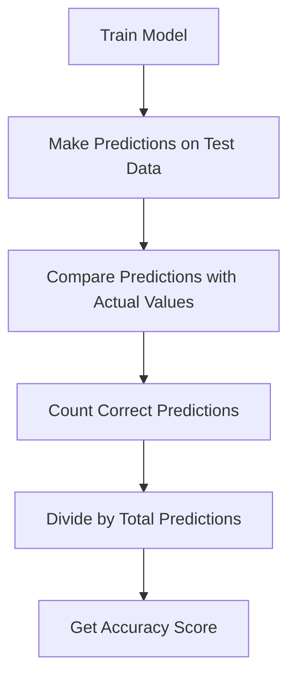

# Introduction to Classification Metrics 

> How do we know if a classification model is performing well?

When we studied regression, we learned about metrics like:

* MSE
* RMSE
* R²

Those were called **Regression Metrics**.

Similarly, in classification problems, we have:

# 📊 Classification Metrics

These metrics help us measure:

> How good is our classification model?

And today, we start with the simplest one:

# 🎯 Accuracy

---

# 🎭 Scene: Student Placement Prediction

Let’s imagine we have a dataset of students.

Each student has:

* CGPA
* IQ
* Placement status (Placed or Not Placed)

Now what do we do?

We split the dataset into two parts:

* Training Set → 800 students
* Testing Set → 200 students

Why?

Because:

* We train the model on training data.
* We test the model on testing data.

---

# 🎯 Step 1: Train Two Models

We train two different classification models:

1. **Logistic Regression**
2. **Decision Tree**

Both models are trained using the same training data.

After training, we use both models to predict placement on the test dataset.

---

# 🎯 Step 2: Compare Predictions

Now suppose we take a small example of 10 test students.

| Student | Actual | Logistic Prediction | Decision Tree Prediction |
| ------- | ------ | ------------------- | ------------------------ |
| 1       | Yes    | Yes                 | Yes                      |
| 2       | Yes    | Yes                 | Yes                      |
| 3       | No     | Yes                 | No                       |
| 4       | Yes    | Yes                 | Yes                      |
| 5       | No     | No                  | No                       |
| 6       | Yes    | Yes                 | Yes                      |
| 7       | No     | Yes                 | No                       |
| 8       | Yes    | Yes                 | Yes                      |
| 9       | No     | No                  | No                       |
| 10      | Yes    | Yes                 | Yes                      |

Now the question:

> Which model is better?

---

# 🎯 What Is Accuracy?

Accuracy tells us:

> Out of all predictions, how many were correct?

Formula:

[
Accuracy = \frac{Correct\ Predictions}{Total\ Predictions}
]

---

# 🔎 Calculate Accuracy for Logistic Regression

Wrong predictions:

* Student 3 ❌
* Student 7 ❌

Total predictions = 10
Correct predictions = 8

Accuracy = 8 / 10 = 0.8 = 80%

---

# 🔎 Calculate Accuracy for Decision Tree

Only 1 wrong prediction.

Correct predictions = 9
Total = 10

Accuracy = 9 / 10 = 0.9 = 90%

---

# 🎯 Conclusion

The **Decision Tree** model performs better on this test dataset because:

90% > 80%

---

# 📊 Flowchart: How Accuracy Is Calculated

---

# 🧠 Very Important Understanding

Accuracy simply answers:

> “How often is the model correct?”

If a model makes 100 predictions and 92 are correct:

Accuracy = 92%

---

# ⚠️ But There Is a Problem

Accuracy is not always reliable.

Imagine:

Out of 100 students,

* 95 are Not Placed
* 5 are Placed

If the model predicts:

> “Not Placed” for everyone

Then Accuracy = 95%

But is the model really good?

No.

It failed to identify all placed students.

That’s why we need more advanced metrics like:

* Confusion Matrix
* Precision
* Recall
* F1 Score

---

# 🎓 Final Simple Definition

If someone asks:

“What is Accuracy?”

You can say:

> Accuracy is the ratio of correct predictions to total predictions in a classification model.

Tell me the next topic 😊
