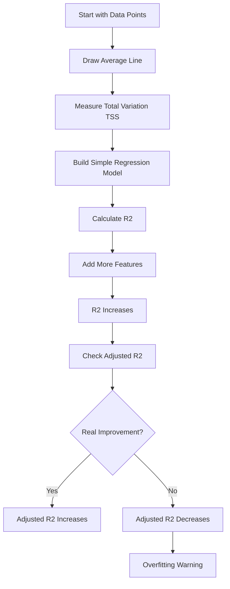

# 🎯 Adjusted R-Squared — With Graphs & Clear Intuition

We’ll *see* what is happening.

No heavy math.
Just clear visual understanding.

---

# 🎭 Scene: We Are Fitting Models to Data

Imagine we collected this data:

Study Hours vs Exam Score.

When we plot the points, they look like this:

```
Score
 90 |                *
 80 |            *
 70 |         *
 60 |      *
 50 |   *
 40 | *
     -------------------------
       1   2   3   4   5
            Study Hours
```

Nice upward trend.

Now we start building models.

---

# 📈 Model 1 — Simple Model (1 Feature)

We use:

* Study Hours

We draw a straight regression line.

```
Score
 90 |               *
 80 |            *
 70 |         *
 60 |      *
 50 |   *
 40 | *
     -------------------------
       1   2   3   4   5
```

The line fits nicely.

Suppose:

R² = 0.85
Adjusted R² = 0.84

Both are high and close.

That means:

✔ Model explains most variation
✔ No unnecessary complexity

Healthy model ✅

---

# 📉 Model 2 — Adding More Features

Now we add:

* Sleep hours
* Number of pens
* Favorite subject
* Random noise

The model becomes more flexible.

Visually, instead of a straight line, imagine a slightly curved surface that bends more to reduce error.

Graph idea:

```
Data Points: *
Model Line:  ~~~~
```

The line starts bending to pass closer to every point.

Now:

R² = 0.92
Adjusted R² = 0.86

R² increased a lot.
Adjusted R² increased only slightly.

Why?

Because some improvement may be just random fitting.

---

# 🤯 Model 3 — Overfitting

Now we go crazy.

We add:

* Roll number
* Shoe size
* Random numbers
* Zodiac sign
* Noise

Now the model becomes extremely flexible.

Visually:

```
Instead of a smooth line:

It becomes wiggly like this:

Score
 90 |               *
 80 |        *    ~~~
 70 |     ~~~  *
 60 |   *   ~~
 50 | ~~ *
 40 | *
     -------------------------
```

The line wiggles to pass very close to each point.

Now:

R² = 0.97
Adjusted R² = 0.72

🚨 See the problem?

R² looks amazing.

But Adjusted R² dropped.

Why?

Because the model is memorizing noise.

---

# 🧠 What Is Actually Happening?

Let’s visualize conceptually.

---

## 🔹 Step 1: Total Variation (Before Model)

Imagine a flat horizontal line at average score.

```
Score
 70 |  --------------------  (Average Line)
```

Total variation = how far points are from this average line.

This is TSS.

---

## 🔹 Step 2: Regression Line (Simple Model)

Now we draw best-fit line.

Points move closer to the line.

Variation reduces.

This reduction is good.

R² measures:

How much variation reduced.

---

## 🔹 Step 3: Adding More Features

When we add more features:

The regression surface becomes more flexible.

It reduces error further.

But here’s the key:

Some reduction is real.
Some reduction is just overfitting.

Adjusted R² tries to detect that.

---

# 📊 Visual Flow of What’s Happening



---

# 🎯 Another Powerful Visual Idea

Imagine this graph:

### X-axis → Number of Features

### Y-axis → Score

Now picture two curves:

1. R² curve → Always goes up 📈
2. Adjusted R² curve → Goes up, then flattens, then may go down 📉

Conceptually:

```
Score
 1.0 |           R²
 0.9 |          /
 0.8 |         /
 0.7 |        /  Adjusted R²
 0.6 |       /  \__
 0.5 |______/__________
         1  2  3  4  5
        Features
```

Important insight:

R² always climbs.

Adjusted R² climbs only if improvement is meaningful.

---

# 🧠 Deep Intuition in One Line

R² says:

> “Error decreased.”

Adjusted R² says:

> “Was that decrease worth the extra complexity?”

---

# 🔥 Real-World Interpretation

If:

R² = 0.95
Adjusted R² = 0.60

That means:

Model is too complex.
Probably overfitting.

If:

R² = 0.80
Adjusted R² = 0.79

That means:

Model is strong and stable.

---

# 🎓 Final Mental Picture

Imagine:

R² = Excited student adding features.

Adjusted R² = Strict teacher asking:
“Show me proof this feature helps.”

---
