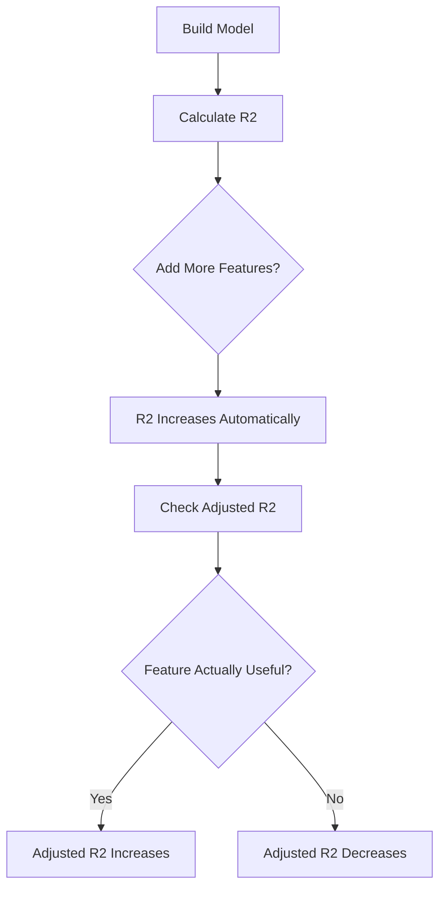

# 🎯 Adjusted R-Squared (Adjusted R²)


---

# 🎭 Scene: We Built a Bigger Model

Imagine we are predicting **house prices** 🏠.

First model uses:

* Size of house

We get:

R² = 0.70
(70% variation explained)

Now we feel smart 😎
So we add more features:

* Number of windows
* Wall color
* Owner’s favorite food 🍕
* Random noise

We run the model again.

Now:

R² = 0.85

We celebrate 🎉

But professor stops us.

> 👨‍🏫 “Wait… R² always increases when you add more variables.”

Even if variables are useless.

---

# 🤯 The Problem With Normal R²

Important rule:

> R² NEVER decreases when you add more features.

Even if features are completely useless.

So you can cheat:

Add 100 random variables → R² increases.

But does model really improve?

Maybe not.

---

# 🧠 That’s Why Adjusted R² Exists

Adjusted R² says:

> “I will only increase if the new variable actually improves the model.”

If you add useless variables:

Adjusted R² decreases.

It penalizes unnecessary complexity.

---

# 🎯 Simple Meaning

R² → How much variation explained
Adjusted R² → How much variation explained **after penalizing extra variables**

---

# 🧮 Adjusted R² Formula (Don’t Panic)

[
Adjusted\ R^2 = 1 - \left(\frac{(1 - R^2)(n - 1)}{n - p - 1}\right)
]

Where:

* n = number of data points
* p = number of predictors (features)

You don’t need to memorize it.

Just understand:

It adjusts based on number of features.

---

# 📊 Flowchart: Why Adjusted R² Is Needed



---

# 📈 Example

Suppose:

Model 1:

* Features = 1
* R² = 0.70
* Adjusted R² = 0.68

Model 2:

* Features = 5
* R² = 0.85
* Adjusted R² = 0.72

See what happened?

R² increased a lot.

But Adjusted R² increased only slightly.

That means:

Extra features are not helping much.

---

# 🎯 Real Interpretation

If:

R² high
Adjusted R² much lower

That means:

Model is overfitting.

If:

R² and Adjusted R² are close

That means:

Features are genuinely useful.

---

# 💻 How To Get Adjusted R² in Python

In sklearn, it is not directly available.

But we can calculate it.

```python
from sklearn.linear_model import LinearRegression
import numpy as np

X = np.array([[1], [2], [3], [4], [5]])
y = np.array([10, 20, 30, 40, 50])

model = LinearRegression()
model.fit(X, y)

r2 = model.score(X, y)

n = len(y)      # number of observations
p = X.shape[1]  # number of predictors

adjusted_r2 = 1 - (1 - r2) * (n - 1) / (n - p - 1)

print("Adjusted R2:", adjusted_r2)
```

---

# 📊 Quick Comparison Table

| Metric      | Increases With More Features? | Penalizes Complexity? |
| ----------- | ----------------------------- | --------------------- |
| R²          | Always Yes                    | No                    |
| Adjusted R² | Only if useful                | Yes                   |

---

# 🎓 When To Use What?

If comparing models with:

Same number of features → R² is fine.

Different number of features → Use Adjusted R².

---

# 🧠 One-Line Memory Trick

If you remember just this:

> Adjusted R² protects you from adding useless variables.

That’s enough.

---

