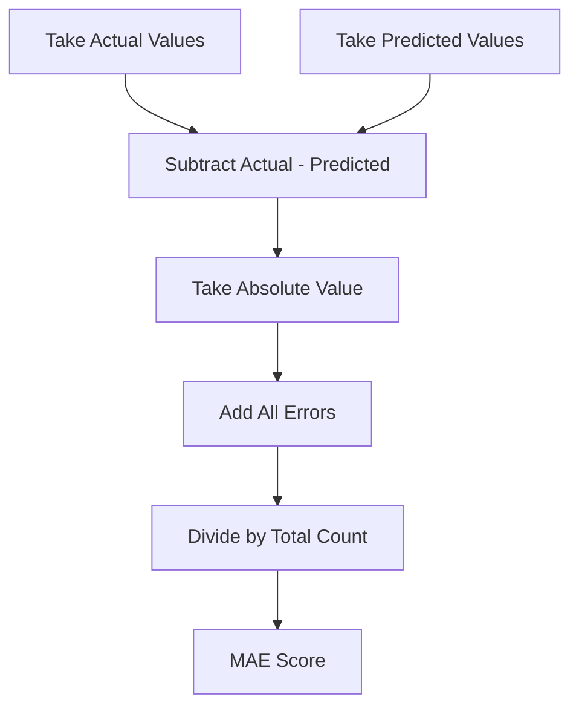
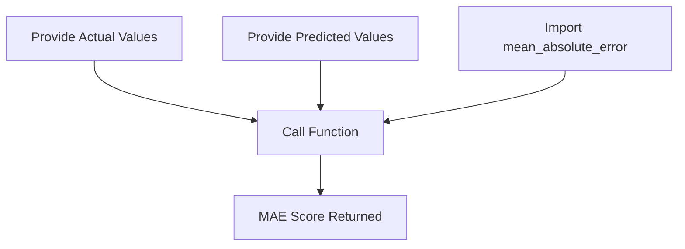
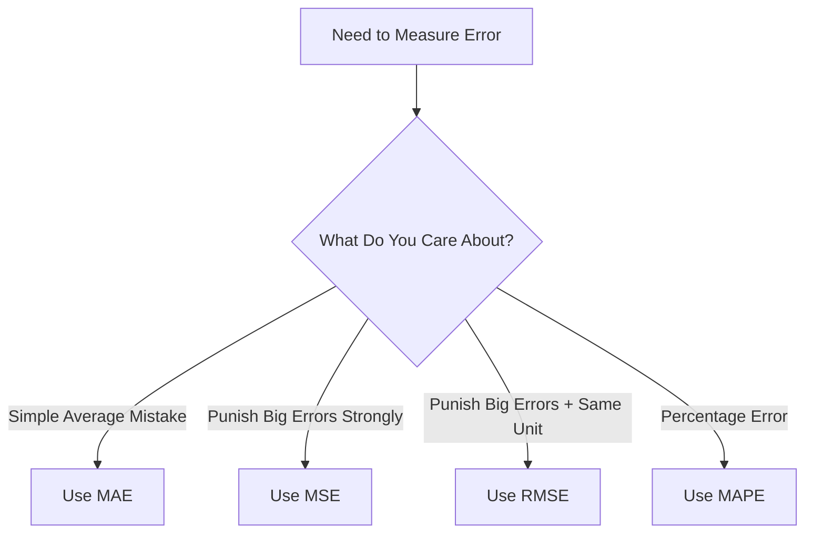

# Mean Absolute Error

# 🎭 Scene: Aarav Builds His First Prediction Model

Aarav built a small model.

It predicts **exam scores** of students 📚.

Now he checks results:

| Actual Score | Predicted Score |
| ------------ | --------------- |
| 2            | 3               |
| 3            | 3               |
| 5            | 8               |
| 5            | 7               |
| 9            | 6               |

He looks confused.

> 👨‍💻 “Okay… but how wrong am I?”

Professor smiles.

> 👨‍🏫 “You need something called **Mean Absolute Error**.”

---

# 🧠 First… What Is Mean Absolute Error (MAE)?

Let’s simplify the name:

* Mean → Average
* Absolute → Ignore minus sign
* Error → Mistake

So MAE means:

> 📌 “Average mistake size (ignoring direction).”

That’s it.

---

# 🎯 What Problem Does MAE Solve?

Suppose:

Actual = 5
Predicted = 8

Error = -3

Another case:

Actual = 8
Predicted = 5

Error = +3

If we just average:

3 + (-3) = 0

It looks perfect 😳
But we clearly made mistakes.

So we remove the minus sign.

That’s why we use **absolute value**.

---

# 🧮 The Formula (Simple Words)

MAE =

1️⃣ Subtract actual − predicted
2️⃣ Take absolute value
3️⃣ Add all mistakes
4️⃣ Divide by total number of values

---

# 🧪 Let’s Calculate MAE Manually in Python

We use the same data Aarav has.

```python
actual = [2, 3, 5, 5, 9]
predicted = [3, 3, 8, 7, 6]

n = 5
total_error = 0

for i in range(n):
    total_error += abs(actual[i] - predicted[i])

mae = total_error / n
print("Mean Absolute Error:", mae)
```

### ✅ Output:

```
Mean Absolute Error: 1.8
```

---

## 🧠 What Does 1.8 Mean?

It means:

> On average, predictions are 1.8 marks away from actual scores.

That’s easy to understand.

---

## 📊 Flowchart: Manual MAE Calculation



---

# 🚀 Easier Method: Using sklearn

Instead of writing a loop, we can use a ready-made function.

From the library:

👉 **`scikit-learn`**

Python package name: `sklearn`

It provides:

```
mean_absolute_error()
```

---

## 🧪 Python Code Using sklearn

```python
from sklearn.metrics import mean_absolute_error

actual = [2, 3, 5, 5, 9]
predicted = [3, 3, 8, 7, 6]

mae = mean_absolute_error(actual, predicted)
print("Mean Absolute Error:", mae)
```

### ✅ Output:

```
Mean Absolute Error: 1.8
```

Same result.

But easier.

---

## 📊 Flowchart: Using sklearn



---

# 🤔 Why Should We Choose MAE?

Professor explains:

### ✅ 1. Easy to Understand

If MAE = 5 (in house prices)

That means:

> On average, we are off by 5 units.

Very clear.

---

### ✅ 2. Less Sensitive to Big Errors

Unlike MSE, MAE does NOT square errors.

So if one mistake is huge, it does not explode the score.

---

### ✅ 3. Simple and Clean

No complicated math feeling.

Just average mistake.

---

# ⚠ When Should We NOT Use MAE?

If very large errors are dangerous.

Example:

* Medical prediction
* Self-driving cars
* Safety systems

In those cases, we may want big mistakes to hurt more.

---

# 🔍 How MAE Compares to Other Metrics

Let’s understand simply.

---

## 🔵 1️⃣ Mean Squared Error (MSE)

What it does:

👉 Squares errors before averaging.

So:

5 becomes 25
10 becomes 100

Big mistakes become HUGE.

### Use when:

Large mistakes must be punished heavily.

---

## 🟣 2️⃣ Root Mean Squared Error (RMSE)

It is:

👉 Square root of MSE.

Why?

Because MSE gives squared units.

RMSE brings unit back to normal.

Still punishes big errors.

---

## 🟠 3️⃣ Mean Absolute Percentage Error (MAPE)

Instead of raw numbers, it gives:

👉 Percentage error.

Example:

If actual = 100
Predicted = 90

Error = 10%

Very useful in business reports.

But dangerous when actual value is near zero.

---

# 📊 Comparison Flowchart



---

# 📋 Quick Comparison Table (Simple Version)

| Metric | Punishes Big Errors? | Easy to Understand? |
| ------ | -------------------- | ------------------- |
| MAE    | No                   | Yes                 |
| MSE    | Yes                  | Medium              |
| RMSE   | Yes                  | Yes                 |
| MAPE   | No                   | Yes                 |

---

# 🎓 Final Super Simple Summary

If you remember only this:

> MAE tells you the average size of your mistakes.

That’s all.

And in Python:

* Manual → loop + abs()
* Easy way → `mean_absolute_error()` from sklearn

---


