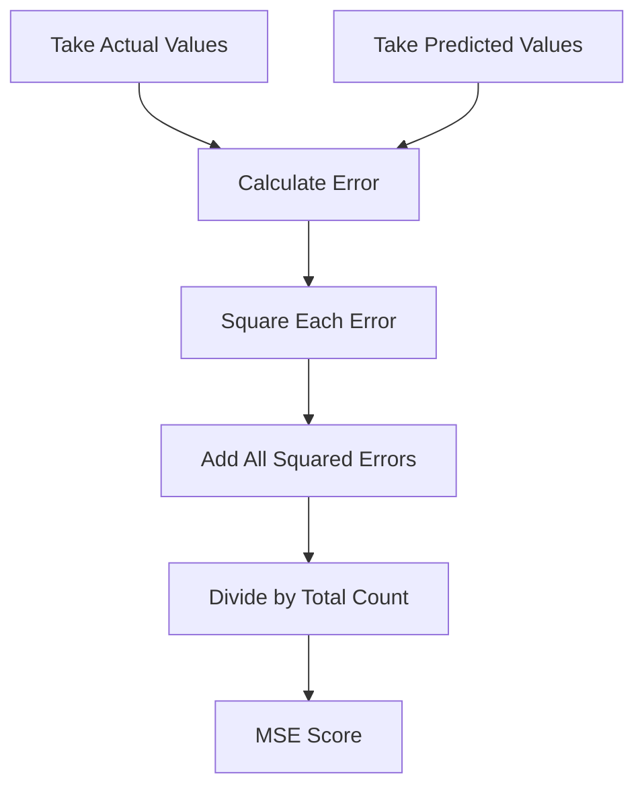
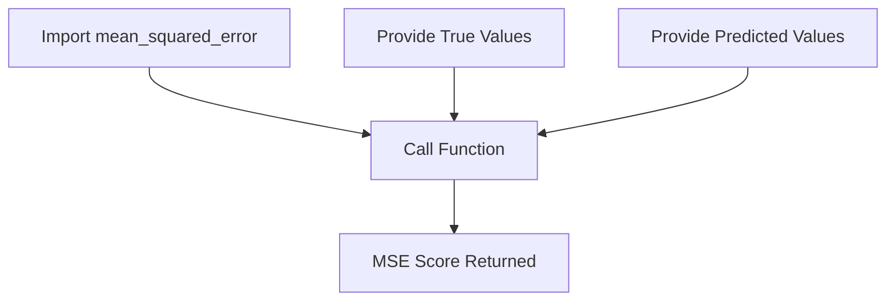
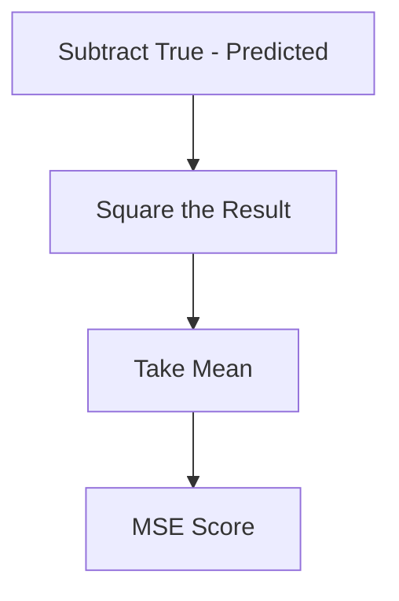

# Mean Squared Error
# 🎭 Scene: Neha Is Testing Her Prediction Model

Neha built a model to predict **student marks** 📚.

She checks results:

| Actual | Predicted |
| ------ | --------- |
| 15     | 18        |
| 25     | 22        |
| 35     | 38        |
| 45     | 42        |
| 55     | 52        |

She asks:

> 👩‍💻 “How wrong is my model?”

Professor replies:

> 👨‍🏫 “Today, we learn **Mean Squared Error (MSE)**.”

---

# 🧠 First… What Is Mean Squared Error?

Let’s break the name:

* Mean → Average
* Squared → Multiply error by itself
* Error → Mistake

So MSE means:

> 📌 “Average of squared mistakes.”

---

# 🎯 Why Do We Square the Errors?

Neha first calculates simple errors:

| Actual | Predicted | Error |
| ------ | --------- | ----- |
| 15     | 18        | -3    |
| 25     | 22        | 3     |
| 35     | 38        | -3    |
| 45     | 42        | 3     |
| 55     | 52        | 3     |

If we just average:

-3 + 3 -3 +3 +3

Some cancel out.

Not good.

So first lesson:

👉 We must remove negative signs.

But instead of absolute value (like MAE), we **square**.

Why square?

Because:

✔ It removes negative sign
✔ It punishes big mistakes more

Example:

* Error = 3 → 9
* Error = 10 → 100

Big mistake becomes HUGE.

---

# 🧮 Step-by-Step Manual Calculation

### Step 1: Square the Errors

| Error | Squared Error |
| ----- | ------------- |
| -3    | 9             |
| 3     | 9             |
| -3    | 9             |
| 3     | 9             |
| 3     | 9             |

---

### Step 2: Add Them

9 + 9 + 9 + 9 + 9 = 45

---

### Step 3: Divide by Total Values (5)

45 ÷ 5 = 9

---

# ✅ Final Answer

MSE = **9**

---

# 🟣 What About RMSE?

RMSE is simply:

> Square root of MSE

So:

√9 = 3

That means:

On average, prediction error is 3 marks.

RMSE gives us the error in the original unit.

---

# 📊 Flowchart: How MSE Is Calculated



---

# 🧠 Real-Life Understanding

Imagine:

You are throwing darts 🎯.

If you miss by 1 cm → small issue.
If you miss by 10 cm → big issue.

MSE makes the 10 cm mistake hurt MUCH more.

That’s why it’s powerful.

---

# 🚀 Calculating MSE in Python

Now Neha asks:

> 👩‍💻 “Can Python do this automatically?”

Professor smiles.

---

# 🟢 Method 1: Using Scikit-Learn (Easiest Way)

Library: `sklearn`

```python
from sklearn.metrics import mean_squared_error

Y_true = [1,1,2,2,4]
Y_pred = [0.6,1.29,1.99,2.69,3.4]

mean_squared_error(Y_true, Y_pred)
```

### ✅ Output:

```
0.21606
```

---

## 🧠 What Did This Function Do?

Behind the scenes:

1. Subtracted values
2. Squared errors
3. Averaged them

All automatically.

---

## 📊 Flowchart: Using sklearn



---

# 🟡 Method 2: Using NumPy (Manual But Clean)

If you want to see the logic clearly:

```python
import numpy as np

Y_true = [1,1,2,2,4]
Y_pred = [0.6,1.29,1.99,2.69,3.4]

MSE = np.square(np.subtract(Y_true, Y_pred)).mean()
print(MSE)
```

### ✅ Output:

```
0.21606
```

---

## 🧠 What Happened Here?

Step by step:

* `np.subtract()` → finds error
* `np.square()` → squares it
* `.mean()` → finds average

Simple chain of actions.

---

## 📊 Flowchart: NumPy Method



---

# 🤔 When Should We Use MSE?

✔ When large errors are very dangerous
✔ When you want model to avoid big mistakes
✔ In scientific and engineering problems

---

# ⚠ When Should We Be Careful?

❌ If your dataset has many extreme values (outliers)
Because they will dominate the score.

---

# 🔍 MSE vs Other Metrics (Simple Version)

| Metric | Big Errors Punished? | Easy to Understand? |
| ------ | -------------------- | ------------------- |
| MAE    | No                   | Yes                 |
| MSE    | Yes (Strongly)       | Medium              |
| RMSE   | Yes                  | Yes                 |
| MAPE   | No                   | Yes                 |

---

# 🎓 Final Beginner Summary

If you remember only this:

> MSE = Average of squared mistakes.

And we square because:

👉 It removes negative sign
👉 It punishes big mistakes heavily

In Python:

* Easy way → `mean_squared_error()`
* Manual way → subtract → square → average

---


