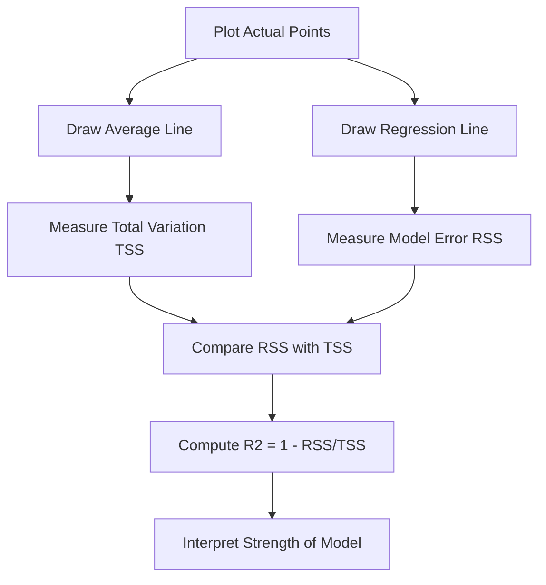

# **Deep intuition with graphs**.

So now imagine we are actually building the model…
we are seeing the points…
we are drawing the line…
and we are *feeling* what R² really means.

No heavy math. Just logic + visuals in your head.

---

# 🎭 Scene: We Are Predicting Exam Scores

We collected data:

| Study Hours | Exam Score |
| ----------- | ---------- |
| 1           | 40         |
| 2           | 50         |
| 3           | 60         |
| 4           | 70         |
| 5           | 80         |

Now imagine these are plotted on a graph.

X-axis → Study Hours
Y-axis → Exam Score

The points almost form a straight line upward.

---

# 📈 Case 1: Perfect Fit (R² = 1)

Imagine we draw a straight line and **every point lies exactly on that line**.

Graph in your mind:

```
80 |            *
70 |         *
60 |      *
50 |   *
40 | *
    -------------------
     1  2  3  4  5
```

Every star is exactly on the line.

That means:

* Model error = 0
* RSS = 0
* R² = 1 − 0 = 1

🎯 Interpretation:

> 100% of variation is explained by study hours.

Nothing is left unexplained.

---

# 📉 Case 2: Good Fit (R² ≈ 0.8)

Now imagine points are close to the line, but not exactly on it.

```
80 |           *
70 |       *
60 |    *
50 |  *
40 | *
    -------------------
```

Some points slightly above or below the line.

That means:

* Some error exists
* But most variation is captured

🎯 Interpretation:

> 80% of score variation is explained
> 20% is due to other factors

This is what good real-world models look like.

---

# 📉 Case 3: Weak Fit (R² ≈ 0.2)

Now imagine random scattered points.

```
80 |      *     *
70 |   *
60 |           *
50 | *
40 |        *
    -------------------
```

You draw a line… but it doesn’t match pattern well.

That means:

* Model explains very little
* Study hours are not strongly related

🎯 Interpretation:

> Only 20% variation explained
> 80% unexplained

---

# 📉 Case 4: No Relationship (R² ≈ 0)

Points completely random.

No upward or downward pattern.

The best line you draw is almost flat (average line).

That means:

Your model is basically doing:

> “I will predict average score for everyone.”

R² ≈ 0

Model is useless.

---

# 🤯 Case 5: Negative R²

This shocks beginners.

Imagine your regression line is so bad that:

It performs worse than predicting the average.

That means:

RSS > TSS

So:

R² = 1 − (RSS/TSS)

becomes negative.

🎯 Interpretation:

> Your model is terrible.

---

# 🧠 The Deep Intuition

Now the real understanding.

R² is not about error size.

It is about:

> How much better is my model compared to just predicting the average?

Think of it like this:

Step 1: Predict average for everyone → measure total error (TSS)
Step 2: Use regression model → measure model error (RSS)

Then compare.

---

# 🎯 Visual Comparison Idea

Imagine a horizontal line at average score:

```
70 |  ----------- (average line)
```

Total variation = how far points are from this average line.

Now when we add regression line:

Points become closer to regression line.

The reduction in variation is what R² measures.

---

# 📊 Flowchart: What Is Happening Visually



---

# 🧩 Another Way To Feel R²

Imagine:

You are explaining weight using height.

If tall people are usually heavier:

Points follow upward pattern → High R²

If weight is random regardless of height:

Points scattered → Low R²

---

# 🔥 Important Insight

R² does NOT mean:

❌ Model is correct
❌ Model is useful
❌ Model predicts perfectly

It ONLY means:

> How well input variables explain output variation.

---

# 🧠 One Sentence That Makes You Advanced

If you say this in an interview:

> “R² measures the proportion of variance in the dependent variable explained by the independent variable.”

You sound professional.

But in simple language:

> It tells how much of the real-world change your model captures.

---

# 🎓 Final Mental Model

Think of R² like this:

If R² = 0.9
Model captures almost entire pattern.

If R² = 0.5
Model captures half pattern.

If R² = 0
Model captures nothing.

If R² < 0
Model is worse than guessing average.

---


Tell me what you want to master next 😄
