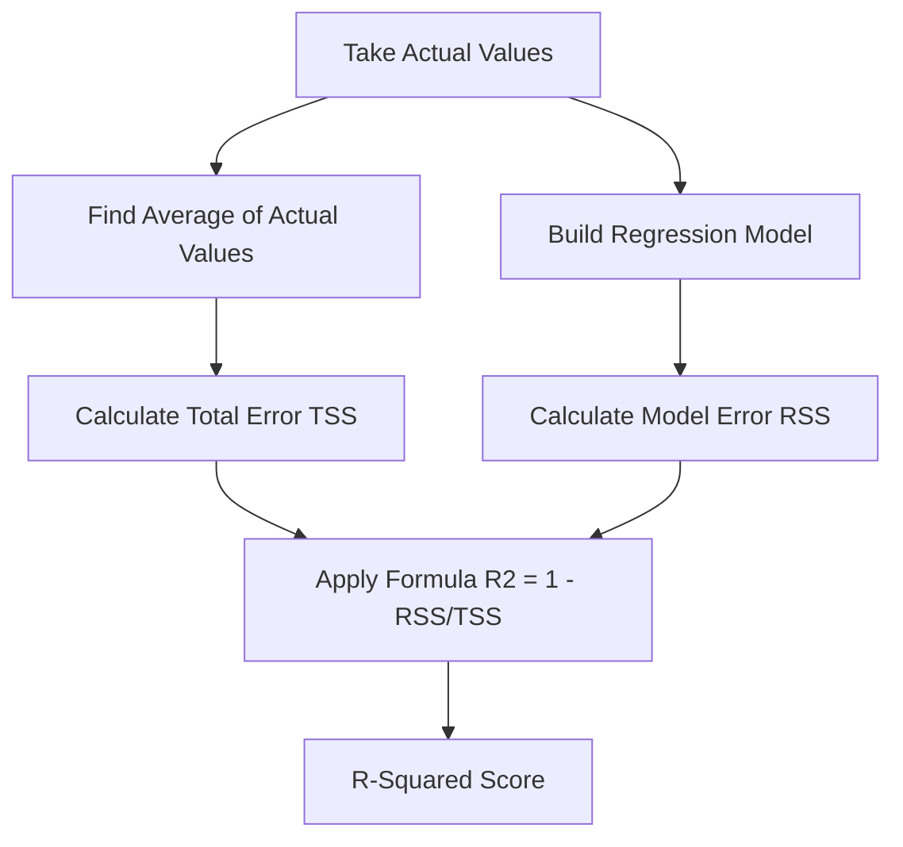

# 🎯 R-Squared (R²)

Let’s understand it like a story.

No fear.
No heavy math.
We build it slowly.

---

# 🎭 Scene: Aarav Built a Model… But Is It Good?

Aarav created a model to predict **students’ exam scores** based on study hours.

He runs the model.

Now he asks:

> 👨‍💻 “Okay… I calculated RMSE. But how good is my model overall?”

Professor smiles.

> 👨‍🏫 “Now we use R-Squared.”

---

# 🧠 First Question: What Is R²?

R² tells us:

> 📌 “How much of the real-world variation is explained by our model?”

In very simple words:

Imagine exam scores depend on:

* Study hours
* Sleep
* IQ
* Luck
* Health
* Mood

Your model only uses study hours.

So R² tells:

👉 How much of the score variation is explained only by study hours?

---

# 🧩 Real-Life Example

Suppose:

Students' scores vary between 40 and 100.

Your model predicts based on study hours.

After calculation, you get:

R² = 0.80

That means:

> ✅ 80% of the score variation is explained by study hours.
> ❌ 20% is unexplained (maybe sleep, luck, etc.)

---

# 🧮 The Idea Behind R² (Very Simple)

There are two types of error:

### 1️⃣ Total Error (Before Model)

If we predict everyone gets average marks.

That error is called:

**Total Sum of Squares (TSS)**

---

### 2️⃣ Model Error (After Model)

Error after using regression line.

That is:

**Residual Sum of Squares (RSS)**

---

# 📌 R² Formula (Simple Form)

[
R^2 = 1 - \frac{RSS}{TSS}
]

Meaning:

R² = 1 − (Model Error / Total Error)

---

# 🎯 What Does This Mean?

If:

Model error is very small → RSS small → R² close to 1
Model error is large → RSS big → R² close to 0

---

# 📊 Flowchart: How R² Is Calculated



---

# 📈 Understanding R² Values

| R² Value | Meaning                  |
| -------- | ------------------------ |
| 1        | Perfect prediction       |
| 0.9      | Very strong model        |
| 0.7      | Good model               |
| 0.5      | Moderate                 |
| 0        | Model explains nothing   |
| Negative | Model worse than average |

Yes… R² can be negative 😲

That happens when your model is worse than simply predicting the average.

---

# 🎯 Simple Example

Suppose:

Actual: [10, 20, 30]

Mean = 20

Total variation (TSS) =
(10−20)² + (20−20)² + (30−20)²
= 100 + 0 + 100 = 200

Now your model error (RSS) = 40

So:

R² = 1 − (40 / 200)
= 1 − 0.2
= 0.8

That means:

80% variation explained.

---

# 💻 How To Calculate R² in Python

## 🟢 Method 1: Using sklearn

```python
from sklearn.metrics import r2_score

actual = [10, 20, 30]
predicted = [12, 18, 29]

r2 = r2_score(actual, predicted)
print("R2 Score:", r2)
```

---

## 🟢 Method 2: Using Regression Model

```python
from sklearn.linear_model import LinearRegression

X = [[1], [2], [3]]
y = [10, 20, 30]

model = LinearRegression()
model.fit(X, y)

print("R2 Score:", model.score(X, y))
```

`.score()` automatically gives R².

---

# 🧠 How Is R² Different From RMSE?

| RMSE                     | R²                                      |
| ------------------------ | --------------------------------------- |
| Tells average error size | Tells how well model explains variation |
| Has units                | No unit                                 |
| Lower is better          | Higher is better                        |

---

# 🎭 Final Understanding Story

Imagine:

You are explaining rain using only temperature.

If R² = 0.95

That means temperature explains 95% of rain variation.

If R² = 0.10

Temperature is almost useless for explaining rain.

---

# 🎯 Final Simple Definition

If you remember just this:

> R² tells how much of the real-world change your model can explain.

That’s it.

---


