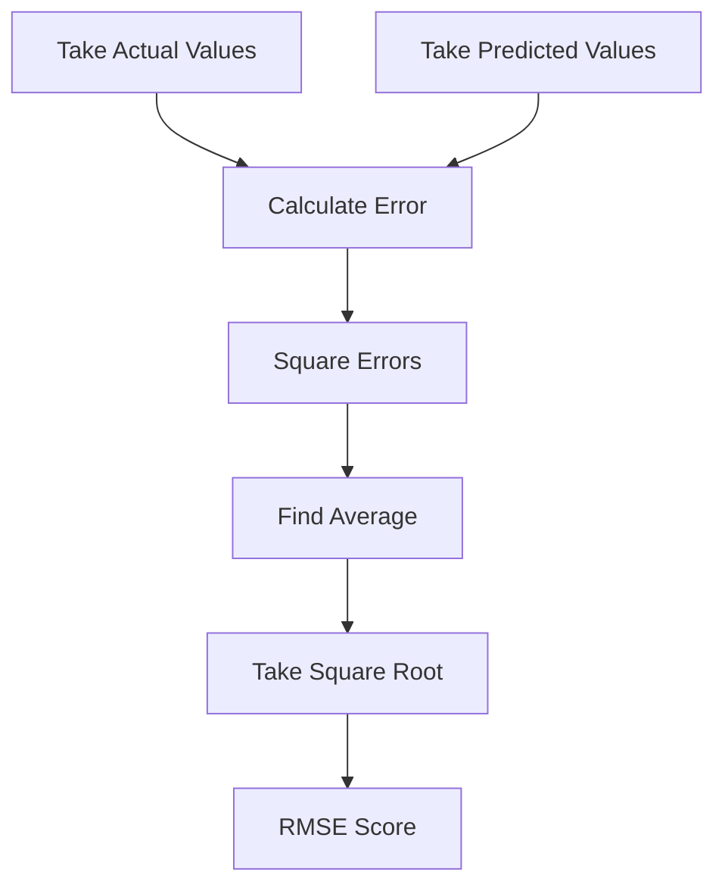
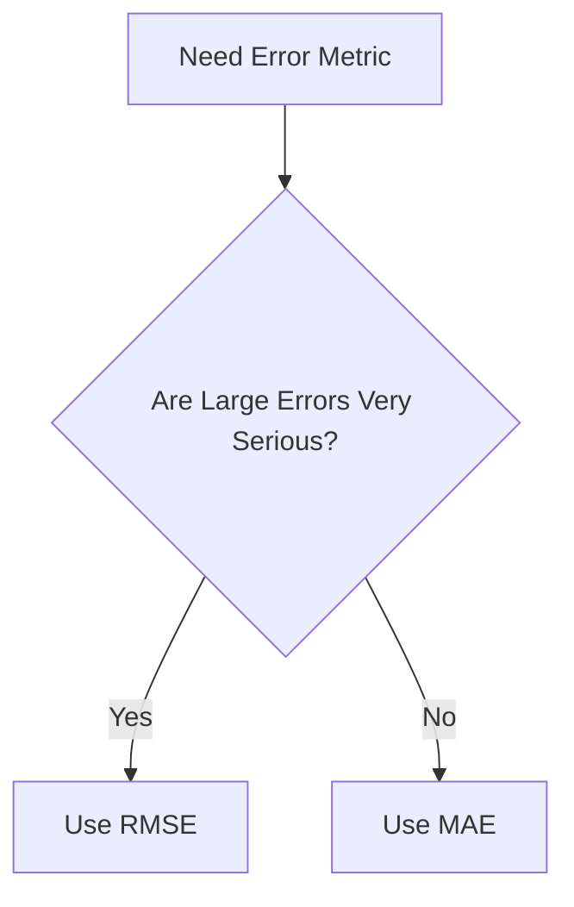

 # **Root Mean Square Error (RMSE)** 


# 🎭 Scene: Kabir Is Confused About MSE

Kabir built a model to predict **house prices** 🏠.

He calculated MSE.

The result is:

```
MSE = 2500
```

Kabir looks confused.

> 👨‍💻 “2500 what? 2500 rupees? 2500 square rupees??”

Professor smiles.

> 👨‍🏫 “Exactly. That’s the problem with MSE.”

---

# 🧠 First… What Is RMSE?

Let’s break the name:

* Root → Square root
* Mean → Average
* Square → Squared errors
* Error → Mistake

So RMSE means:

> 📌 “Square root of the average squared mistakes.”

In short:

> RMSE = √(MSE)

---

# 🎯 Why Do We Need RMSE?

We already had MSE.

So why create something new?

Because:

MSE gives error in **squared units**.

If we predict:

* House price (in dollars)

Then:

* MSE is in dollars²

That makes no practical sense.

So we take square root.

Now the unit becomes normal again.

---

# 🧮 Simple Example

Let’s say:

Actual values:
[10, 20, 30]

Predicted values:
[12, 18, 33]

---

## Step 1: Find Errors

| Actual | Predicted | Error |
| ------ | --------- | ----- |
| 10     | 12        | -2    |
| 20     | 18        | 2     |
| 30     | 33        | -3    |

---

## Step 2: Square the Errors

| Error | Squared |
| ----- | ------- |
| -2    | 4       |
| 2     | 4       |
| -3    | 9       |

Total = 4 + 4 + 9 = 17

---

## Step 3: Find MSE

17 ÷ 3 = 5.67

So:

MSE = 5.67

---

## Step 4: Take Square Root

√5.67 ≈ 2.38

So:

RMSE ≈ 2.38

---

# ✅ Final Meaning

RMSE = 2.38 means:

> On average, our predictions are about 2.38 units away from actual values.

Now that makes sense.

---

# 📊 Flowchart: How RMSE Is Calculated



---

# 🚀 How To Calculate RMSE in Python

Kabir asks:

> 👨‍💻 “Can Python do this automatically?”

Professor nods.

---

## 🟢 Method 1: Using sklearn

```python id="rmsepy1"
from sklearn.metrics import mean_squared_error
import numpy as np

actual = [10, 20, 30]
predicted = [12, 18, 33]

mse = mean_squared_error(actual, predicted)
rmse = np.sqrt(mse)

print("RMSE:", rmse)
```

---

## 🟢 Method 2: Using NumPy Directly

```python id="rmsepy2"
import numpy as np

actual = np.array([10, 20, 30])
predicted = np.array([12, 18, 33])

rmse = np.sqrt(np.mean((actual - predicted) ** 2))
print("RMSE:", rmse)
```

Both methods give same answer.

---

# 🧠 Why RMSE Is Powerful

✔ Punishes big mistakes (because of squaring)
✔ Gives result in original unit
✔ Easy to explain

Example:

If RMSE = 5000 (house price)

You can say:

> “On average, predictions are off by 5000 dollars.”

Very clear.

---

# ⚠ When Should We Be Careful?

If your data has extreme outliers.

Because:

Squaring makes large errors VERY large.

So RMSE becomes dominated by big mistakes.

---

# 🔍 RMSE vs MAE (Simple Comparison)

| Metric | Punishes Big Errors Strongly? | Same Unit as Target? |
| ------ | ----------------------------- | -------------------- |
| MAE    | No                            | Yes                  |
| RMSE   | Yes                           | Yes                  |

Simple rule:

If big mistakes are very dangerous → Use RMSE
If all mistakes are equally important → Use MAE

---

# 📊 Decision Flowchart



---

# 🎓 Super Simple Summary

If you remember just this:

> RMSE = Square root of MSE
> It tells average error size in original units
> It punishes big mistakes more

That’s enough to understand RMSE confidently.

---


Tell me what level you want next.
