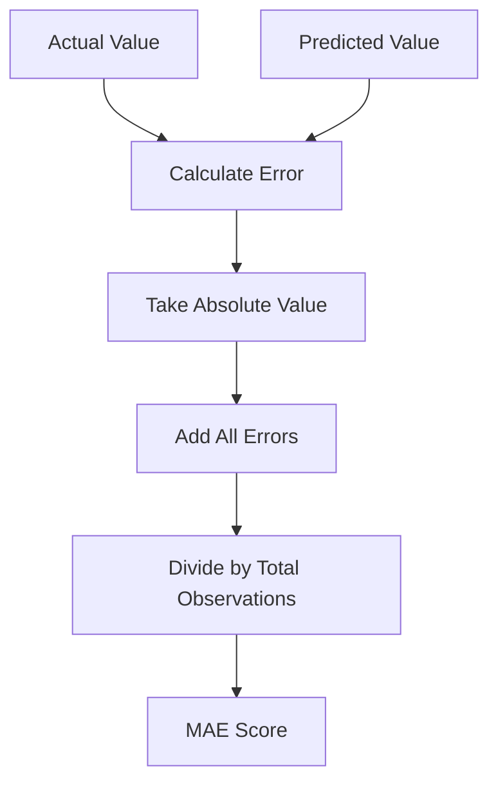
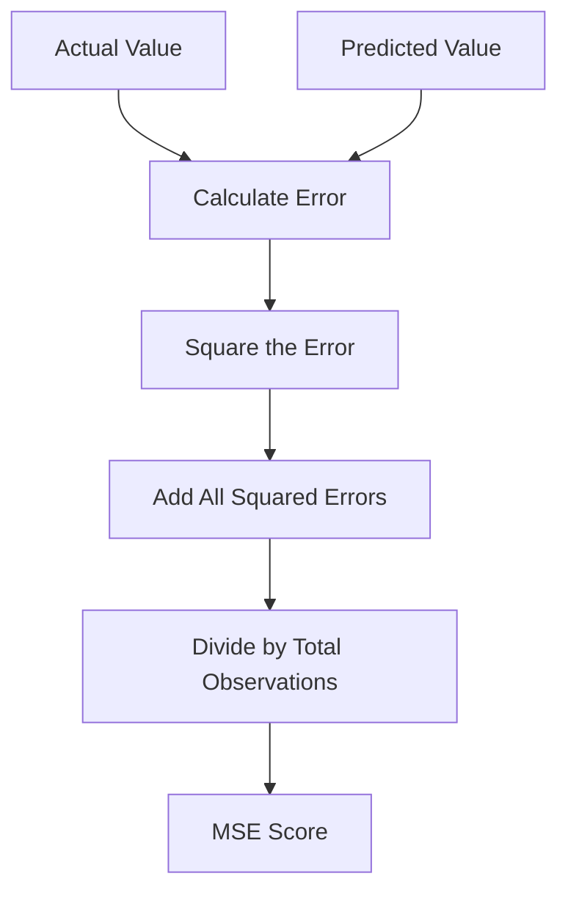
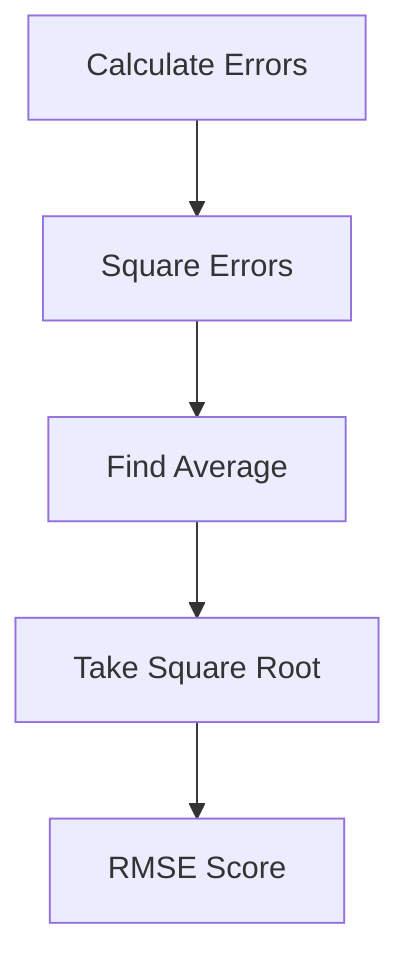
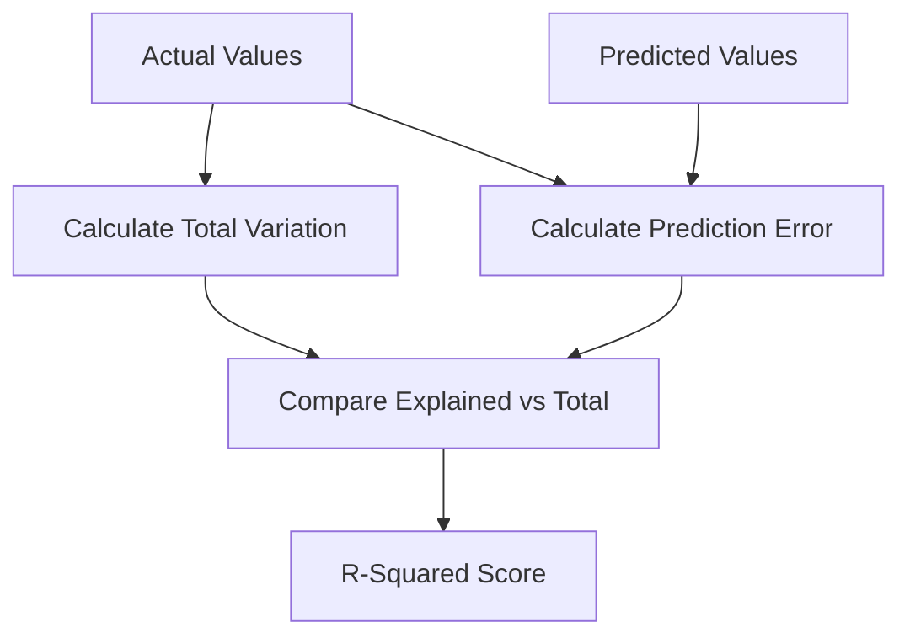
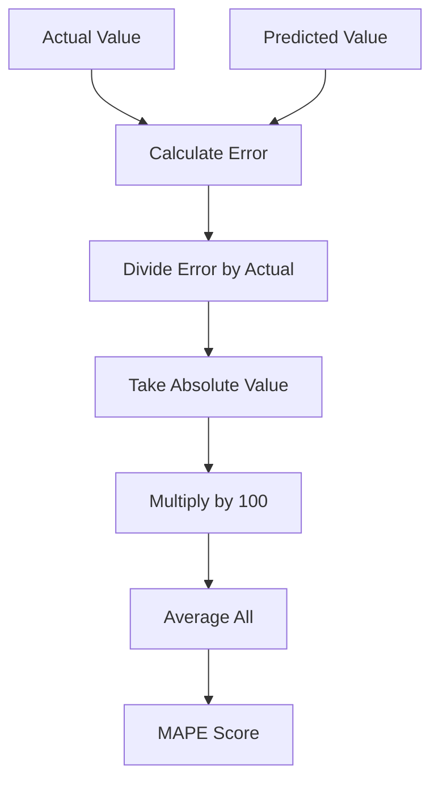
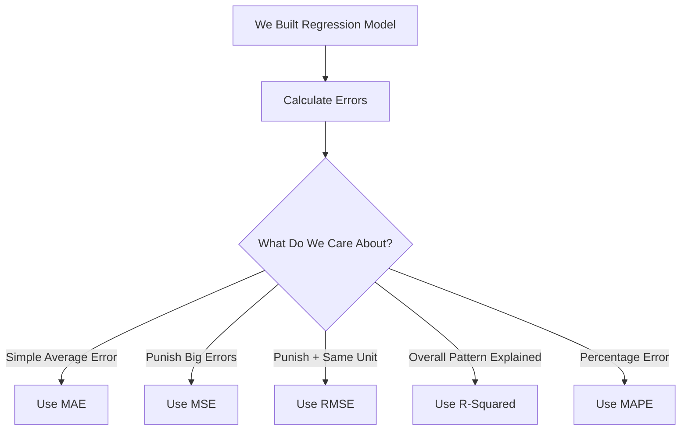

# Regression Metrics

# 🎭 Scene: We Built a House Price Predictor

We trained our regression model.

It predicts house prices like this:

| Actual | Predicted |
| ------ | --------- |
| 300    | 260       |
| 500    | 540       |
| 200    | 210       |

Now we ask:

> 🤔 Is this model good or bad?

Professor says:

> 👨‍🏫 “To answer that… we need Regression Metrics.”

---

# 🧠 Step 1: What Is Regression?

Regression = Predicting a number.

Examples:

* House price
* Salary
* Temperature
* Sales
* Weight

If output is a number → It’s regression.

---

# 🎯 Step 2: What Is a Regression Metric?

A regression metric is:

> A score that tells us how wrong our predictions are.

Simple.

Now let’s explore them one by one.

---

# 🟢 1️⃣ Mean Absolute Error (MAE)

---

## 🎬 Problem We Faced

We calculated error:

Actual = 300
Predicted = 260
Error = 40

Next:

Actual = 500
Predicted = 540
Error = -40

If we average:

40 + (-40) = 0

That looks perfect.

But it’s wrong.

Positive and negative canceled out.

---

## 💡 Solution

We remove the minus sign.

We take absolute value.

Absolute means:

Ignore negative sign.

Now:

|40| = 40
|-40| = 40

Average = 40

That makes sense.

---

## 📌 What Is MAE?

MAE =
Average of total mistakes
After removing minus signs.

---

## 🧠 When To Use?

✔ When you want simple interpretation
✔ When all errors are equally important

---

## ⚠ When Not To Use?

❌ When very large mistakes are dangerous

---

## 🧒 Simple Version

> MAE tells us: “On average, how wrong are we?”

---

### 📊 Flowchart for MAE

---

# 🔵 2️⃣ Mean Squared Error (MSE)

---

## 🎬 New Problem

Our model made one huge mistake:

| Actual | Predicted |
| ------ | --------- |
| 500    | 100       |

Error = 400

MAE treats 5 and 400 in same linear way.

But 400 is a disaster.

---

## 💡 Solution

Square the errors.

400 becomes 160000.

Now big mistakes become VERY big.

---

## 📌 What Is MSE?

MSE =
Average of squared errors.

---

## 🧠 Why Square?

To punish big mistakes strongly.

---

## 🧠 When To Use?

✔ When large errors are very serious
✔ When you want model to avoid big mistakes

---

## ⚠ When Not To Use?

❌ When data has many extreme values
(because they dominate the score)

---

## 🧒 Simple Version

> MSE punishes big mistakes heavily.

---

### 📊 Flowchart for MSE

---

# 🟣 3️⃣ Root Mean Squared Error (RMSE)

---

## 🎬 Confusion Appears

MSE = 2900

But 2900 what?

Squared dollars?

That’s confusing.

---

## 💡 Solution

Take square root of MSE.

Now unit becomes normal again.

---

## 📌 What Is RMSE?

RMSE =
Square root of MSE.

---

## 🧠 Why Use RMSE?

✔ Keeps strong punishment of big errors
✔ Returns to original unit

---

## ⚠ When Not To Use?

❌ If you don’t want outliers to influence heavily

---

## 🧒 Simple Version

> RMSE is MSE but easier to understand.

---

### 📊 Flowchart for RMSE

---

# 🟡 4️⃣ R-Squared (R²)

---

## 🎬 Different Question

Instead of asking:

“How wrong are we?”

We ask:

“How much of the pattern did we understand?”

---

## 🧠 Idea

R² tells us:

How much variation in data the model explains.

Range:

0 → explains nothing
1 → perfect

---

If R² = 0.45

That means:

Model explains 45% of variation.

---

## 🧠 When To Use?

✔ To understand overall performance
✔ To compare models

---

## ⚠ When Not To Use?

❌ Never use alone.
Always check error metrics too.

---

## 🧒 Simple Version

> R² tells how smart the model is overall.

---

### 📊 Flowchart for R²

---

# 🟠 5️⃣ Mean Absolute Percentage Error (MAPE)

---

## 🎬 Final Question

Can we measure error in percentage?

Example:

Actual = 100
Predicted = 80

Error = 20

20 / 100 = 20%

---

## 📌 What Is MAPE?

MAPE =
Average percentage error.

---

## 🧠 When To Use?

✔ When business prefers percentage
✔ When values are not near zero

---

## ⚠ When Not To Use?

❌ When actual values are near zero
(because division becomes unstable)

---

## 🧒 Simple Version

> MAPE tells how many percent wrong we are.

---

### 📊 Flowchart for MAPE

---

# 🏁 Final Comparison Flow

---

# 🎓 Final Beginner Summary

If you remember just this:

* MAE → Average mistake
* MSE → Punish big mistakes
* RMSE → Punish big mistakes + easy to read
* R² → How much pattern explained
* MAPE → Percentage mistake

That’s enough to understand regression metrics confidently.

---
