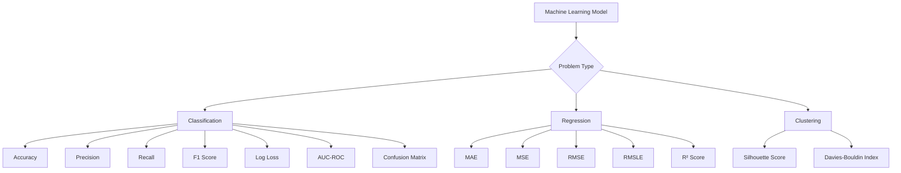
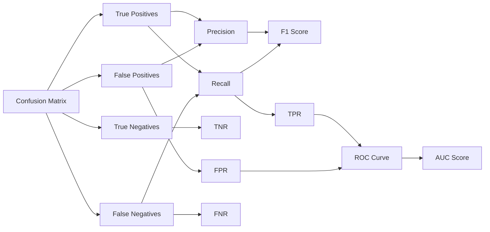
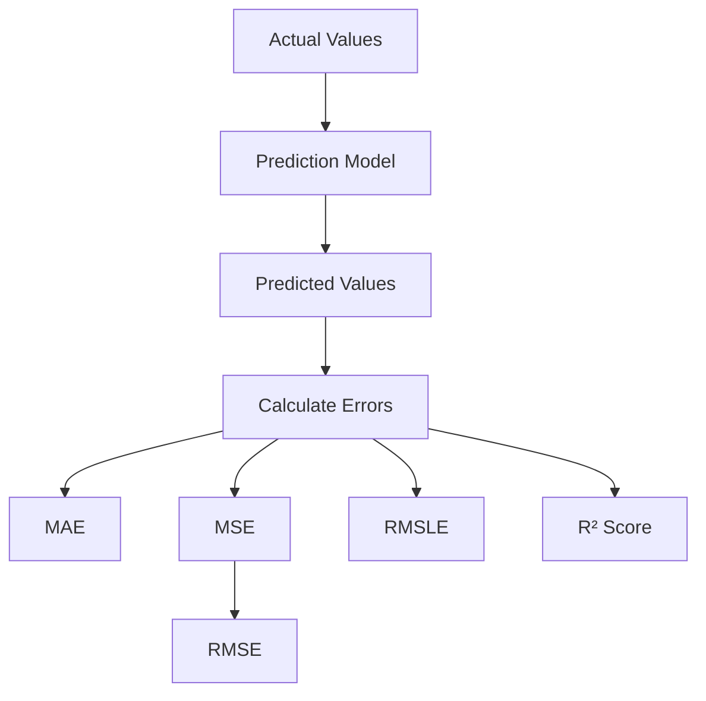
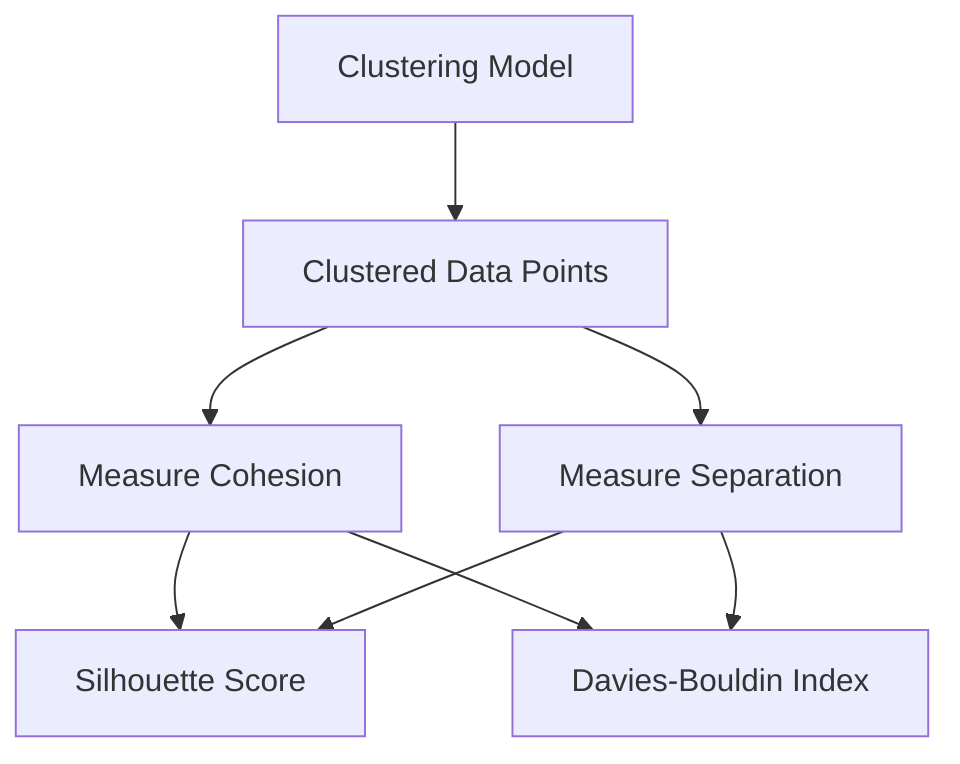
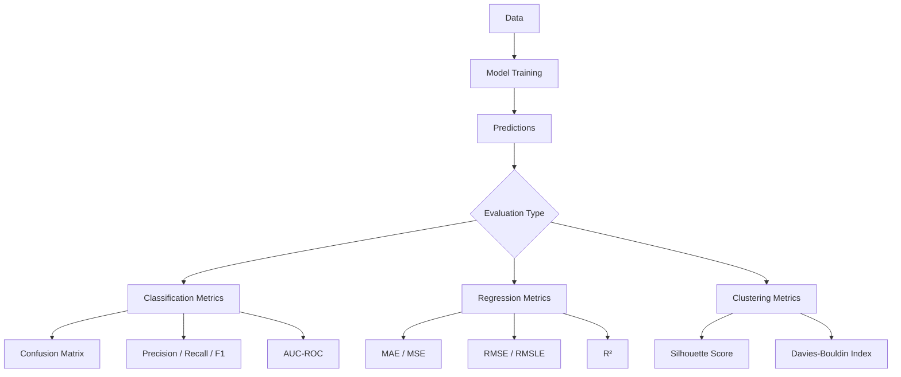

---

# 📊 Model Evaluation

In this section, we will study **Evaluation Metrics in Machine Learning**.

The reading material included here covers:

* Classification Metrics

  * Accuracy
  * Precision
  * Recall
  * F1 Score
  * Log Loss
  * AUC–ROC
  * Confusion Matrix

* Regression Metrics

  * MAE
  * MSE
  * RMSE
  * RMSLE
  * R² Score

* Clustering Metrics

  * Silhouette Score
  * Davies–Bouldin Index

This section will help you understand how to properly measure model performance and choose the right metric based on the problem type.

---

# 📊 1️⃣ Evaluation Metrics Overview Flowchart

---

# 📈 2️⃣ Classification Metrics Relationship Diagram

---

# 📊 3️⃣ Regression Metrics Flow

---

# 🔍 4️⃣ Clustering Evaluation Diagram

---

# 🚀 : Full Evaluation Pipeline Diagram

If you want one clean high-level diagram:

---

