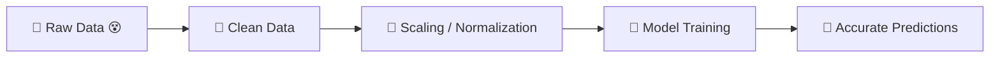
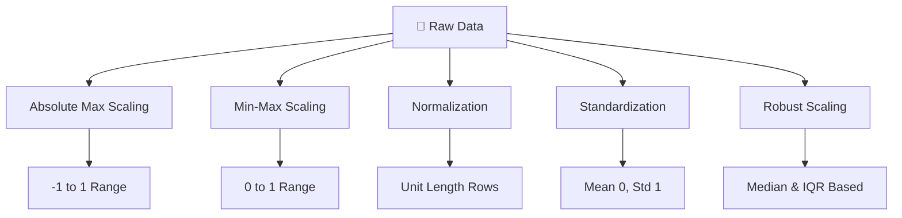

# 🚀 Feature Engineering  
## Scaling, Normalization & Standardization 


---

# 🎬 The Story Begins...

Imagine this.

You built an amazing machine learning model.

You trained it.

You waited.

You felt excited.

But the results were… terrible. 😵

Why?

Because your features were not prepared properly.

Some numbers were very large.  
Some were very small.  
Some had outliers.  
Some were skewed.

And your model got confused.

That’s when you discover:

# 🧠 Feature Engineering

---

# 🌍 What is Feature Engineering? (In Simple Words)

Feature engineering means:

👉 Improving the input data  
👉 Transforming raw columns into better ones  
👉 Making data easier for models to understand  

Think of it like this:

Raw data = Raw ingredients 🥦  
Feature engineering = Cutting, cleaning, seasoning 🍳  
Model training = Cooking 🍲  
Prediction = Final dish 🍽  

If ingredients are bad, dish will be bad.

---

# 🎞 The Big Picture (Animated Flow)



Now let’s understand the different scaling techniques.

---

# 🏠 First, Load the Dataset

We start simple.

```python
# Import libraries to work with data
import pandas as pd
import numpy as np

# Load the dataset
df = pd.read_csv('Housing.csv')

# Select only numeric columns
# (Scaling only works on numbers)
df = df.select_dtypes(include=np.number)

# Show first 5 rows
df.head()
```

Why select numeric columns?

Because scaling works only on numbers, not text.

---

# 🔵 1. Absolute Maximum Scaling

## 🧠 Idea (Very Simple)

Divide every value in a column by the maximum absolute value of that column.

Formula:

X_scaled = Xi / max(|X|)

This makes all values between **-1 and 1**.

---

## 🌍 Real-World Analogy

Imagine:

Tallest person in class = 6 feet  
Everyone’s height is divided by 6  

Now all heights are between 0 and 1.

But…

If one person is 9 feet tall (outlier 😳)

Everything gets distorted.

---

## 🧑‍💻 Code (With Full Explanation)

```python
# Find maximum absolute value in each column
# np.abs(df) -> converts all values to positive
# np.max(..., axis=0) -> finds max value column-wise
max_abs = np.max(np.abs(df), axis=0)

# Divide entire dataframe by max absolute values
scaled_df = df / max_abs

# Show first 5 rows
scaled_df.head()
```

⚠ Sensitive to outliers.

---

# 🟢 2. Min-Max Scaling

## 🧠 Idea

Formula:

X_scaled = (Xi - Xmin) / (Xmax - Xmin)

This scales values between **0 and 1**.

---

## 🌍 Real-World Analogy

Imagine exam marks:

Lowest mark = 20  
Highest mark = 100  

You rescale everyone between 0 and 1.

Lowest becomes 0  
Highest becomes 1  

But…

If one student scores 1000 (error/outlier 😵)

Everything breaks.

---

## 🧑‍💻 Code (Beginner Friendly)

```python
from sklearn.preprocessing import MinMaxScaler

# Create scaler object
scaler = MinMaxScaler()

# Fit scaler to data and transform
# fit -> learns min and max
# transform -> applies formula
scaled_data = scaler.fit_transform(df)

# Convert back to DataFrame
scaled_df = pd.DataFrame(scaled_data, columns=df.columns)

# Show first 5 rows
scaled_df.head()
```

Best for:
- Neural Networks
- Bounded input features

---

# 🟡 3. Normalization (Vector Normalization)

## 🧠 Idea

This scales each ROW instead of each column.

It makes the length of each row equal to 1.

Formula:

X_scaled = Xi / ||X||

Where ||X|| = Euclidean length of the row.

---

## 🌍 Real-World Analogy

Imagine arrows pointing in different directions.

Normalization keeps direction same  
But makes all arrows same length.

Used when direction matters more than magnitude.

Perfect for:
- Text classification
- Cosine similarity
- Clustering

---

## 🧑‍💻 Code

```python
from sklearn.preprocessing import Normalizer

# Create Normalizer object
scaler = Normalizer()

# Fit and transform data
scaled_data = scaler.fit_transform(df)

# Convert to DataFrame
scaled_df = pd.DataFrame(scaled_data, columns=df.columns)

# Show result
scaled_df.head()
```

Notice:

Each row is scaled separately.

---

# 🔴 4. Standardization (Z-Score Scaling)

## 🧠 Idea

Formula:

X_scaled = (Xi - mean) / standard deviation

After this:

Mean = 0  
Standard deviation = 1  

---

## 🌍 Real-World Analogy

Imagine measuring temperature:

Instead of actual temperature,  
you measure how far it is from average.

This shows relative difference.

---

## 🧑‍💻 Code (Fully Explained)

```python
from sklearn.preprocessing import StandardScaler

# Create StandardScaler object
scaler = StandardScaler()

# Learn mean and standard deviation
# Then transform data
scaled_data = scaler.fit_transform(df)

# Convert to DataFrame
scaled_df = pd.DataFrame(scaled_data, columns=df.columns)

# Show first rows
print(scaled_df.head())
```

Best for:
- Logistic Regression
- Linear Regression
- SVM
- Neural Networks

Works well when data is approximately normal.

---

# 🟣 5. Robust Scaling

## 🧠 Idea

Instead of mean and std…

It uses:

Median  
IQR (Interquartile Range)

Formula:

X_scaled = (Xi - Median) / IQR

---

## 🌍 Real-World Analogy

Imagine salary data:

Most people earn 30k–50k  
But CEO earns 10 million 😳  

Standard scaling gets disturbed.

Robust scaling ignores extreme salaries  
and focuses on middle 50%.

---

## 🧑‍💻 Code

```python
from sklearn.preprocessing import RobustScaler

# Create RobustScaler object
scaler = RobustScaler()

# Fit and transform
scaled_data = scaler.fit_transform(df)

# Convert back to DataFrame
scaled_df = pd.DataFrame(scaled_data, columns=df.columns)

# Display
print(scaled_df.head())
```

Best for:
- Data with outliers
- Skewed distributions

---

# 📊 Visual Comparison Flow



---

# ⚖ Comparison Table

| Method | Range | Outlier Sensitivity | Best For |
|--------|--------|--------------------|----------|
| Absolute Max | -1 to 1 | High | Sparse/simple data |
| Min-Max | 0 to 1 | High | Neural networks |
| Normalization | Unit length | Per row | Text, similarity |
| Standardization | Mean 0 | Moderate | Most ML models |
| Robust | Median-based | Low | Outlier-heavy data |

---

# 🎯 Why Scaling is Important

Without scaling:

- Large features dominate
- Gradient descent becomes unstable
- Model trains slowly
- Predictions become biased

With scaling:

✔ Faster training  
✔ Better accuracy  
✔ Stable learning  
✔ Fair feature contribution  

---

# 🏁 Final Thought

Feature engineering is not optional.

It is the foundation.

Raw data is chaotic.  
Scaling brings balance.  
Balance brings performance.  

> Clean features → Stable model → Better predictions.

---

⭐ If this helped you, consider starring the repository.
Because great models are built on well-engineered features.
