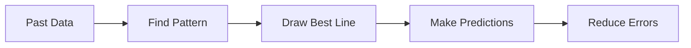
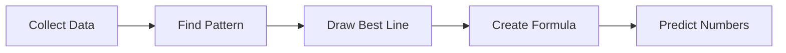

# 🎬 The Story of Linear Regression (Explained From Absolute Zero)


---

# 🎭 Meet Our Characters

* 👩 **Riya** – A student with **no coding or math background**.
* 👨‍🏫 **Professor Arjun** – A teacher who explains things in everyday language.
* 🤖 **Milo** – A small robot learning how to make predictions from data.

---

# 🌅 Chapter 1: The First Question

One day Riya asked a question.

> 👩 Riya: “Professor, how do websites predict things like house prices or future sales?”

The professor smiled.

> 👨‍🏫 “They use **Machine Learning**.”

Riya looked confused.

So the professor started from the beginning.

---

# 🧠 What is Machine Learning?

Machine Learning simply means:

> **Teaching a computer to learn patterns from past information and make predictions.**

Example:

If we show Milo many examples of:

* house sizes
* house prices

Milo may learn a **pattern**.

Then Milo can predict the price of a **new house**.

---

# 📊 What is Data?

Before learning Machine Learning, we must understand **data**.

**Data = Information we collect.**

Example data about houses:

| House Size | Price    |
| ---------- | -------- |
| 500 sq ft  | ₹20 lakh |
| 700 sq ft  | ₹28 lakh |
| 900 sq ft  | ₹35 lakh |
| 1200 sq ft | ₹50 lakh |

This table is called a **dataset**.

---

# 📚 Important Terms (Very Simple)

Let’s explain every word.

### Dataset

A **dataset** is a **collection of data organized in a table**.

Example:

| Size | Price |
| ---- | ----- |

---

### Row

A **row** represents **one example**.

Example:

```
700 sq ft house → ₹28 lakh
```

This is **one row**.

---

### Column

A **column** represents **one type of information**.

Example:

| Column     | Meaning       |
| ---------- | ------------- |
| House Size | area of house |
| Price      | cost of house |

---

### Feature

A **feature** is simply **an input piece of information used for prediction**.

Example:

Feature = House Size

---

### Target

The **target** is the value we want to **predict**.

Example:

Target = House Price

---

# 🎯 What is Regression?

Now the professor explained the main idea.

> **Regression = Predicting numbers using data.**

Regression is used when the answer is a **number**.

Examples:

| Problem     | Prediction   |
| ----------- | ------------ |
| House price | ₹50 lakh     |
| Temperature | 32°C         |
| Salary      | ₹8 lakh      |
| Sales       | 10,000 units |

All answers are **numbers**, so we use **Regression**.

---

# 🎬 Chapter 2: The Pattern Discovery

Milo looked at the house data.

| Size | Price |
| ---- | ----- |
| 500  | 20    |
| 700  | 28    |
| 900  | 35    |
| 1200 | 50    |

He noticed something.

> 🤖 Milo: “When house size increases… price also increases!”

This is called a **relationship**.

---

# 📈 What is a Relationship in Data?

A **relationship** means:

> When one value changes, another value also changes.

Example:

| House Size | Price     |
| ---------- | --------- |
| small      | cheap     |
| big        | expensive |

This pattern helps prediction.

---

# 📉 Visualizing the Data

The professor drew a graph.

First he explained what a graph is.

---

## What is a Graph?

A **graph** is a visual way to show data.

It uses two lines:

| Line   | Meaning         |
| ------ | --------------- |
| X-axis | horizontal line |
| Y-axis | vertical line   |

Example:

* X-axis → House size
* Y-axis → Price

Each house becomes a **dot (data point)**.

---

# 📍 What is a Data Point?

A **data point** is one plotted value on a graph.

Example:

```
House size = 700
Price = 28
```

This becomes **one dot**.

---

# 🎬 Chapter 3: The Magic Line

When we plot many points, they look like this pattern.

Small house → low price
Large house → high price

So the professor draws a **straight line through the points**.

This is called:

> **The Line of Best Fit**

---

# 📏 What is the Line of Best Fit?

The **Line of Best Fit** is:

> The straight line that passes **as close as possible to all data points**.

It represents the **overall trend** in the data.

---

# 🧠 What is Linear Regression?

Now the professor finally explained.

> **Linear Regression = Finding the best straight line that describes the relationship between input and output.**

Let’s break this word.

---

## What Does "Linear" Mean?

Linear means:

> **Straight line relationship**

Example:

```
Size increases → Price increases steadily
```

Graph shape:

```
 /
/
/
```

Not curved.

Just a **straight line**.

---

## What Does "Regression" Mean?

Regression means:

> **Predicting a numeric value using past data.**

So:

> **Linear Regression = Predicting numbers using a straight line pattern.**

---

# ✏ The Famous Linear Regression Formula

The professor wrote this formula.

[
y = a + bx
]

Let’s explain each symbol.

---

### y

**y = predicted value**

Example:

Predicted house price.

---

### x

**x = input value**

Example:

House size.

---

### a

**a = intercept**

Intercept means:

> The starting value when x = 0.

Think of it as **where the line starts on the graph**.

---

### b

**b = slope**

Slope means:

> How steep the line is.

Or simply:

> How much **y changes when x increases**.

Example:

If slope = 2

Then:

```
x increases by 1
y increases by 2
```

---

# 🎬 Chapter 4: Milo Makes a Prediction

Now Milo has learned the line.

Riya asks:

> 👩 “What if the house size is **1000 sq ft**?”

Milo checks the line.

He calculates.

> 🤖 “The predicted price is **around ₹40 lakh**.”

This is called:

> **Prediction**

---

# 🔮 What is Prediction?

Prediction means:

> **Estimating an unknown value using a learned pattern.**

Example:

Using past data to estimate future value.

---

# ⚠ What if the Prediction is Wrong?

Sometimes predictions are not exact.

Example:

Actual price = **50 lakh**
Predicted price = **46 lakh**

Difference:

```
50 − 46 = 4
```

This difference is called **Error**.

---

# ❌ What is Error?

Error means:

> **Difference between actual value and predicted value.**

Formula:

[
Error = Actual − Predicted
]

Machine learning models try to **reduce error as much as possible**.

---

# 🎯 Goal of Linear Regression



Goal:

> Make predictions that are **very close to the real value**.

---

# 🌍 Where Linear Regression Is Used

Linear Regression is used in many industries.

| Industry       | Example               |
| -------------- | --------------------- |
| Real Estate 🏠 | Predict house prices  |
| Business 📊    | Predict sales         |
| Finance 💰     | Predict revenue       |
| Healthcare 🏥  | Predict recovery time |
| Weather 🌦     | Predict temperature   |

---

# 🎬 Final Scene: Milo Understands Everything

Milo summarizes his learning.



He has now learned **Linear Regression**.

---

# 🎉 Moral of the Story

Linear Regression teaches computers:

> **How to learn a straight-line pattern from data and predict numbers.**

It is one of the **most basic and important algorithms in Machine Learning**.

Almost every ML journey starts here.

---

# 🧠 Everything You Learned

You now understand these terms:

✔ Machine Learning
✔ Data
✔ Dataset
✔ Row
✔ Column
✔ Feature
✔ Target
✔ Relationship
✔ Graph
✔ Data point
✔ Line of best fit
✔ Linear Regression
✔ Formula (y = a + bx)
✔ Slope
✔ Intercept
✔ Prediction
✔ Error

---

