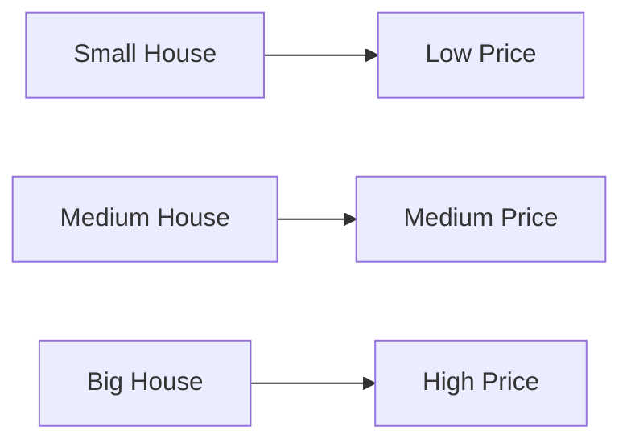
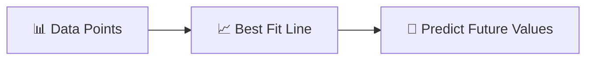
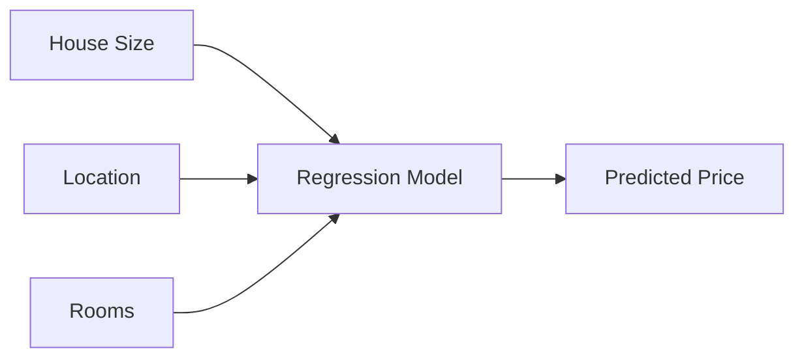
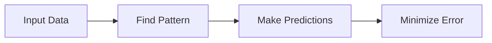
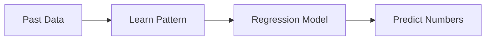

# 🎬 The Story of Regression in Machine Learning

### 🌱 A Super Simple Beginner’s Guide (For Non-Tech Students)

---

## 🎭 Meet Our Characters

* 👩 **Riya** – A curious student who has never studied coding before.
* 👨‍🏫 **Professor Arjun** – A patient teacher who loves simple explanations.
* 🤖 **Milo** – A tiny robot learning how to predict numbers.

---

# 🌅 Chapter 1: Milo Wants to Predict the Future

One day in the university lab…

Milo looked at a notebook full of numbers.

House prices.

Salaries.

Temperatures.

Sales.

He looked confused.

> 🤖 Milo: “Why are humans always trying to guess numbers about the future?”

Riya asked the professor.

> 👩 Riya: “Can machines actually **predict numbers**?”

Professor Arjun smiled.

> 👨‍🏫 “Yes. And that is called **Regression**.”

And thus began Milo’s journey.

---

# 🧠 What is Regression?

Professor Arjun wrote on the board:

> **Regression = Predicting a number using data.**

That’s it.

Regression is used when the answer is a **numeric value**.

---

## 📌 Examples of Regression

| Problem                   | Predicted Value |
| ------------------------- | --------------- |
| 🏠 House price prediction | ₹50,00,000      |
| 💼 Salary prediction      | ₹8,00,000       |
| 🌡 Temperature prediction | 32°C            |
| 📈 Sales prediction       | 10,000 units    |

All of these answers are **numbers**.

So we use **Regression**.

---

# 🎯 Regression vs Classification

Riya looked puzzled.

> 👩 Riya: “But we learned about models that predict things like spam or not spam.”

The professor explained.

| Type               | Output     |
| ------------------ | ---------- |
| **Classification** | Categories |
| **Regression**     | Numbers    |

Example:

| Problem                | Type           |
| ---------------------- | -------------- |
| Email spam detection   | Classification |
| House price prediction | Regression     |
| Disease yes/no         | Classification |
| Temperature prediction | Regression     |

---

# 🤖 How Milo Learns Regression

Professor Arjun showed Milo some data.

Example dataset:

| House Size (sq ft) | Price   |
| ------------------ | ------- |
| 500                | 20 lakh |
| 700                | 28 lakh |
| 900                | 35 lakh |
| 1200               | 50 lakh |

Milo starts seeing a pattern.

> Bigger house → Higher price

So Milo learns the relationship.

---

# 📈 Visualizing Regression

Professor Arjun drew a graph.



If we plot the data points, they roughly form a **line**.

Regression tries to find the **best line** that explains the pattern.

---

# 📏 The Best Fit Line

The professor drew a straight line through the points.



This line helps Milo answer questions like:

> “What will be the price of a **1000 sq ft house**?”

Even if that exact value was never in the data.

---

# 🧮 Simple Regression Idea

Regression tries to find a formula like this:

[
Price = a + b × House\ Size
]

Where:

* **a** = starting value
* **b** = how much price increases per unit size

Don’t worry about the math.

Just remember:

> Regression finds the **best formula connecting inputs and outputs**.

---

# 🎭 Chapter 2: Milo Makes His First Prediction

Riya asked Milo:

> 👩 “What if a house is **1000 sq ft**?”

Milo checks the learned pattern.

Then proudly says:

> 🤖 “Price ≈ **40 lakh**.”

Everyone claps.

Milo has officially made his **first regression prediction**.

---

# ⚠ Real Life Is Messy

But data is not always perfect.

Example:

| Size | Price   |
| ---- | ------- |
| 900  | 36 lakh |
| 900  | 34 lakh |
| 900  | 37 lakh |

Same size.

Different price.

Why?

Because many other things matter:

* Location 📍
* Age of house 🏚
* Nearby schools 🏫
* Transport 🚇

Regression tries to **approximate the pattern**, not perfectly memorize.

---

# 🧠 Types of Regression (Beginner Level)

Professor Arjun explained there are different regression techniques.

---

## 1️⃣ Linear Regression

The simplest type.

Prediction follows a **straight line**.

Example relationship:

```
Price increases steadily with house size
```

Very common in beginner ML.

---

## 2️⃣ Multiple Linear Regression

Sometimes one factor isn’t enough.

Example:

House price depends on:

* Size
* Location
* Number of rooms
* Age of building

Now Milo uses **multiple inputs**.



---

# 🎬 Chapter 3: Milo’s Mistakes

Sometimes Milo predicts badly.

Example:

Actual price = **50 lakh**

Predicted price = **46 lakh**

Difference = **4 lakh**

This difference is called:

> **Error**

Regression models try to **reduce error as much as possible**.

---

# 📉 The Goal of Regression



The better the pattern, the smaller the errors.

---

# 🌍 Where Regression Is Used in Real Life

Regression is everywhere.

| Industry       | Example                       |
| -------------- | ----------------------------- |
| Finance 💰     | Stock price prediction        |
| Healthcare 🏥  | Predict patient recovery time |
| Marketing 📊   | Predict sales                 |
| Weather 🌦     | Predict temperature           |
| Real Estate 🏠 | Predict property prices       |

Even big companies use regression.

---

# 🎭 Final Scene: Milo Becomes a Predictor

Milo started with confusion.

But now he understands.



He can now predict:

* prices
* salaries
* temperatures
* sales

All using **Regression**.

---

# 🎉 Moral of the Story

Regression is simply:

> **Learning from past numbers to predict future numbers.**

It is one of the **most fundamental ideas in Machine Learning**.

Almost every ML journey begins here.

---

# 🧠 What You Learned

✔ What Regression means
✔ Difference between Regression and Classification
✔ How machines learn numeric patterns
✔ Best-fit line idea
✔ Prediction errors
✔ Real-world uses of regression

---


