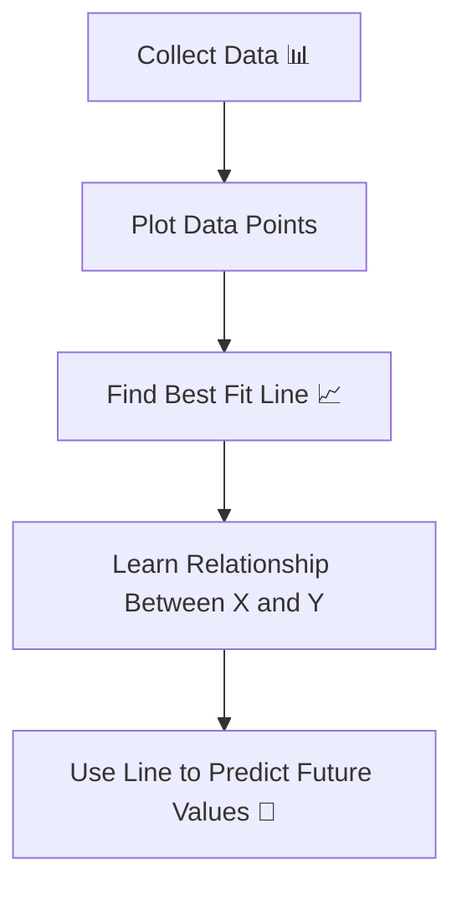
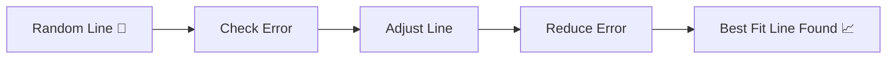

# 🎬 Linear Regression

## 📈 The Day Aarav Taught Robo to Predict the Future

---

## 🌟 New Characters

👨‍🎓 **Aarav** – A curious beginner who has never studied computer science.
👩‍🔬 **Dr. Meera** – A patient data scientist who explains everything simply.
🤖 **Robo** – A machine learning model that learns patterns from data.

---

# 🌌 Chapter 1: A Curious Question

One evening Aarav was staring at a dataset.

It looked like this:

| Hours Studied | Exam Score |
| ------------- | ---------- |
| 1             | 50         |
| 2             | 55         |
| 3             | 65         |
| 4             | 70         |
| 5             | 80         |

Aarav noticed something interesting.

> The more hours students studied…
> the higher their exam scores became.

So Aarav wondered:

> 👨‍🎓 “If a student studies **6 hours**, what will their score be?”

Dr. Meera smiled.

> 👩‍🔬 “That is exactly what **Linear Regression** is for.”

---

# 🧠 What is Linear Regression?

Linear Regression is a machine learning method that:

> **Predicts a number using a straight line relationship between variables.**

Example predictions:

* House price
* Salary
* Temperature
* Sales
* Exam score

It answers questions like:

```
If X changes, how will Y change?
```

---

# 📊 The Idea Behind Linear Regression

Imagine plotting the data on a graph.

```
X-axis → Hours studied
Y-axis → Exam score
```

Each row becomes a **point on the graph**.

Linear Regression tries to draw the **best possible straight line** through those points.

That line helps predict future values.

---

# 🔄 Linear Regression Learning Flow



---

# 🎴 Real-Life Analogy

Imagine you're driving a car.

When you press the accelerator:

```
More acceleration → Higher speed
```

There is a **relationship**.

Linear Regression simply finds relationships like this in data.

Example:

```
More advertising → More sales
More experience → Higher salary
More study hours → Better exam score
```

---

# 📐 The Linear Regression Equation

The equation looks like this:

```
y = mx + b
```

Where:

| Symbol | Meaning                       |
| ------ | ----------------------------- |
| x      | Input value                   |
| y      | Predicted output              |
| m      | Slope (how steep the line is) |
| b      | Intercept (starting point)    |

---

# 🧩 Simple Example

Let’s say the learned equation becomes:

```
Score = 5 × Hours + 45
```

Now Aarav predicts:

Student studies **6 hours**

```
Score = 5 × 6 + 45
Score = 75
```

Prediction:

> 🎯 **75 marks**

---

# 🔄 How the Model Learns the Line



The algorithm keeps adjusting the line until the prediction errors become small.

---

# 📉 Why It Is Called "Regression"

Dr. Meera explained something interesting.

Long ago, statisticians used regression to study:

```
Height of parents vs height of children
```

Children’s heights tended to **regress toward the average**.

That’s where the name came from.

---

# 💻 Linear Regression Code (Super Beginner Friendly)

```python
from sklearn.linear_model import LinearRegression
import numpy as np

# X represents input values
# In this case: number of hours studied
X = np.array([[1], [2], [3], [4], [5]])

# y represents the output values
# In this case: exam scores
y = np.array([50, 55, 65, 70, 80])

# Create the Linear Regression model
model = LinearRegression()

# Train the model using the data
# The model learns the relationship between X and y
model.fit(X, y)

# Now we ask the model to predict score for 6 hours of study
prediction = model.predict([[6]])

# Print the prediction
print("Predicted Score:", prediction)
```

---

# 🧾 Code Explanation (Very Simple)

### Import the model

```python
from sklearn.linear_model import LinearRegression
```

This imports the **Linear Regression algorithm** from sklearn.

---

### Define input data

```python
X = np.array([[1], [2], [3], [4], [5]])
```

These numbers represent **hours studied**.

---

### Define output values

```python
y = np.array([50, 55, 65, 70, 80])
```

These represent **exam scores**.

---

### Create model

```python
model = LinearRegression()
```

This creates an **empty regression model**.

---

### Train the model

```python
model.fit(X, y)
```

Here the model learns:

```
How hours studied affect exam score
```

---

### Make prediction

```python
prediction = model.predict([[6]])
```

Now we ask:

```
If someone studies 6 hours, what score should they get?
```

---

# 🔍 What the Model Actually Learns

Behind the scenes, the model calculates:

```
slope (m)
intercept (b)
```

These values define the **best fit line**.

Example:

```
Score = 5 × Hours + 45
```

---

# 📊 Where Linear Regression Is Used

Companies use Linear Regression everywhere.

Examples:

🏠 House price prediction
📈 Stock price forecasting
🛒 Sales prediction
🚗 Fuel consumption prediction
🎓 Student performance prediction

---

# ⚠️ Limitations of Linear Regression

Linear Regression works well when the relationship is **roughly linear**.

But sometimes relationships look like curves.

Example:

```
Speed vs fuel consumption
```

In those cases, more complex models are needed.

---

# 🎬 Chapter 2: Aarav’s First Prediction

Aarav trained Robo.

Then he predicted scores for new students.

Robo replied:

```
Student studying 6 hours → 75 marks
Student studying 7 hours → 80 marks
```

Aarav smiled.

> 👨‍🎓 “Robo can now predict the future!”

Dr. Meera laughed.

> 👩‍🔬 “Not the future… just the **pattern**.”

---

# 🎯 Key Insight

Linear Regression finds a **straight-line relationship between variables**.

Then it uses that relationship to **predict unknown values**.

---

# 🧠 What You Now Understand

✔ What Linear Regression is
✔ Why it predicts numbers
✔ The line equation (y = mx + b)
✔ How the model learns patterns
✔ How to implement it in Python
✔ Where it is used in real life

---

# 🚀 Next Episode

Aarav’s journey continues.


