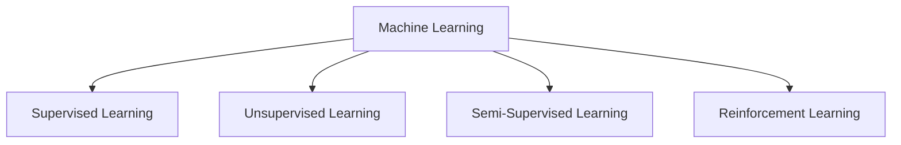
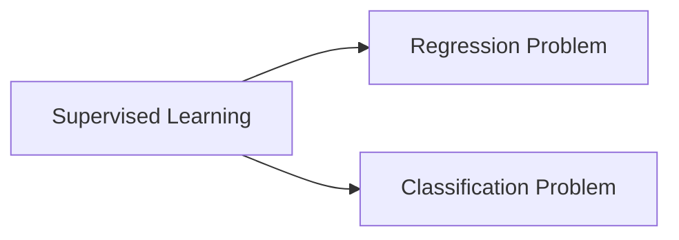
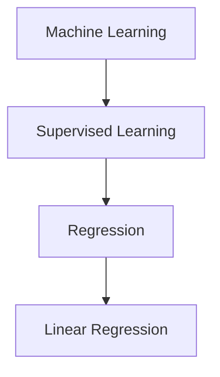
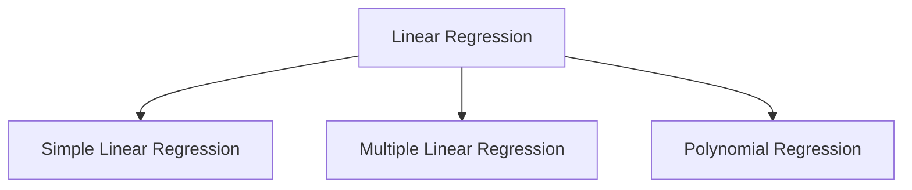
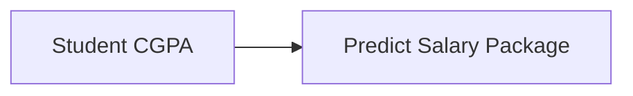
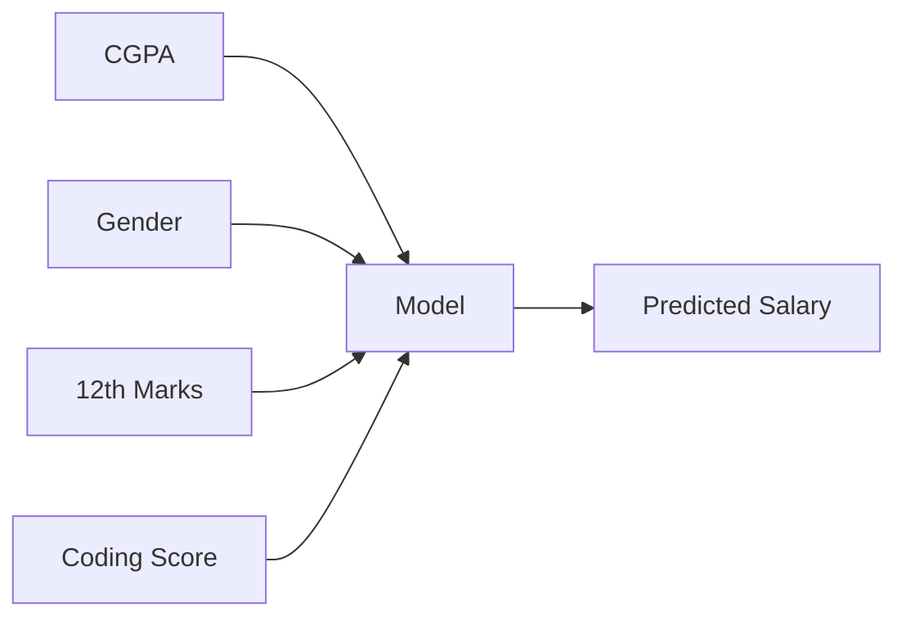
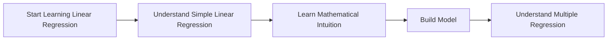
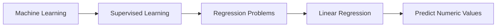

# 🎬 The Story of Linear Regression

### 🌱 A Cinematic Beginner Guide to the First ML Algorithm

---

# 🎭 Meet Our Characters

* 👩 **Riya** – A beginner learning Machine Learning for the first time
* 👨‍🏫 **Professor Arjun** – A calm teacher who explains complex things simply
* 🤖 **Milo** – A small robot trying to learn from data

---

# 🌅 Chapter 1: The First Algorithm Everyone Meets

One day in the lab…

Riya asked a question.

> 👩 Riya: “Professor, everyone says the first Machine Learning algorithm is **Linear Regression**. Why?”

Professor Arjun smiled.

> 👨‍🏫 “Because it is the **most simple and understandable algorithm in Machine Learning**.”

Even Milo nodded.

> 🤖 Milo: “Finally… something my tiny robot brain can understand.”

And that’s why almost **every Machine Learning course begins with Linear Regression**.

---

# 🧠 Why Linear Regression is Taught First

Many Machine Learning algorithms are complicated.

For example:

* Neural Networks 🧠
* Support Vector Machines ⚔️
* Decision Trees 🌳

When beginners see them for the first time they feel like this:

> 😵 “What is happening??”

But Linear Regression is different.

It is:

✔ Easy to understand
✔ Easy to visualize
✔ Easy to explain
✔ A **foundation algorithm**

---

# 🏗 Why Linear Regression is Important

Professor Arjun wrote on the board:

> **Linear Regression is a foundation algorithm of Machine Learning.**

If you understand it well:

* many future algorithms become easier
* Machine Learning concepts become clearer

Think of it like learning **basic mathematics before calculus**.

---

# 📚 First Important Concept: Types of Machine Learning

Before understanding Linear Regression, we must know **where it belongs**.

Machine Learning has different categories.



---

# 🧑‍🏫 What is Supervised Learning?

Linear Regression belongs to **Supervised Learning**.

### Supervised Learning

Supervised learning means:

> The model learns from **labeled data**.

---

### What is Labeled Data?

Labeled data means:

> Data where the **correct answer is already known**.

Example:

| CGPA | Salary Package |
| ---- | -------------- |
| 6.5  | 3 LPA          |
| 7.2  | 4 LPA          |
| 8.5  | 8 LPA          |

Here we already know:

* Input → CGPA
* Output → Salary

So the model can learn the **relationship**.

---

# 📊 Types of Problems in Supervised Learning

Supervised Learning mainly solves two types of problems.



---

# 🎯 What is a Regression Problem?

A **Regression problem** means:

> Predicting a **continuous numeric value**.

Examples:

| Problem                | Prediction   |
| ---------------------- | ------------ |
| House price prediction | ₹50 lakh     |
| Salary prediction      | ₹8 lakh      |
| Temperature prediction | 32°C         |
| Sales prediction       | 10,000 units |

Notice something?

All answers are **numbers**.

That means we use **Regression algorithms**.

---

# 🎬 Where Linear Regression Fits



So now we know:

> Linear Regression is a **Supervised Machine Learning Algorithm used to solve Regression problems**.

---

# 🎭 Chapter 2: Types of Linear Regression

Professor Arjun said:

> “When you study Linear Regression, you will usually see three types.”



Let’s understand each one.

---

# 🟢 1️⃣ Simple Linear Regression

The name already tells the story.

> **Simple Linear Regression = One input variable and one output variable**

---

### Important Terms

Before moving forward, understand two words.

| Term            | Meaning                     |
| --------------- | --------------------------- |
| Input variable  | information used to predict |
| Output variable | value we want to predict    |

---

# 📊 Example: Student Placement Data

Suppose we have data of students.

| CGPA | Salary Package |
| ---- | -------------- |
| 6.6  | 3 LPA          |
| 7.0  | 4 LPA          |
| 8.2  | 7 LPA          |

---

### What is CGPA?

**CGPA = Cumulative Grade Point Average**

It represents the **student's academic performance**.

---

### What is Salary Package?

Package means:

> The **annual salary offered during placement**

Example:

3 LPA means:

3 Lakh Per Annum.

---

# 🎯 The Goal of the Model

The machine learning model learns this relationship:



Example prediction:

If a student has:

```
CGPA = 8.0
```

The model predicts:

```
Salary ≈ 6 LPA
```

This is **Simple Linear Regression**.

Because we used:

* One input → CGPA
* One output → Salary

---

# 🟡 2️⃣ Multiple Linear Regression

Now imagine the data becomes bigger.

Companies don't only look at CGPA.

They may also consider:

* Gender
* 12th Marks
* Coding Score
* Projects

Now the dataset might look like this:

| CGPA | Gender | 12th Marks | Coding Score | Salary |
| ---- | ------ | ---------- | ------------ | ------ |
| 7.5  | Male   | 85         | 8            | 6 LPA  |

Now the prediction depends on **many inputs**.



---

### Definition

> **Multiple Linear Regression = When we use more than one input variable to predict the output.**

---

# 🔵 3️⃣ Polynomial Regression

Sometimes data does not follow a straight line.

Example:

House prices may grow **curved instead of straight**.

In that case we use:

> **Polynomial Regression**

It can model **curved relationships**.

But that is an **advanced topic**, so we will study it later.

---

# 🎬 Chapter 3: Our First Target

Professor Arjun told Riya:

> “Before learning everything, we must first master **Simple Linear Regression**.”

Why?

Because:

✔ It is the easiest
✔ It builds the foundation
✔ Once you understand it, **Multiple Regression becomes easy**

---

# 🧭 Our Learning Plan



---

# 🎬 Final Scene

Professor Arjun looked at Milo.

> 👨‍🏫 “Today you learned where Linear Regression fits in Machine Learning.”

Milo summarized proudly.



Milo's robot brain was happy.

> 🤖 “Finally… Machine Learning is starting to make sense.”

---

# 🎉 Moral of the Story

Linear Regression is the **first step into Machine Learning**.

It helps you understand:

* how models learn patterns
* how predictions are made
* how data is used

Master this algorithm and **many ML concepts will become easier**.

---

# 🧠 What You Learned

✔ What Linear Regression is
✔ Why it is the first ML algorithm
✔ What Supervised Learning is
✔ What Regression problems are
✔ Types of Linear Regression
✔ Simple Linear Regression
✔ Multiple Linear Regression
✔ Polynomial Regression

---


Exactly in the **same cinematic storytelling format**.
