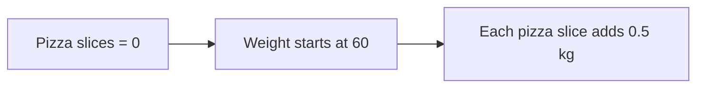
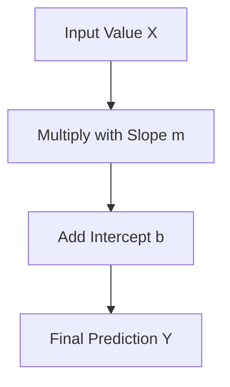
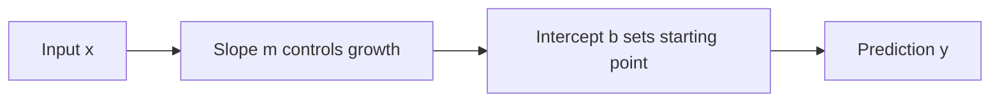
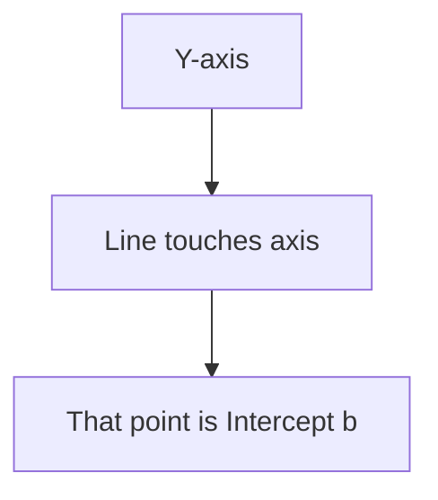
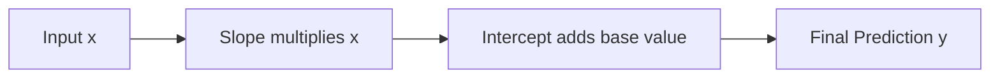

# 🎬 The Story of Intercept (b)

### 🍕 The Starting Point of Every Prediction

---

# 🎭 Meet Our Characters

* 👩 **Riya** – A beginner trying to understand Machine Learning
* 👨‍🏫 **Professor Arjun** – Explains things in the simplest way
* 🤖 **Milo** – The learning robot who predicts everything

---

# 🌅 Chapter 1: Milo’s Confusion

One day in the lab…

Milo proudly announced:

> 🤖 “I can now predict exam marks!”

Riya got excited.

> 👩 “Wow! How?”

Milo showed the equation:

```
Marks = 10 × StudyHours + 30
```

Riya stared at it.

> 👩 “Wait… what is this **+30** doing here?”

Professor Arjun smiled.

> 👨‍🏫 “Ah… that is called the **Intercept (b)**.”

And thus the story begins.

---

# 🧠 First, Remember the Famous Equation

Linear Regression uses a simple formula.

```
y = mx + b
```

Where:

| Symbol | Meaning          |
| ------ | ---------------- |
| x      | Input value      |
| y      | Predicted output |
| m      | Slope            |
| b      | Intercept        |

Think of it like a **recipe for prediction**.

---

# 🎯 What is Intercept?

Professor Arjun explained simply:

> **Intercept is the value of y when x = 0.**

Or even simpler:

👉 **Where the line starts.**

---

# 🍕 Example 1: Pizza Weight Prediction

Suppose Milo predicts weight based on pizza slices.

```
Weight = 0.5 × PizzaSlices + 60
```

Now imagine Rahul says:

> “Bro… I ate **0 pizza slices today**.”

Prediction:

```
Weight = 0.5 × 0 + 60
Weight = 60 kg
```

So even if pizza = **0**, weight is **60 kg**.

Why?

Because humans exist without pizza.

Unfortunately.

That **60** is the **Intercept**.

---

# 📊 Graph Intuition

Let’s visualize it.

X-axis → Pizza slices
Y-axis → Weight

The line starts at **60**.



---

### Graph Representation

```
Weight
 |
70|
65|
60|  *
55|
50|
 |
 +-------------------
   0 1 2 3 4
   Pizza slices
```

That **first point (60)** is the **Intercept**.

---

# 🚕 Example 2: Taxi Story (Funniest One)

Riya books a taxi.

Driver says:

> “₹50 base charge… then ₹20 per kilometer.”

Equation becomes:

```
Cost = 20 × Distance + 50
```

Now imagine Riya changes her mind.

> 👩 “Actually… I don't want to go anywhere.”

Distance = **0**

Cost = **₹50**

Driver:

> “Madam… car start kiya hai… emotions start ho gaye.”

That **₹50** is the **Intercept**.

---

# 🔄 Prediction Flow

Here’s how the prediction happens.



Example:

```
x = 3 study hours
m = 10
b = 30
```

```
Marks = (10 × 3) + 30
Marks = 60
```

---

# 🏫 Example 3: Study Hours

Equation:

```
Marks = 10 × StudyHours + 30
```

Graph intuition:

```
Marks
 |
80|
70|
60|       *
50|    *
40|  *
30|*
 |
 +-----------------
 0 1 2 3 4
 Study Hours
```

Notice something important:

The line starts at **30 marks**.

Even if the student studies **0 hours**, the prediction is **30 marks**.

---

# 🎭 Character Personality

Think of the equation like a team.



Roles:

**x → Input**

“The data we give.”

**m → Slope**

“How fast things change.”

**b → Intercept**

“Where everything begins.”

---

# 😂  Example

Predicting **happiness based on coffee cups**.

Equation:

```
Happiness = 5 × Coffee + 20
```

Friend says:

> “I drank **0 coffee today**.”

Prediction:

```
Happiness = 5 × 0 + 20
Happiness = 20
```

So even with **no coffee**, happiness is **20**.

Why?

Because the person still has:

* WiFi
* memes
* and food.

That **20** is the **Intercept**.

---

# 📊 Intercept on the Graph

The intercept is always where the line touches the **Y-axis**.



---

# 🧠 Simple Definition

Intercept (b) means:

> **The predicted value when the input is zero.**

Or simply:

👉 **The starting value of the model.**

---

# 🎬 Story Recap

Professor Arjun summarized:



Milo finally understood.

> 🤖 “So intercept is the **starting point of prediction**!”

Professor Arjun smiled.

> 👨‍🏫 “Exactly.”

---

# 🎉 Final Moral

Every prediction line needs two things:

1️⃣ **Slope** → how fast things change
2️⃣ **Intercept** → where the story begins

Together they form:

```
y = mx + b
```

The **heart of Linear Regression**.

---


