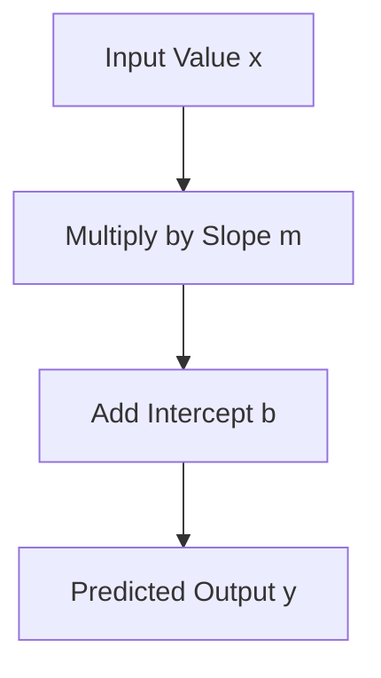
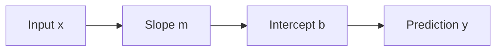
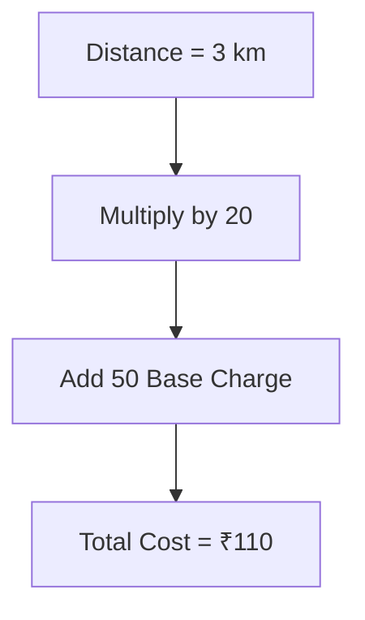
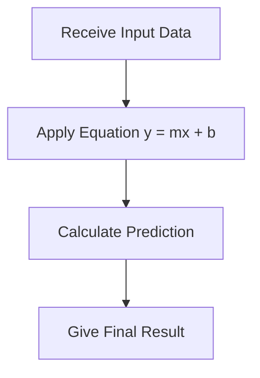
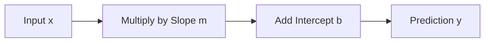

# 🎬 The Story of the Linear Regression Equation

### 🧠 The Magic Formula That Makes Predictions

---

## 🎭 Meet Our Characters

* 👩 **Riya** – A beginner trying to understand Machine Learning
* 👨‍🏫 **Professor Arjun** – The calm teacher who explains everything simply
* 🤖 **Milo** – The robot learning how to predict things

---

# 🌅 Chapter 1: Milo Wants a Prediction Formula

After learning about:

* Best Fit Line
* Residuals

Milo said proudly:

> 🤖 “Okay… I understand the idea.
> But how do I actually **calculate predictions**?”

Professor Arjun walked to the board and wrote a **simple equation**.

```id="t7i4yw"
y = mx + b
```

Riya blinked.

> 👩 “That tiny formula does all of Linear Regression??”

Professor Arjun smiled.

> 👨‍🏫 “Yes. This is the **Linear Regression Equation**.”

---

# 🧠 First Let's Understand Each Symbol

The equation looks small but each symbol has a job.

| Symbol | Meaning         |
| ------ | --------------- |
| y      | Predicted value |
| x      | Input value     |
| m      | Slope           |
| b      | Intercept       |

Think of it like a **prediction recipe**.

---

# 🎯 What Does the Equation Do?

The equation simply says:

> Take the input → multiply it → add a starting value → get prediction.

---

### Prediction Flow



---

# 🍕 Example 1: Predicting Marks

Suppose Milo learned this equation from data.

```id="6aohwh"
Marks = 8 × StudyHours + 32
```

Now Riya tests Milo.

> 👩 “What if a student studies **5 hours**?”

Milo calculates.

```id="rle5dg"
Marks = 8 × 5 + 32
Marks = 72
```

Milo predicts:

> 🤖 “The student will get **72 marks**!”

---

# 📊 Graph Intuition

Imagine the graph.

X-axis → Study hours
Y-axis → Marks

The equation creates a **straight line**.

```id="7l1vl4"
Marks
 |
90|
80|        *
70|      *
60|    *
50|  *
40|
 |
 +--------------------
 1 2 3 4 5
 Study Hours
```

Every point on this line follows:

```id="o7t4ui"
y = mx + b
```

---

# 🎭 Meet the Equation Characters

Think of the equation like a **team of workers**.



Each member has a role.

---

## 👇 Character 1: Input (x)

This is the **information we give the model**.

Example inputs:

* Study hours
* Pizza slices
* Distance traveled
* House size

Example:

```id="1lgx6g"
x = 4 hours of study
```

---

## 📈 Character 2: Slope (m)

Slope tells us:

> **How fast the output changes when input increases.**

Example:

```id="y25oeb"
m = 8
```

This means:

Every **extra study hour adds 8 marks**.

---

## 🎯 Character 3: Intercept (b)

Intercept is the **starting value**.

It answers the question:

> What happens when **x = 0**?

Example:

```id="y4dtrn"
b = 32
```

Even if the student studies **0 hours**, predicted marks = **32**.

---

# 🚕 Funny Taxi Example

Taxi company pricing:

* ₹20 per kilometer
* ₹50 base charge

Equation becomes:

```id="5yrua7"
Cost = 20 × Distance + 50
```

Let’s test it.

Distance = **3 km**

```id="k3r1gl"
Cost = 20 × 3 + 50
Cost = 110
```

Taxi driver:

> 🚕 “₹110 please.”

Riya:

> 👩 “That equation works everywhere!”

---

# 📊 Visual Flow of the Equation



This is exactly how the **Linear Regression Equation works**.

---

# 🤖 Milo's Prediction Machine

Milo now follows this simple process.



---

# 🎯 Why It Is Called **Linear** Regression

The word **Linear** means:

> The relationship forms a **straight line**.

If you draw predictions on a graph, you get:

```id="1nggtg"
Straight Line
```

Not a curve.

---

# 🧠 Super Simple Definition

Linear Regression Equation:

> A formula used to **predict a value using a straight-line relationship between input and output**.

Or even simpler:

👉 **Prediction = Change × Input + Starting Value**

---

# 🎬 Story Recap

Professor Arjun summarized everything.



Riya finally understood.

> 👩 “So the equation is just a **machine for making predictions**!”

Milo proudly beeped.

> 🤖 “Yes! And that machine is called **Linear Regression**.”

---

# 🎉 Moral of the Story

Behind every prediction in Linear Regression is this tiny formula:

```id="dwpbt2"
y = mx + b
```

It converts **data → prediction** using a straight line.

---

# 🧠 What You Learned

✔ What the Linear Regression equation is
✔ Meaning of **x, m, b, y**
✔ How predictions are calculated
✔ Why the relationship is linear
✔ Real-life examples (marks, taxi pricing)

---


