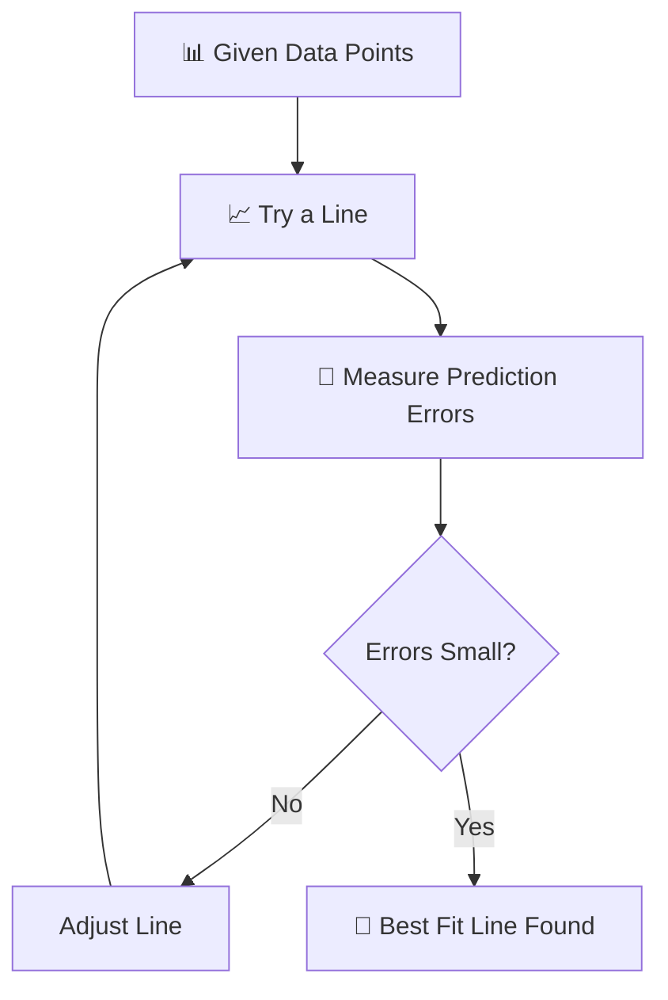
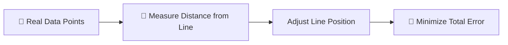
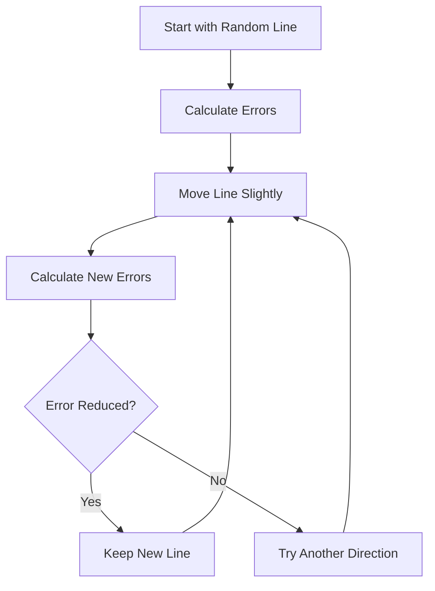
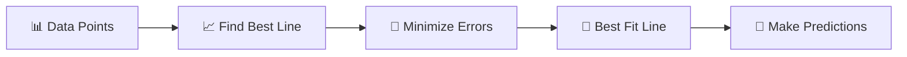

# 🎯 The Story of the Best Fit Line

### 🎬 The Real Goal of Linear Regression (Super Simple + Funny)

---

## 🎭 Meet Our Characters Again

* 👩 **Riya** – The curious beginner
* 👨‍🏫 **Professor Arjun** – The calm teacher
* 🤖 **Milo** – The robot learning Machine Learning

---

# 🌅 Chapter 1: Milo Sees Real Data

One day Milo received **real-world student data**.

It looked like this:

| Study Hours | Marks |
| ----------- | ----- |
| 1           | 40    |
| 2           | 50    |
| 3           | 65    |
| 4           | 70    |
| 5           | 80    |

Riya asked:

> 👩 “Milo… can you predict marks for **6 study hours**?”

Milo said:

> 🤖 “Maybe… but first I need to draw a **line**.”

Riya got confused.

> 👩 “Why a line?”

Professor Arjun stepped in.

> 👨‍🏫 “Because **Linear Regression tries to find the best line that explains the data**.”

---

# 📊 Visualizing the Data

Imagine each row as a **dot on a graph**.

X-axis → Study Hours
Y-axis → Marks

```
Marks
 |
85|        *
80|            *
70|       *
60|
50|    *
40|  *
 |
 +-----------------
 1  2  3  4  5
 Study Hours
```

The dots look **almost like a straight trend**.

---

# 🤔 The Big Question

Milo asked:

> 🤖 “There are **infinite lines** I could draw.
> Which one should I choose?”

Professor Arjun smiled.

> 👨‍🏫 “We choose the **Best Fit Line**.”

---

# 🎯 What is the Best Fit Line?

A **Best Fit Line** is the line that:

✔ Passes as close as possible to all points
✔ Represents the trend of the data
✔ Minimizes prediction errors

In simple words:

> The line that **best represents the relationship between X and Y**.

---

# 🧩 Step-by-Step Idea

How Milo finds it:



---

# 🎯 Example Prediction

Suppose Milo finds this equation:

```
Marks = 8 × StudyHours + 32
```

Now predict marks for **6 hours study**.

```
Marks = 8 × 6 + 32
Marks = 80
```

So Milo predicts:

> 🤖 “If someone studies **6 hours**, they may score around **80 marks**.”

---

# 🏹 The Dartboard Story (Funny Intuition)

Professor Arjun explained using a **dart game**.

Imagine Riya throwing darts at a dartboard.

Some land close to the center.

Some miss slightly.



The **best line** is the one where:

👉 Total mistake is **smallest**

---

# 📉 Error Intuition

Suppose a student studied **3 hours**.

Actual marks = **65**

But the line predicts **60**.

Error =

```
Error = Actual − Predicted
Error = 65 − 60 = 5
```

That difference is called **error**.

---

# 📊 Graph of Best Fit Line

```
Marks
 |
90|
80|            *
75|           /
70|       *  /
65|         *
60|       /
50|    * /
40|  *
 |
 +------------------
 1 2 3 4 5
 Study Hours
```

The line passes **through the middle of the data**.

Not touching every point.

But **closest overall**.

---

# 🤖 Milo’s Learning Process

Milo tries many lines like this:



Eventually Milo finds the **best line**.

---

# 🧠 Super Simple Definition

Best Fit Line means:

> The line that **minimizes the total prediction error for all data points**.

Or simpler:

👉 **The line that sits closest to all points.**

---

# 🎬 Story Recap

Riya asked:

> 👩 “So the real job of Linear Regression is finding this line?”

Professor Arjun nodded.

> 👨‍🏫 “Exactly.”



Milo proudly announced:

> 🤖 “Now I understand!
> Linear Regression is basically **finding the smartest line**.”

---

# 🎉 Moral of the Story

Linear Regression is not just drawing a line.

It is about finding the **Best Fit Line** that:

✔ Explains the data
✔ Minimizes errors
✔ Helps make predictions

---

# 🧠 What You Learned

✔ Why we draw a line in regression
✔ What a Best Fit Line is
✔ Why errors matter
✔ How predictions happen

---

