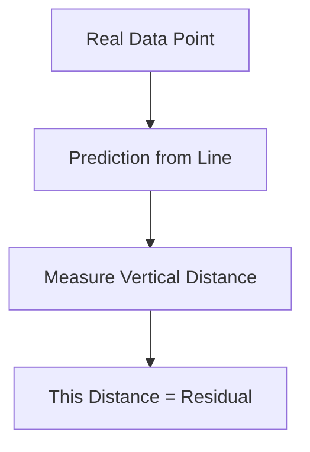
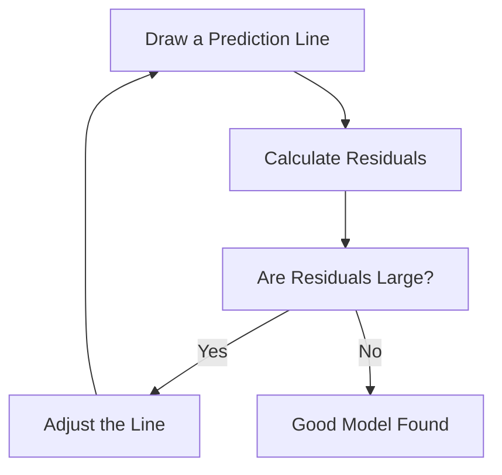
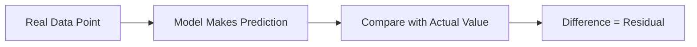

# 🎯 The Story of Residuals

### 🎬 The Tiny Mistakes Every Model Makes

---

## 🎭 Meet Our Characters (Again!)

* 👩 **Riya** – Curious beginner asking lots of questions
* 👨‍🏫 **Professor Arjun** – Explains everything calmly
* 🤖 **Milo** – The robot learning to predict things

---

# 🌅 Chapter 1: Milo Makes His First Prediction

Yesterday, Milo learned about the **Best Fit Line**.

He proudly showed his prediction formula:

```
Marks = 8 × StudyHours + 32
```

Riya decided to test Milo.

She said:

> 👩 “Okay Milo… if a student studies **3 hours**, what will be the marks?”

Milo calculated quickly.

```
Marks = 8 × 3 + 32
Marks = 56
```

Milo said:

> 🤖 “The student will get **56 marks**!”

But the real exam result was…

**65 marks** 😳

---

# 🤔 Riya Notices Something

Riya said:

> 👩 “Wait… you predicted **56**, but the real marks are **65**.”

Professor Arjun nodded.

> 👨‍🏫 “Yes… that small difference is called a **Residual**.”

And Milo suddenly became nervous.

> 🤖 “So… I made a mistake?”

Professor Arjun:

> 👨‍🏫 “Don’t worry Milo. Every model makes small mistakes.”

---

# 🎯 What is a Residual?

A **Residual** is simply:

> The difference between the **actual value** and the **predicted value**.

In math:

```
Residual = Actual Value − Predicted Value
```

---

# 📊 Example Calculation

Actual marks = **65**
Predicted marks = **56**

```
Residual = 65 − 56
Residual = 9
```

So Milo’s **residual = 9 marks**.

This means the prediction was **9 marks lower** than reality.

---

# 📈 Visual Graph Intuition

Let’s imagine the graph again.

```id="l6o7n4"
Marks
 |
90|
80|           *
70|        *
65|      *
60|      |\
56|      | *  (Prediction)
50|      |
 |
 +---------------------
   1  2  3  4
   Study Hours
```

The **vertical distance between the point and the line** is the **Residual**.

---

# 📏 Residual = Distance from the Line

Think of the best fit line like a **road**.

And each real data point like a **house**.

Some houses are exactly on the road.

Some are **above** or **below** it.



Residual = **how far the prediction is from reality**.

---

# 🍕 Funny Pizza Example

Milo predicts **weight based on pizza slices**.

Equation:

```
Weight = 0.6 × PizzaSlices + 60
```

Friend eats **5 pizza slices**.

Prediction:

```
Weight = 0.6 × 5 + 60
Weight = 63 kg
```

But real weight = **66 kg**

Residual:

```
Residual = 66 − 63
Residual = 3
```

Milo underestimated the weight 😅

---

# 🎯 Residual Can Be Positive or Negative

Residuals can go **two directions**.

### Positive Residual

Actual value **greater** than prediction.

```
Residual = +9
```

Meaning the model **predicted too low**.

---

### Negative Residual

Actual value **smaller** than prediction.

Example:

Predicted = 70
Actual = 65

```
Residual = 65 − 70 = -5
```

Meaning the model **predicted too high**.

---

# 📊 Residual Visualization

```id="h7z6a9"
Marks
 |
80|
70|         *
65|      *
60|------*-------  ← Best Fit Line
55|
50|   *
 |
 +------------------
 1 2 3 4
 Study Hours
```

Each vertical gap = **Residual**.

---

# 🤖 Milo Tries to Improve

Milo now checks all residuals.

If residuals are large, it means the line is **not perfect**.

So Milo tries to adjust the line.



The goal is:

> Make **all residuals as small as possible**.

---

# 🎭 A Funny Teacher Example

Professor Arjun said:

> 👨‍🏫 “Think of predictions like **throwing chalk at a board**.”

Sometimes chalk lands exactly on target.

Sometimes it misses.

Each miss is a **Residual**.

The smaller the miss, the better the aim.

---

# 🧠 Super Simple Definition

Residual means:

> The difference between **actual value** and **predicted value**.

Or simply:

👉 **How wrong the prediction was.**

---

# 🎬 Story Recap

Riya summarized the lesson.



Milo finally understood.

> 🤖 “Residuals are my **tiny prediction mistakes**!”

Professor Arjun smiled.

> 👨‍🏫 “Exactly. And our goal is to make them as **small as possible**.”

---

# 🎉 Moral of the Story

No model is perfect.

But a good model tries to:

✔ Minimize residuals
✔ Reduce prediction errors
✔ Fit data better

---

# 🧠 What You Learned

✔ What residuals are
✔ How to calculate residuals
✔ Why residuals matter
✔ How residuals appear on graphs

---


