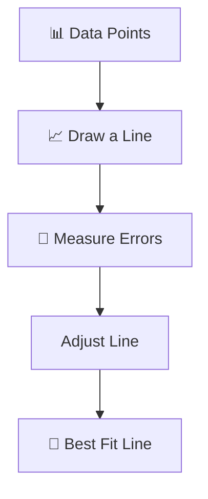
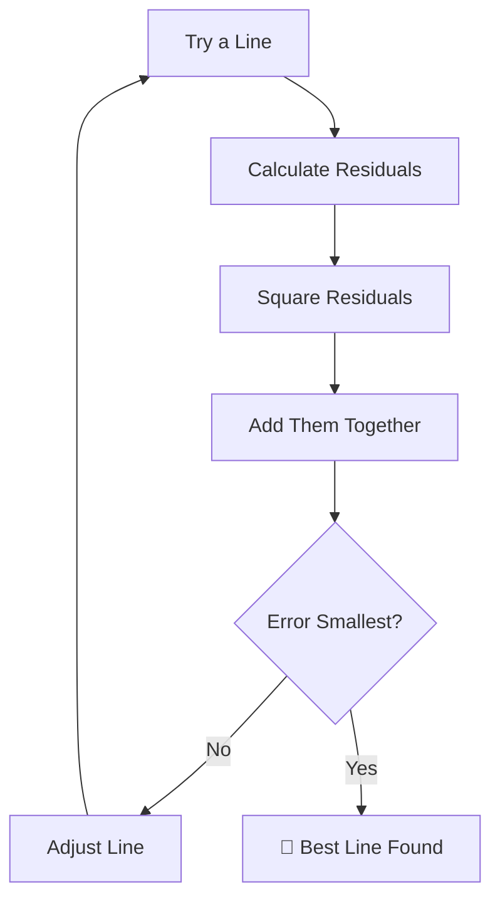
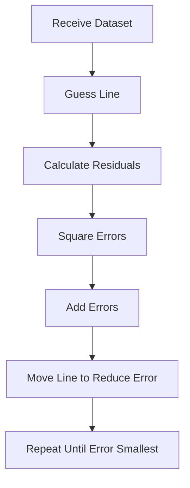
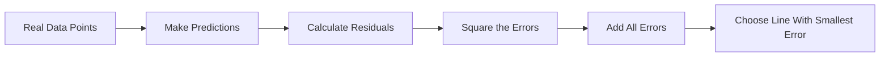

# 🎯 The Story of Least Squares

### 🎬 How Linear Regression Finds the Best Line

---

## 🎭 Meet Our Characters

* 👩 **Riya** – Curious beginner
* 👨‍🏫 **Professor Arjun** – Explains complex ideas simply
* 🤖 **Milo** – The robot learning to make predictions

---

# 🌅 Chapter 1: Milo Faces a Big Problem

Yesterday Milo learned the **Linear Regression Equation**.

```text
y = mx + b
```

But now Milo is stuck.

He asked nervously:

> 🤖 “Professor… how do I find the **correct values of m and b**?”

Riya added:

> 👩 “Yeah… anyone can write the formula.
> But how do we find the **best line**?”

Professor Arjun smiled.

> 👨‍🏫 “We use something called the **Least Squares Method**.”

---

# 🧠 First Let's Remember the Goal

Linear Regression wants to find:

> The **Best Fit Line**.

Meaning:

A line that stays **as close as possible to all data points**.

---

### Prediction Process



But how do we measure **errors**?

That’s where the magic happens.

---

# 📏 Step 1: Calculate Residuals

Remember residuals?

Residual means:

```text
Residual = Actual Value − Predicted Value
```

Example:

Actual marks = **70**
Predicted marks = **65**

```text
Residual = 70 − 65 = 5
```

Residual = **5 marks error**.

---

# 📊 Residual on Graph

```text
Marks
 |
80|
70|       *
65|      |
60|------*------  Best Fit Line
55|
 |
 +-----------------
 1 2 3 4
 Study Hours
```

The vertical distance between:

Point ↔ Line

is the **Residual**.

---

# 🤔 Problem With Residuals

Milo noticed something.

Some residuals are **positive**.

Some are **negative**.

Example:

```text
Residual1 = +5
Residual2 = -5
```

If we add them:

```text
+5 + (-5) = 0
```

Milo panicked.

> 🤖 “Wait… it looks like **zero error** even though I made mistakes!”

Professor Arjun nodded.

> 👨‍🏫 “Exactly. That’s why we **square the errors**.”

---

# 🧮 Step 2: Square the Errors

Instead of using errors directly, we square them.

Example:

```text
Error = 5
Squared Error = 25
```

```text
Error = -5
Squared Error = 25
```

Now both become **positive numbers**.

---

# 🎯 Why Square the Errors?

Squaring errors does two things:

1️⃣ Removes negative values
2️⃣ Punishes large mistakes more

Example:

| Error | Squared Error |
| ----- | ------------- |
| 2     | 4             |
| 5     | 25            |
| 10    | 100           |

Big mistakes become **much bigger**.

This forces the model to avoid them.

---

# 🧩 Step 3: Add All Squared Errors

Now Milo adds all squared errors.

Example:

```text
Error1 = 3 → 9
Error2 = 4 → 16
Error3 = 2 → 4
```

Total:

```text
Total Error = 9 + 16 + 4 = 29
```

This total is called:

> **Sum of Squared Errors (SSE)**

---

# 🎯 The Goal of Least Squares

Linear Regression tries to:

> Find the line that **minimizes the Sum of Squared Errors**.

---

### Optimization Process



---

# 🎯 Why It Is Called **Least Squares**

Because the model tries to find:

> The **least (smallest) sum of squared errors**.

Least → smallest
Squares → squared errors

So the name becomes:

```text
Least Squares
```

---

# 🍕 Funny Pizza Prediction Example

Milo predicts weight based on pizza slices.

Two possible lines:

### Line A

Errors:

```text
3, 4, 2
```

Squared errors:

```text
9 + 16 + 4 = 29
```

---

### Line B

Errors:

```text
5, 6, 3
```

Squared errors:

```text
25 + 36 + 9 = 70
```

Professor Arjun asked:

> 👨‍🏫 “Which line is better?”

Riya answered immediately.

> 👩 “Line A! Because **29 < 70**.”

Professor Arjun nodded.

> 👨‍🏫 “Exactly. Linear Regression chooses **Line A**.”

---

# 📊 Visual Intuition

```text
Marks
 |
90|
80|       *
75|     /
70|   *
65|  /
60| *
 |
 +----------------
 1 2 3 4
 Study Hours
```

The chosen line keeps the **distances small**.

---

# 🤖 Milo’s Learning Process

Milo now follows this process.



Eventually Milo finds:

> 🎯 The **Best Fit Line**

---

# 🧠 Super Simple Definition

**Least Squares Method**:

> A technique used in Linear Regression to find the line that **minimizes the total squared prediction errors**.

Or simpler:

👉 **Choose the line that makes the smallest overall mistakes.**

---

# 🎬 Story Recap

Riya summarized the lesson.



Milo finally understood.

> 🤖 “So Linear Regression finds the best line by **minimizing squared mistakes**!”

Professor Arjun smiled.

> 👨‍🏫 “Exactly. That is the **Least Squares Method**.”

---

# 🎉 Moral of the Story

Linear Regression is not guessing.

It uses **math** to find the line that makes the **smallest overall errors**.

---

# 🧠 What You Learned

✔ Why we square errors
✔ What Sum of Squared Errors means
✔ Why the method is called Least Squares
✔ How the best line is chosen

---

